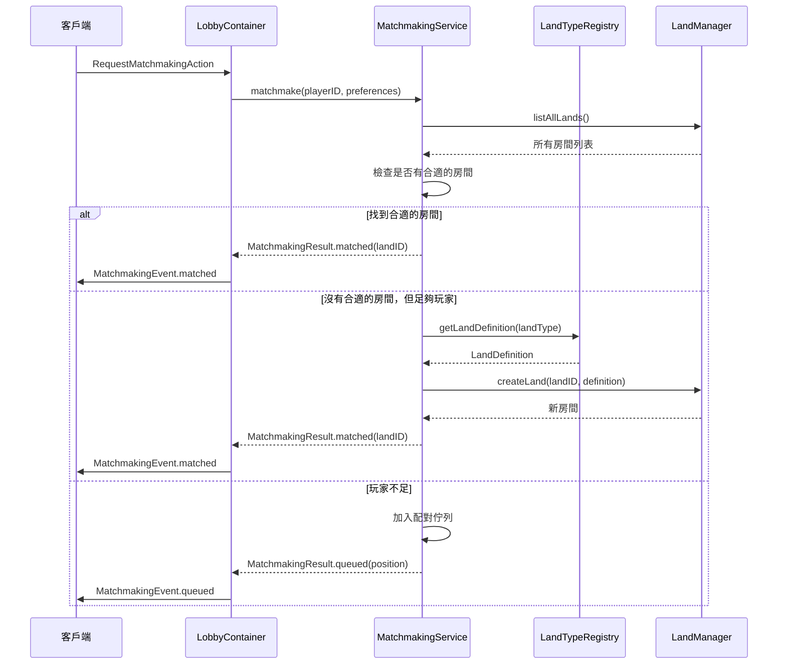
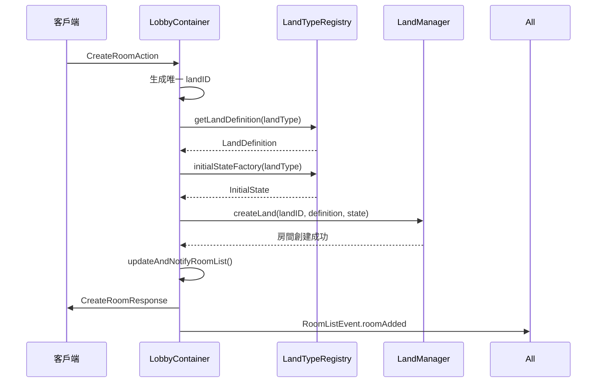

# Matchmaking

Matchmaking 模組提供配對與 Lobby 輔助功能，支援自動配對、房間創建和房間列表管理。

## 概述

Matchmaking 模組包含以下核心組件：

- **MatchmakingService**：依 landType 做配對與建立房間
- **LobbyState** / **LobbyContainer**：Lobby 相關狀態與操作
- **LandTypeRegistry**：註冊 landType 對應的 LandDefinition 與初始狀態
- **MatchmakingStrategy**：可自定義的配對策略

## 核心組件

### MatchmakingService

負責玩家配對的核心服務，支援多種 landType，每個 landType 有獨立的配對佇列。

**主要功能**：
- 自動配對玩家到現有房間
- 當有足夠玩家時創建新房間
- 管理配對佇列
- 支援取消配對和查詢狀態

### LobbyContainer

Lobby 的容器，提供完整的配對與房間管理功能。

**主要功能**：
- 處理配對請求（透過 MatchmakingService）
- 允許客戶端自由創建房間
- 支援手動選擇房間加入
- 追蹤並推送房間列表變化（類似 Colyseus LobbyRoom）

### LobbyState

Lobby 的狀態定義，包含配對狀態、等待玩家列表和可用房間列表。

### LandTypeRegistry

註冊不同 landType 的配置，包括 LandDefinition 工廠和初始狀態工廠。

## 使用範例

### 1. 基本設定

首先，定義 Lobby 的 State 和 Land：

```swift
import SwiftStateTree
import SwiftStateTreeMatchmaking

// 使用內建的 LobbyState 或擴展它
@StateNodeBuilder
struct MyLobbyState: StateNodeProtocol {
    @Sync(.broadcast)
    var players: [PlayerID: PlayerInfo] = [:]
    
    @Sync(.perPlayerSlice())
    var matchmakingStatus: [PlayerID: MatchmakingStatus] = [:]
    
    @Sync(.broadcast)
    var availableRooms: [LandID: AvailableRoom] = [:]
}

// 定義 Lobby Land
let lobbyLand = Land("lobby-main", using: MyLobbyState.self) {
    AccessControl {
        AllowPublic(true)
        MaxPlayers(1000) // Lobby 可以容納很多玩家
    }
    
    Rules {
        // 處理配對和房間相關的 Action
        HandleAction(RequestMatchmakingAction.self) { state, action, ctx in
            // 實際處理會委派給 LobbyContainer
            // 這裡只是範例，實際使用時需要整合 LobbyContainer
            return MatchmakingResponse(result: .failed(reason: "Not implemented"))
        }
    }
}
```

### 2. 建立 LandTypeRegistry

註冊不同類型的遊戲房間：

```swift
import SwiftStateTreeTransport

// 定義遊戲房間的 State
@StateNodeBuilder
struct GameRoomState: StateNodeProtocol {
    @Sync(.broadcast)
    var players: [PlayerID: PlayerState] = [:]
    
    @Sync(.broadcast)
    var gameStatus: String = "waiting"
}

// 定義遊戲房間的 Land
func createGameRoomLand(landType: String, landID: LandID) -> LandDefinition<GameRoomState> {
    return Land(landType, using: GameRoomState.self) {
        AccessControl {
            AllowPublic(true)
            MaxPlayers(4)
        }
        
        Rules {
            // 遊戲邏輯...
        }
    }
}

// 建立 LandTypeRegistry
let landTypeRegistry = LandTypeRegistry<GameRoomState>(
    landFactory: { landType, landID in
        createGameRoomLand(landType: landType, landID: landID)
    },
    initialStateFactory: { landType, landID in
        GameRoomState()
    }
)
```

### 3. 建立 MatchmakingService

```swift
import SwiftStateTreeMatchmaking

// 建立配對策略工廠
let strategyFactory: @Sendable (String) -> any MatchmakingStrategy = { landType in
    // 可以為不同的 landType 使用不同的策略
    switch landType {
    case "battle-royale":
        return DefaultMatchmakingStrategy(
            maxPlayersPerLand: 100,
            minPlayersToStart: 50
        )
    case "team-deathmatch":
        return DefaultMatchmakingStrategy(
            maxPlayersPerLand: 8,
            minPlayersToStart: 4
        )
    default:
        return DefaultMatchmakingStrategy(
            maxPlayersPerLand: 4,
            minPlayersToStart: 2
        )
    }
}

// 建立 MatchmakingService
let matchmakingService = MatchmakingService<GameRoomState, YourRegistry>(
    registry: yourRegistry,
    landTypeRegistry: landTypeRegistry,
    strategyFactory: strategyFactory
)
```

### 4. 建立 LobbyContainer

```swift
// 假設已經有 LandContainer（從 LandManager 取得）
let lobbyContainer = LobbyContainer<MyLobbyState, YourRegistry>(
    container: lobbyLandContainer,
    matchmakingService: matchmakingService,
    landManagerRegistry: yourRegistry,
    landTypeRegistry: landTypeRegistry
)
```

### 5. 處理配對請求

在 Lobby 的 Action handler 中整合 LobbyContainer：

```swift
let lobbyLand = Land("lobby-main", using: MyLobbyState.self) {
    Rules {
        HandleAction(RequestMatchmakingAction.self) { state, action, ctx in
            // 委派給 LobbyContainer 處理
            let result = try await lobbyContainer.requestMatchmaking(
                playerID: ctx.playerID,
                preferences: action.preferences
            )
            
            // 更新狀態
            state.matchmakingStatus[ctx.playerID] = MatchmakingStatus(
                position: result.position,
                waitTime: 0,
                preferences: action.preferences
            )
            
            return MatchmakingResponse(result: result)
        }
        
        HandleAction(CreateRoomAction.self) { state, action, ctx in
            // 委派給 LobbyContainer 創建房間
            let landID = try await lobbyContainer.createRoom(
                playerID: ctx.playerID,
                landType: action.landType,
                roomName: action.roomName,
                maxPlayers: action.maxPlayers
            )
            
            return CreateRoomResponse(
                landID: landID,
                success: true,
                message: "Room created"
            )
        }
        
        HandleAction(JoinRoomAction.self) { state, action, ctx in
            // 委派給 LobbyContainer 驗證房間
            let success = await lobbyContainer.joinRoom(
                playerID: ctx.playerID,
                landID: action.landID
            )
            
            return JoinRoomResponse(
                success: success,
                message: success ? "Room found" : "Room not found"
            )
        }
    }
}
```

### 6. 處理配對事件

Client 會收到配對結果事件：

```swift
// 在 Client 端處理 MatchmakingEvent
switch event {
case .matched(let landID):
    // 配對成功，連接到房間
    connectToRoom(landID: landID)
    
case .queued(let position):
    // 進入佇列，顯示等待位置
    showQueuePosition(position)
    
case .failed(let reason):
    // 配對失敗，顯示錯誤
    showError(reason)
}
```

### 7. 處理房間列表事件

Client 會收到房間列表更新事件：

```swift
// 在 Client 端處理 RoomListEvent
switch event {
case .roomList(let rooms):
    // 收到完整房間列表（首次加入 Lobby 時）
    updateRoomList(rooms)
    
case .roomAdded(let room):
    // 新房間加入
    addRoomToList(room)
    
case .roomRemoved(let landID):
    // 房間移除
    removeRoomFromList(landID)
    
case .roomUpdated(let room):
    // 房間更新（例如玩家數量變化）
    updateRoomInList(room)
}
```

## 配對流程

### 自動配對流程



### 房間創建流程



## 自定義配對策略

可以實作 `MatchmakingStrategy` protocol 來自定義配對邏輯：

```swift
import SwiftStateTreeTransport

struct CustomMatchmakingStrategy: MatchmakingStrategy {
    func canMatch(
        playerPreferences: MatchmakingPreferences,
        landStats: LandStats,
        waitingPlayers: [MatchmakingRequest]
    ) async -> Bool {
        // 自定義配對邏輯
        // 例如：檢查玩家等級、區域等
        if let minLevel = playerPreferences.minLevel {
            // 檢查房間是否符合等級要求
        }
        
        if let region = playerPreferences.region {
            // 檢查區域匹配
        }
        
        // 檢查房間是否還有空位
        return landStats.playerCount < landStats.maxPlayers ?? Int.max
    }
    
    func hasEnoughPlayers(
        matchingPlayers: [MatchmakingRequest],
        preferences: MatchmakingPreferences
    ) -> Bool {
        // 自定義判斷是否有足夠玩家
        // 例如：需要至少 2 個玩家才能開始
        return matchingPlayers.count >= 2
    }
}
```

## 多房間管理

在多房間模式下，LobbyContainer 會自動追蹤所有遊戲房間：

```swift
// 更新房間列表並通知所有 Lobby 玩家
await lobbyContainer.updateAndNotifyRoomList()

// 手動查詢房間列表
let rooms = await lobbyContainer.updateRoomList()
```

## 最佳實踐

1. **Lobby 命名**：使用 `lobby-` 前綴來識別 Lobby（例如：`lobby-asia`、`lobby-europe`）

2. **配對策略**：為不同的 landType 使用不同的配對策略，以符合遊戲需求

3. **房間列表更新**：定期更新房間列表，確保玩家看到最新的房間資訊

4. **錯誤處理**：妥善處理配對失敗的情況，提供清晰的錯誤訊息

5. **佇列管理**：考慮實作佇列超時機制，避免玩家無限等待

## 相關文檔

- [Transport 層](transport/README.md) - 了解 LandManager 和 LandContainer
- [Hummingbird 整合](hummingbird/README.md) - 了解如何在 Hummingbird 中使用
- [核心概念](core/README.md) - 了解 StateNode 和 Land DSL
