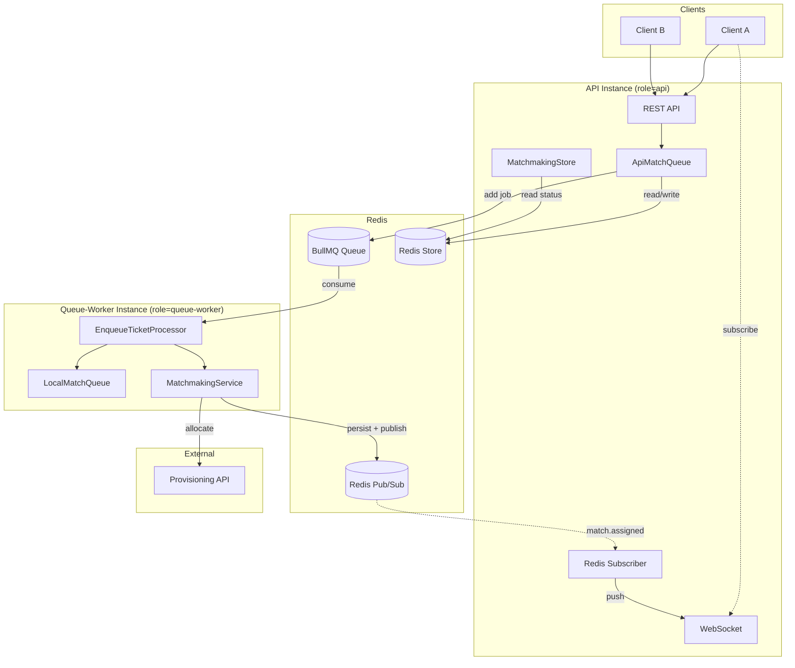

# Control Plane

NestJS-based control plane for SwiftStateTree game servers. Handles matchmaking, provisioning, JWT issuance; extensible for account and friend systems.

## Architecture

### Role-Based Deployment

The control plane supports horizontal scaling via `MATCHMAKING_ROLE`:

| Role | HTTP/WebSocket | Queue Worker | Use Case |
|------|----------------|--------------|----------|
| `api` | ✅ | ❌ | API-only instance; enqueue adds job to BullMQ |
| `queue-worker` | ❌ | ✅ | Queue-worker instance; processes enqueueTicket jobs |
| `all` (default) | ✅ | ✅ | Single-instance; both API and queue-worker |

### Architecture Diagram

*Diagram below: scaled deployment (api + queue-worker). Single-instance (role=all) runs both in one process.*



**Single-instance (role=all)**: API and queue-worker run in the same process; LocalMatchQueue holds tickets in memory; WebSocket push works in-process.

**Scaled (api + queue-worker)**: Clients always connect to API's WebSocket. Queue-worker never exposes WS. Match-assigned flows: queue-worker persists to Redis → publishes to Redis Pub/Sub → API subscribes and pushes to its WS clients.

## Features

- Redis-backed queue storage (BullMQ) with group deduplication
- **Pub/Sub module** for match.assigned events (Redis in production, InMemory for unit/e2e tests)
- **Role-based scaling**: `api` / `queue-worker` / `all` via `MATCHMAKING_ROLE`
- **Continuous periodic matchmaking**: Tickets wait at least M seconds before being matched
- Gateway-facing REST API: enqueue, cancel, status
- JWT issuance (RS256) and JWKS endpoint for game server token validation
- Provisioning client integration for Land assignment

## Development

Start Redis before running tests or server:

```bash
docker compose up -d
```

Run tests:

```bash
npm test
npm run test:e2e
npm run test:e2e:split     # api + queue-worker split, in-process (requires Redis, recommended)
npm run test:e2e:split:sh  # api + queue-worker split, two real processes (requires Redis)
```

## Quick Start

```bash
# Install dependencies
npm install

# Start Redis (required)
docker compose up -d

# Run tests
npm test
npm run test:e2e -- --runInBand

# Start server (default: role=all, single-instance)
PROVISIONING_BASE_URL=http://127.0.0.1:9101 npm run start:dev

# Role-based deployment (scaled)
MATCHMAKING_ROLE=api PROVISIONING_BASE_URL=http://127.0.0.1:9101 npm run start:dev   # API only
MATCHMAKING_ROLE=queue-worker PROVISIONING_BASE_URL=http://127.0.0.1:9101 npm run start:dev # Queue-worker only
```

## API Endpoints

| Method | Path | Description |
|--------|------|-------------|
| GET | /health | Health check |
| POST | /v1/matchmaking/enqueue | Enqueue a match group |
| POST | /v1/matchmaking/cancel | Cancel a ticket |
| GET | /v1/matchmaking/status/:ticketId | Get ticket status |
| GET | /.well-known/jwks.json | JWKS for token validation |
| GET | /api | **Swagger UI** (OpenAPI documentation) |
| GET | /v1/admin/servers | List registered servers (read-only) |
| GET | /v1/admin/queue/summary | Queue summary by queueKey (read-only) |

## Environment Variables

Config is centralized in `infra/config/`. Copy `.env.example` to `.env` for local dev. **K8s**: inject env via ConfigMap/Secret.

| Variable | Description | Default |
|----------|-------------|---------|
| `PORT` | Server port | 3000 |
| `REDIS_HOST` | Redis host | localhost |
| `REDIS_PORT` | Redis port | 6379 |
| `PROVISIONING_BASE_URL` | Provisioning API base URL | http://127.0.0.1:9101 |
| `MATCHMAKING_ROLE` | Instance role: `api`, `queue-worker`, or `all` | all |
| `MATCHMAKING_MIN_WAIT_MS` | Minimum wait before a ticket can be matched | 3000 |
| `NODE_ID` | Unique ID for this API instance (Phase 2 multi-node) | Auto-generated UUID |
| `USE_NODE_INBOX_FOR_MATCH_ASSIGNED` | Use node inbox routing for match.assigned | true |
| `CLUSTER_DIRECTORY_TTL_SECONDS` | UserIdDirectory session lease TTL (userId→nodeId) | 8 |
| `MATCHMAKING_RELAX_AFTER_MS` | Relax group size after this wait (ms) | 30000 |

## Matchmaking Flow

1. Client calls `POST /v1/matchmaking/enqueue` → receives `ticketId` and `status: "queued"` (API writes to Redis and adds job; Worker processes asynchronously when scaled)
2. Client polls `GET /v1/matchmaking/status/:ticketId` or subscribes via WebSocket `ws://host/realtime?ticketId=:ticketId` for real-time push
3. When assigned, the response includes `assignment` with `connectUrl`, `matchToken`, etc.

## MVP Constraints

- **Redis required**: Queue state is stored in Redis. Start Redis via `docker compose up -d`.
- **No automatic reassignment**: Failed assignments are not retried. Client must retry through Gateway.
- **Development mode**: `ALLOW_CLIENT_PLAYER_ID` (Mode A) for development; production should use Gateway-issued identity (Mode B).
- **Scaled WebSocket**: When using `api` + `queue-worker` split, clients connect to the API instance. Match-assigned push requires `role=all` (single instance) or a Redis pub/sub bridge to forward from queue-worker to API.