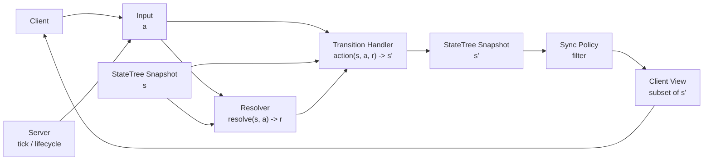
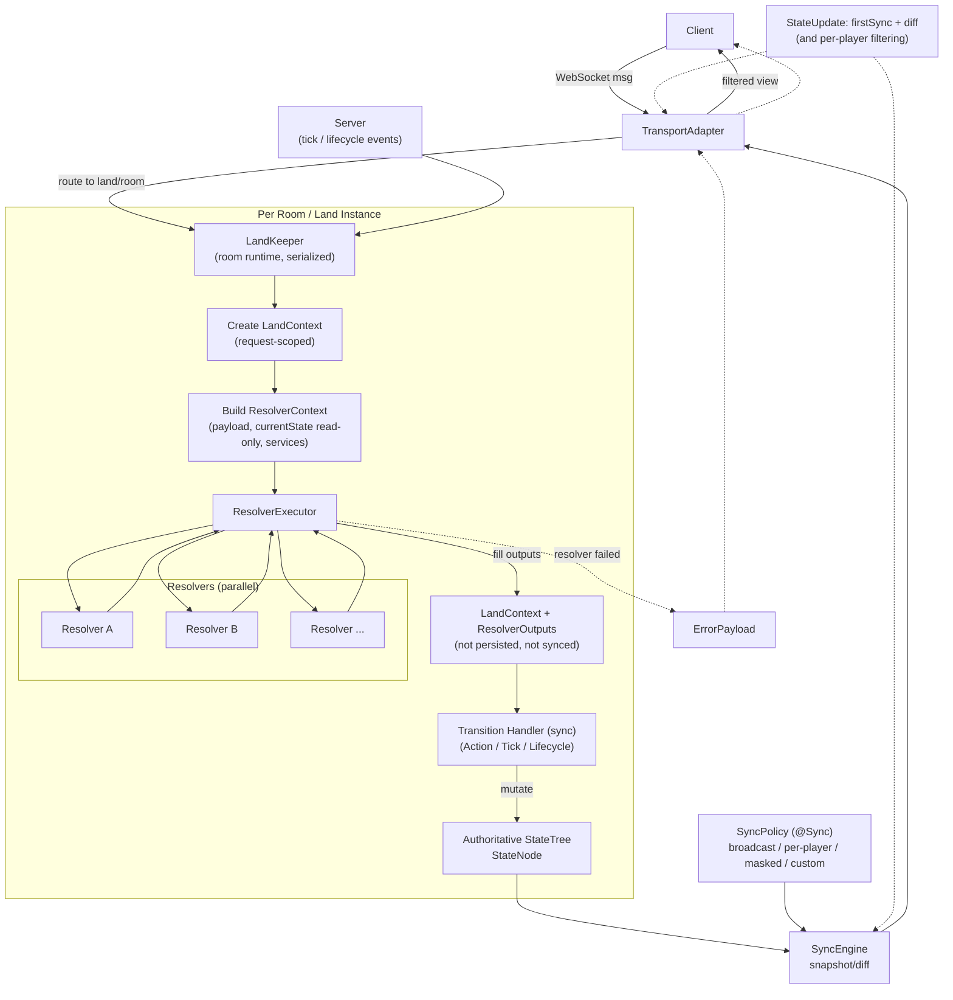

# 3. 系統設計與實作 (System Design and Implementation)

本章先以 **StateTree 程式設計模型** 為主角，說明其如何在多人即時系統中提供「單一事實來源」、「反應式同步」與「決定性重評估」等核心能力（3.1 節）。在此模型基礎上，我們再描述如何將其落地為一套可部署的伺服器端框架：我們以 Swift 語言實作該模型並形成 **SwiftStateTree**，並進一步詳述其 **系統架構**（3.2 節）與 **關鍵實作機制**（3.3 節），包含並發邊界、編譯期程式生成，以及同步與傳輸的效能優化。

## 3.1 StateTree 程式設計模型 (The StateTree Programming Model)

多人遊戲伺服器架構的根本挑戰，在於如何在處理即時互動與網路延遲的同時，管理共享狀態的一致性。傳統方法通常將狀態分散在各種實體物件中（OOP），或是將狀態完全解耦為原始數據陣列（ECS）。這兩種方式在定義「哪些資料應同步給誰」以及「狀態如何演變至當前形式」時，往往會帶來複雜性。

StateTree 模型透過引入一個以 **單一權威 StateTree** 為中心的反應式程式設計觀點來解決這些挑戰。

為避免名詞混淆，本章的 **Action** 採用廣義定義：泛指任何會觸發狀態轉換的 handler（包含客戶端送出的指令，以及伺服器端的 Tick、生命週期事件等）。在此定義下，「狀態只能透過 Action 改動」等價於「狀態只能透過明確的轉換處理器改動」。

圖中的符號可與 3.1.2 節的形式化定義對應：$s \equiv S_t$、$s' \equiv S_{t+1}$、$a \equiv I_t$、$r \equiv C_t$。

### 3.1.1 單一事實來源與狀態節點 (Single Source of Truth and State Nodes)

在此模型中，遊戲房間或應用程式情境的完整權威狀態被建模為一個階層式的 **StateTree**。該樹由 **StateNodes** 組成，這些節點是強型別、不可變的值型資料結構（value types）。

*   **集中式權威 (Centralized Authority)**：不同於將狀態分散在多個並行/隔離的執行單元中的分散式模型，StateTree 代表了世界在任一 Tick 的完整快照。這種集中化簡化了對全域一致性與互動規則的推理。
*   **基於快照的持久化 (Snapshot-based Persistence)**：由於狀態被視為不可變的值型快照（snapshot），系統可以高效地捕捉任一時間點的完整世界狀態。此能力是系統同步引擎與歷史追蹤的基礎。

### 3.1.2 決定性重評估與形式化定義 (Deterministic Re-evaluation and Formalism)

StateTree 模型的一項關鍵設計是其對決定性（Determinism）的處理方式。我們將狀態轉換定義為一個決定性函數，而非僅是程式碼執行的副作用。形式上，權威狀態的演進可表示為：

$$
S_{t+1} = \delta(S_t, I_t, C_t)
$$

其中：
*   $S_t$ 代表時間 $t$ 的權威 **StateTree 快照**。
*   $I_t$ 代表觸發轉換的 **輸入**（例如客戶端指令、生命週期事件或系統 Tick）。
*   $C_t$ 代表 **執行脈絡**，由 Resolver 填充（見 3.1.3 節）。
*   $\delta$ 是由應用程式的規則規格所定義的 **轉換函數**；在滿足本模型的限制（特別是非決定性隔離與可重放輸入/脈絡）時，它應保持決定性以支援可重現的重評估。

在此模型中，**重播 (Replay)** 被定義為對轉換函數 $\delta$ 的受控 **重評估 (Re-evaluation)**，而非單純的快照還原或副作用回放。當系統保存輸入 ($I_t$) 與解析後的脈絡 ($C_t$) 並確保其可重放時，即可重建狀態演進的歷史。此特性稱為 **決定性重評估 (Deterministic Re-evaluation)**，對於分散式系統中的除錯、稽核與正確性驗證至關重要。

需要強調的是：上述形式化定義描述的是 **programming model 的語意目標**。若系統在狀態轉換中引入非決定性來源（例如直接讀取時間、亂數、或任何平台相依的運算），則該非決定性必須被提升為可觀測、可重放的輸入（$I_t$ 或 $C_t$）的一部分；否則「重評估」將不再保證可重現。

### 3.1.3 關注點分離：State、Action 與 Resolver

為了確保轉換函數 $\delta$ 的純粹性，此模型嚴格區分了三種職責：

1.  **State (事實 Truth)**：需要同步的持久化權威資料結構。它作為系統的「記憶」。
2.  **Action (狀態轉換 Transition)**：修改狀態的唯一合法入口。Action handler 是同步函數，根據輸入與脈絡對 StateTree 應用變更。
3.  **Resolver (脈絡 Context)**：處理外部副作用與非決定性資料來源（如資料庫讀取、亂數生成、時間獲取）的機制。
    *   **積極平行執行 (Eager Parallel Execution)**：在 Action 處理器被調用之前，所有宣告的 Resolver 會平行執行以獲取必要資料。
    *   **脈絡注入 (Context Injection)**：結果被注入至執行脈絡 ($C_t$) 中。Action 處理器隨後從此不可變脈絡中讀取資料。
    *   **隔離 (Isolation)**：此設計確保 Action 處理器本身保持純粹且具決定性，因為所有非決定性因素皆在處理器運行 *之前* 被解析並捕捉於 $C_t$ 中。

### 3.1.4 模型限制與可推論特性 (Constraints and Derived Properties)

為了讓上述語意能被清楚檢查與討論，我們將 StateTree programming model 的核心限制（constraints）概括如下：

1.  **單一權威狀態樹 (Single Source of Truth)**：權威狀態在任一時間點皆由單一 StateTree 快照 $S_t$ 定義。
2.  **單一路徑的狀態變更 (Action-only Mutation)**：狀態變更只能透過 Action 驅動的轉換函數 $\delta$ 發生。
3.  **非決定性隔離 (Non-determinism Isolation)**：任何外部 I/O、時間、亂數、或其他非決定性來源，必須被隔離並以上下文 $C_t$ 的形式提供，且可被保存以支援重評估。
4.  **同步語意分離 (Sync Policy Separation)**：哪些資料應被同步給哪些客戶端，屬於資料的宣告式同步語意；其配置不應與「如何演化狀態」的業務邏輯耦合。

在上述限制下，我們可推論出一些重要特性，例如：狀態演化路徑單一而可追蹤、可透過輸入與上下文重建（replay/debuggability），以及以狀態差異為基礎的自動化同步（sync-friendliness）。在後續章節中，我們會進一步說明這些語意如何被落地為可部署系統，並討論實作層面對「決定性」的支援方式與其限制。

### 3.1.5 輸入、決定性與失敗語意 (Inputs, Determinism, and Failure Semantics)

為避免將「模型語意」與「特定實作細節」混淆，本節補充幾個在 programming model 層級需要被明確化的要點：

*   **輸入的範疇 (Inputs)**：$I_t$ 表示任何會觸發狀態轉換的輸入，來源可以是客戶端指令，也可以是伺服器端的 Tick、生命週期事件（join/leave）或其他系統事件。
*   **決定性的成立條件 (Determinism)**：若要讓重評估可重現，狀態轉換不應直接讀取非決定性來源（時間、亂數、外部 I/O、平台相依運算）。任何非決定性資訊應被提升為可觀測且可重放的輸入/脈絡（$I_t$ 或 $C_t$）的一部分；實作層也可透過 deterministic math 等方式降低數值運算的不一致風險。
*   **失敗語意 (Failure Semantics)**：當 Resolver 解析外部資料失敗時，對應的狀態轉換應被中止（Action handler 不應在缺失脈絡下繼續執行），並回傳可被客戶端理解的錯誤結果；此行為將錯誤處理從業務邏輯中抽離，避免導致隱性不一致的狀態更新。
*   **同步的安全邊界 (Sync as a Security Boundary)**：Sync policy 決定每個客戶端可觀測的 view，是資料最小揭露與 per-player 權限邊界的一部分；因此其語意應獨立於業務邏輯，並可被清楚審查。

## 3.2 系統架構 (System Architecture)

為了將 3.1 節的 StateTree 模型落地並可部署，我們以 Swift 實作了 SwiftStateTree，並採用嚴謹的分層架構以強制落實伺服器權威、模組化與可擴展性。如 **圖 1**（系統堆疊圖）所示，架構被組織為不同層級，每層封裝特定職責。

在一致性與並發的觀點上，本系統以「房間/實例」作為主要隔離單元：單一房間內的狀態轉換被序列化以維持一致性；不同房間之間則可併行執行以提升吞吐量。此設計使 programming model 的約束能在實務上以清晰的邊界落地。

為了便於閱讀，下表快速區分本節專有名詞的角色與生命週期：

| 名稱 | 角色 | 生命週期 / 範圍 |
|---|---|---|
| `Land` | 靜態規格：定義 State/handlers/resolvers/sync policy | 應用程式啟動後常駐；不持有執行期狀態 |
| `LandKeeper` | 房間執行器：持有單一房間的權威 StateTree，執行 transition handlers 並觸發同步 | 每個房間/實例一個；房間建立到銷毀 |
| `LandRouter` | 路由器：將連線/landID 導向正確的 `LandKeeper` | 服務層常駐；管理多房間映射 |
| `LandManager` | 房間管理：建立/查詢/銷毀同類型的 `LandKeeper` | 服務層常駐；管理一組房間 |
| `LandServer` | 組合單元：組裝 Manager/Router/Transport，提供特定遊戲/服務的完整入口 | 服務層常駐；可同時存在多個 |
| `LandHost` | 主機整合：HTTP/WebSocket 入口，掛載多個 `LandServer` | 程序常駐；通常一個 |

### 3.2.1 規則定義層 (Rule Definition Layer: Land DSL)
位於基礎的是由 **Land DSL** 建構的 **規則定義層**。
*   **宣告式與無狀態 (Declarative & Stateless)**：一個 `Land` 定義以純宣告方式描述應用程式的領域邏輯（存取控制、生命週期掛勾、Action 處理器）。它不包含任何執行期狀態或傳輸相依性。
*   **可攜性 (Portability)**：由於 `Land` 是一份可執行的規格說明，它可以被隔離測試或部署至不同環境而無需修改。

### 3.2.2 狀態管理層 (State Management Layer: LandKeeper)
**狀態管理層** 由 `LandKeeper` 實現。
*   **執行期封裝 (Runtime Encapsulation)**：每個 `LandKeeper` 管理特定房間的單一、隔離的 StateTree 實例。
*   **並發模型 (Concurrency Model)**：作為 Swift **Actor** 實作，LandKeeper 將房間內的執行序列化，無需手動鎖定即可確保狀態轉換的執行緒安全。它協調「Resolver → Action → State Update」的循環。

### 3.2.3 路由與房間管理層 (Routing and Room Management Layer)
*   **LandRouter**：管理客戶端連線與房間識別碼之間的映射。確保來自特定客戶端的訊息能一致地導向至正確的 LandKeeper。
*   **LandManager**：協調同一類型多個房間（LandKeeper）的生命週期。處理動態房間創建、查詢與銷毀。
*   **LandContainer**：將 LandKeeper 與其關聯的 `TransportAdapter` 包裝在一起，將領域邏輯與底層網路協定解耦。

### 3.2.4 服務整合層 (Service Integration Layer)
*   **LandServer**：組合（Compose）Manager、Router 與 Transport 層，為特定遊戲類型（例如「戰鬥伺服器」或「大廳伺服器」）提供完整服務。它遵循「組合優於繼承」原則。
*   **LandHost**：頂層的 HTTP/WebSocket 伺服器整合（目前基於 Hummingbird 框架）。它管理網路監聽器並將進入的請求路由至適當的已註冊 LandServer。

## 3.3 關鍵實作機制 (Key Implementation Mechanisms)

本節詳述 SwiftStateTree 如何利用 Swift 語言特性來實現 StateTree 模型，並針對高效能網路進行優化。

### 3.3.1 基於 Swift 語言特性的實作
*   **Value Types 與 Copy-on-Write (COW)**：StateTree 使用 Swift `struct` 實作。Swift 的 COW 優化確保在發生修改之前，建立快照的成本幾乎為零（O(1)）。這使得為了 Diff 計算或回滾而保留歷史紀錄變得極具記憶體效率。
*   **Macros 與型別安全 (Macros & Type Safety)**：我們利用 Swift Macros (`@StateNodeBuilder`, `@Sync`, `@Payload`) 在編譯期生成 Schema 定義與序列化程式碼。這消除了執行期反射（Reflection）的開銷，並確保伺服器與客戶端邊界的型別安全。
*   **Actor 隔離 (Actor Isolation)**：`LandKeeper` actor 提供了強大的並發邊界。雖然伺服器執行緒池上平行運行多個房間，但單一房間內的邏輯保證是序列執行的，簡化了狀態一致性維護。
*   **決定性運算支援 (Deterministic Math Support)**：為降低平台相依浮點運算造成的非決定性，我們提供 deterministic math 的實作與使用指引，協助開發者將關鍵遊戲邏輯限制在可重現的數值運算子集。由於目前尚未以編譯器/型別系統強制限制非決定性來源，這部分屬於「架構允許 + 實務建議」的支援機制。

### 3.3.2 同步引擎與傳輸優化 (SyncEngine and Transport Optimization)
`SyncEngine` 負責狀態變更的反應式傳播。引擎不發送手動更新封包，而是自動計算當前幀快照 ($S_{t+1}$) 與前一幀快照 ($S_t$) 之間的差異。

為了最小化頻寬使用——這是擴展性（RQ1）的關鍵因素——我們實作了一個多階段編碼管線：

1.  **Opcode-driven JSON Arrays**：將冗長的 JSON Objects（如 `{"kind": "action", ...}`）替換為緊湊的陣列（如 `[101, ...]`），移除重複的欄位名稱。
2.  **路徑雜湊 (Path Hashing)**：將長字串路徑（如 `players.user-123.position`）替換為 4-byte 整數雜湊，顯著降低深層狀態樹的 Overhead。
3.  **混合二進制編碼 (Hybrid Binary Encoding: MessagePack + Runtime Compression)**：
    *   **MessagePack**：採用二進制格式消除文字解析開銷並縮減整數大小。
    *   **動態鍵壓縮 (Dynamic Key Compression)**：針對無法在編譯期雜湊的動態 Map Key（如玩家 ID），系統維護一個執行期的「Slot ID」映射表。36-byte 的 UUID 字串只需傳送一次，後續更新僅需使用 1-byte 的整數 Slot 索引。

此演進確保 SwiftStateTree 在保留開發者友善的「全狀態樹」抽象的同時，能達到與高度優化、手寫網路協定相當的傳輸效率。
