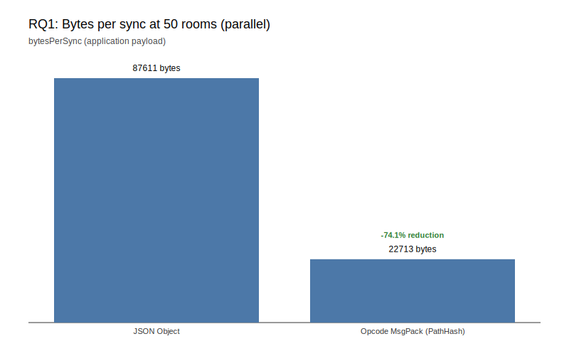

[English version TBD]

## 第 4 章 — 實證評估

本章以軟體工程實證研究常用的「黃金鐵三角」為主軸，將評估拆成三個研究問題（RQ）：**效率（Efficiency）**、**擴展性（Scalability）**、**正確性/能力（Correctness & Capabilities）**。

### 4.1 實驗設定（Experimental Setup）

#### 測試機器（Test Environment）

| 用途 | 平台 | CPU | 記憶體 | 備註 |
|------|------|-----|--------|------|
| RQ1 / RQ2 Stage 1–3 | Linux x86_64 (WSL2) | AMD Ryzen 5 7600X 6-Core, 12 logical cores | 16 GB | Encoding benchmark、server-loadtest、ws-loadtest |
| RQ3 錄製 | macOS arm64 | Apple M2, 8 cores | — | Live 錄製 re-evaluation records |
| RQ3 重播驗證 | Linux x86_64 | 同上 RQ1 機器 | — | 跨架構 determinism 驗證 |

硬體細節以各結果檔的 `metadata.environment` 為準。

- **受評系統**：SwiftStateTree（SST），使用 `hero-defense` land 作為測試案例。
- **工作負載（Workload）**：
  - 每次 iteration（每個 room）先執行 `stepTickOnce()` × `ticksPerSync`，再執行一次 `syncNow()`。
  - 本章主要設定：`ticksPerSync = 2`（tick=20Hz、sync=10Hz），`playersPerRoom = 5`。
- **硬體/作業系統（Hardware/OS）**：見上表；RQ3 採跨架構驗證（arm64 錄製 → x86_64 重播）。
- **比較的編碼格式（RQ1 / RQ2 Stage 1）**：
  - Baseline：`JSON Object`
  - Optimized：`Opcode MsgPack (PathHash)`

#### `hero-defense` 遊戲案例摘要（Game Scenario）

`hero-defense` 是一個以 tick 驅動的 tower-defense 類 land，用來代表「持續演化、狀態差分頻繁」的多人即時工作負載：

- **核心目標**：玩家共同防守基地；怪物週期性生成並向基地移動，命中/到達基地會影響基地狀態。
- **主要實體（State 的動態集合）**：玩家（players）、怪物（monsters）、砲塔（turrets）等，以動態 key 的集合/字典形式存在並隨時間增減。
- **每 tick 的典型演化**：更新玩家/怪物移動、週期性生成怪物、執行玩家與砲塔的自動射擊與命中結算，因而持續產生狀態差分並觸發同步。
- **互動來源（Action / Client Events）**：玩家可移動、射擊、放置砲塔、升級等（本章 benchmark 的比較中，除編碼格式與 room-level 排程方式外，其餘工作負載保持一致）。

**測試條件（Test Conditions）**

| 參數 | 值 | 說明 |
|------|---|------|
| playersPerRoom | 5 | 每房 5 名玩家，代表小隊規模 |
| tick 頻率 | 20 Hz | 每 50 ms 一 tick |
| sync 頻率 | 10 Hz | 每 2 tick 同步一次（`ticksPerSync = 2`） |
| iterations | 600 / 200 | Object Counts、ws-loadtest 用 600（~60 s）；Encoding benchmark 用 200 |
| 等效時長 | ~60 s/room | 600×2 tick × 50 ms ≈ 60 秒（對齊 ws-loadtest steady） |
| 怪物生成 | 週期性 | 每 `spawnInterval` tick 生成 1 隻；interval 隨時間由 30 加速至 3 tick |

**動態物件數量（Object Counts）**

測試僅使用玩家與怪物（無砲塔）。以 `ObjectCountSampler` 於單一 room、600 iterations（~60 s，對齊 ws-loadtest steady phase）執行期間，每 10 秒取樣一次；重複 10 次運行以取得各時間點範圍（若有變異則顯示 min/avg/max）。玩家數固定為 5；怪物因持續生成與擊殺，隨時間在 **1–4** 隻之間波動（10 次運行各時間點結果一致，表示遊戲具決定性）。

| time (s) | iterations | players (總人數) | monsters |
|---------:|-----------:|-----------------:|---------:|
| 0        | 1          | 5                | 1        |
| 10       | 101        | 5                | 3        |
| 20       | 201        | 5                | 3        |
| 30       | 301        | 5                | 3        |
| 40       | 401        | 5                | 2        |
| 50       | 501        | 5                | 4        |
| 60       | 600        | 5                | 3        |

重現指令：`cd Examples/GameDemo && swift run -c release ObjectCountSampler`

---

### 4.2 RQ1 — 網路效率（Network Efficiency）：opcode-driven 編碼能節省多少 payload？

**敘事方式（從演進史建立因果鏈）**  
為了避免把 RQ1 寫成「單純跑分」，本節以 SST 的傳輸協議演進順序敘述，將設計決策與效益連結起來（詳見 `docs/transport_evolution.md` / `docs/transport_evolution.zh-TW.md`）：

1. **Baseline：JSON Object**  
   - 優點：可讀性高、易除錯  
   - 缺點：同步封包大（payload bytes 高）
2. **中間階段：Opcode-driven（概念層）**  
   - 核心想法：將「狀態變更」表達成 opcode array，讓 payload 更接近差分/指令流（減少結構與欄位名稱帶來的膨脹）  
   - PathHash 的目的：用 hash 取代長路徑字串，進一步壓縮
3. **最終版：Opcode MsgPack + PathHash**  
   - 用二進位編碼（MessagePack）承載 opcode array，並搭配 PathHash 壓縮路徑  
   - 目標：同時降低 payload size，並降低編碼/解碼與傳輸成本

**指標（Metric）**  
以 `CountingTransport` 量測每次 sync 的 application payload 大小：`bytesPerSync`。此指標明確代表 **應用層 payload bytes**，不包含 WebSocket framing/TLS/傳輸層壓縮等額外開銷。

**資料來源（Evidence）**  
- 演進敘事：`docs/transport_evolution.md`、`docs/transport_evolution.zh-TW.md`
- 可重現的 benchmark 原始結果檔：
  - [JSON Object（raw）](/Examples/GameDemo/results/encoding-benchmark/scalability-matrix-json-object-ppr5-200iterations-tick2-2026-01-25T10-01-01Z.json)
  - [Opcode MsgPack (PathHash)（raw）](/Examples/GameDemo/results/encoding-benchmark/scalability-matrix-messagepack-pathhash-ppr5-200iterations-tick2-2026-01-25T10-01-03Z.json)

**圖（直接嵌入）**  
以下圖表顯示 `rooms=50`、parallel 模式下的 `bytesPerSync` 對比（application payload）：



**表（直接嵌入）**  
（取自 `deep-research/emse-artifacts/artifacts/rq1_network_efficiency.csv`，總人數 = rooms × playersPerRoom）

| Format                    | Rooms | 總人數 | playersPerRoom | ticksPerSync | iterations | bytesPerSync (serial) | bytesPerSync (parallel) | diff |
|--------------------------|------:|------:|---------------:|-------------:|-----------:|----------------------:|------------------------:|----:|
| JSON Object              | 10    | 50   | 5              | 2            | 200        | 17627               | 17627                 | 0    |
| JSON Object              | 30    | 150  | 5              | 2            | 200        | 52521               | 52521                 | 0    |
| JSON Object              | 50    | 250  | 5              | 2            | 200        | 87611               | 87611                 | 0    |
| Opcode MsgPack (PathHash)| 10    | 50   | 5              | 2            | 200        | 4572                | 4572                  | 0    |
| Opcode MsgPack (PathHash)| 30    | 150  | 5              | 2            | 200        | 13612               | 13612                 | 0    |
| Opcode MsgPack (PathHash)| 50    | 250  | 5              | 2            | 200        | 22713               | 22713                 | 0    |

**一致性檢核（serial vs parallel）**  
- `bytesPerSync` 由 `CountingTransport` 實際累計的 `totalBytes / iterations` 計算得到。  
- 在相同 workload（同 `ticksPerSync`、`playersPerRoom`、`rooms`、`iterations`）下，serial 與 parallel 僅差在「room 間排程方式」，理論上不應改變每個 room 的狀態演進與 sync patch，故 `bytesPerSync` 應一致。  
- 本次重跑中，所有組合皆觀察到 `diff = 0`，表示 serial 與 parallel 的 `bytesPerSync` 完全相同。

**最終版總結（Final vs Baseline，rooms=50、總人數 250）**  
為了讓讀者快速理解「最終版帶來的工程含義」，下表以 `rooms=50`、parallel 模式匯總 **Size + Compute** 的直覺對比（後續由 RQ2 的 Stage 2/Stage 3 實測補足端到端差異）：  

| 指標（rooms=50, 總人數 250, parallel） | JSON Object | Opcode MsgPack (PathHash) | 改善幅度 |
|---------------------------------------|-----------:|---------------------------:|--------:|
| bytesPerSync (bytes)                  | 87611      | 22713                      | -74.1%  |
| avgCostPerSyncMs (ms)                 | 0.0705     | 0.0573                     | -18.7%  |

**關鍵結論（可直接用在論文的句型）**  
在相同遊戲工作負載下，`Opcode MsgPack (PathHash)` 相較 `JSON Object` 在各房間規模下都能顯著降低 `bytesPerSync`，代表 SST 的 opcode-driven 編碼在頻寬成本上具有實質工程效益。

---

### 4.3 RQ2 — 三階段擴展性評估（Encoding → In-Memory → Socket）

**目的（Goal）**  
為降低「只測編碼」與實際部署情境的落差，RQ2 改採三階段實測流程，逐步從編碼層擴展到記憶體內執行，再到真實 WebSocket 網路路徑；本節不再使用 `MaxRooms/MaxPlayers` 估算模型。

**三階段設計總覽**

| Stage | 範圍 | 主要指標 |
|------|------|---------|
| Stage 1: 編碼 | `sync patch` 編碼效率（不含真實 socket） | `bytesPerSync`, `avgCostPerSyncMs`, `throughputSyncsPerSecond` |
| Stage 2: In-Memory | LandServer + ClientSimulator（同程序，無 TCP/WebSocket） | `roomsCreated/roomsTarget`, `avgSentBytesPerSecond`, `avgRecvBytesPerSecond`, CPU 使用率 |
| Stage 3: Socket | 真實 GameServer + Node.js `ws` client（含 TCP/WebSocket） | phase `pass/fail`, `errorRate`, `disconnectRate`, `rtt p95`, `update p95` |

**Stage 1 — 編碼層（Encoding）**  
延續 RQ1，固定 workload（`ticksPerSync=2`、`playersPerRoom=5`）比較 `JSON Object` 與 `Opcode MsgPack (PathHash)`。與 Stage 2/3 一致，測試 100、300、500 rooms；總人數 = rooms × 5。

| Format                    | Rooms | 總人數 | bytesPerSync (parallel) |
|--------------------------|------:|------:|------------------------:|
| JSON Object              | 100   | 500   | 175471                  |
| JSON Object              | 300   | 1500  | 525826                  |
| JSON Object              | 500   | 2500  | 876666                  |
| Opcode MsgPack (PathHash)| 100   | 500   | 49851                   |
| Opcode MsgPack (PathHash)| 300   | 1500  | 149500                  |
| Opcode MsgPack (PathHash)| 500   | 2500  | 249247                  |

實測日期：2026-02-06。`USE_SNAPSHOT_FOR_SYNC=false`（legacy 路徑）以取得正確 bytesPerSync。證據檔見附錄。

**Stage 2 — In-Memory 整合壓測**  
量測「伺服器邏輯 + transport pipeline」在不經過真實 socket 時的承載行為。採用 MessagePack 編碼、`playersPerRoom=5`、steady 30 秒，結果如下：

| Rooms | 總人數 | roomsCreated/roomsTarget | avgSentBytes/s | avgRecvBytes/s | CPU (avg) |
|------:|------:|--------------------------|----------------|----------------|----------:|
| 100   | 500  | 100/100                  | 30.6 KB        | 512 KB         | 11.9%     |
| 300   | 1500 | 300/300                  | 89.4 KB        | 1.53 MB        | 26.2%     |
| 500   | 2500 | 500/500                  | 148 KB         | 2.66 MB        | 38.7%     |

三組皆達成 `roomsCreated = roomsTarget`，steady phase 流量穩定，無 disconnect。

**Stage 3 — Socket 端到端壓測**  
使用真實 WebSocket 客戶端與 GameServer，每組 room count 獨立執行 3 次。採用 `scenarios/hero-defense/default.json`、MessagePack 編碼：

| Rooms | 總人數 | 通過率 | errorRate | disconnectRate | rtt p95 (steady) | update p95 (steady) |
|------:|------:|-------:|----------:|----------------|-----------------|---------------------|
| 100   | 500  | 3/3    | 0         | 0              | 3 ms            | 101 ms              |
| 300   | 1500 | 3/3    | 0         | 0              | 11 ms           | 103 ms              |
| 500   | 2500 | 3/3    | 0         | 0              | 77 ms           | 115 ms              |

三組 room count 皆全數通過（preflight/steady/postflight 皆 `passed`），errorRate 與 disconnectRate 皆為 0。

**小結**  
三階段實測顯示：Stage 1 編碼層（見 RQ1）與 Stage 2 in-memory 皆能穩定承載至 500 rooms；Stage 3 導入真實 WebSocket 後，100/300/500 rooms 皆通過，rtt 與 update 延遲隨 room 數增加而上升，但仍在可接受範圍。

---

### 4.4 RQ3 — 決定性驗證（Determinism Verification）：跨架構重播是否能達到 0 mismatches？

**目標（Goal）**  
驗證 SST 的 Deterministic Re-evaluation：將 live 錄製的 inputs + resolver outputs 固定化，於不同 CPU 架構上重播並逐 tick 比對 state hash。

**資料集（Datasets）**  
- 含互動輸入（262 ticks；含 actions/client events）：
  - [hero-defense-2026-01-25T05-17-26Z-CD3C81D9.json](/Examples/GameDemo/reevaluation-records/hero-defense-2026-01-25T05-17-26Z-CD3C81D9.json)
  - [hero-defense-2026-01-25T05-17-35Z-C9517718.json](/Examples/GameDemo/reevaluation-records/hero-defense-2026-01-25T05-17-35Z-C9517718.json)
- 多 seed 重複（120 ticks；join + tick 演進）：
  - [hero-defense-2026-01-25T05-29-15Z-F7E0C6B2.json](/Examples/GameDemo/reevaluation-records/hero-defense-2026-01-25T05-29-15Z-F7E0C6B2.json)
  - [hero-defense-2026-01-25T05-29-43Z-7FD0D4DC.json](/Examples/GameDemo/reevaluation-records/hero-defense-2026-01-25T05-29-43Z-7FD0D4DC.json)
  - [hero-defense-2026-01-25T05-30-21Z-0B596849.json](/Examples/GameDemo/reevaluation-records/hero-defense-2026-01-25T05-30-21Z-0B596849.json)

**程序（Procedure）**  
1. Live mode 錄製並啟用 per-tick `stateHash`。
2. Reevaluation mode 重播，跳過 resolver 執行並使用錄製的 `resolverOutputs`。
3. 逐 tick 比對「計算出的 state hash」與「錄製的 ground truth」。
4. 同一台機器連跑兩次 re-evaluation，驗證 run1 vs run2 的一致性。

**實作工具（現成）**  
使用 `ReevaluationRunner`：
```bash
swift run -c release ReevaluationRunner --input <record.json> --verify
```

**結果摘要（本次驗證）**  
- 5 份 record 全部驗證通過：
  - ✅ Verified: computed hashes match recorded ground truth
  - ✅ Cross-architecture verification: arm64 → x86_64
  - ✅ Verified: hashes are identical across two re-evaluation runs
- 互動版（262 ticks）統計：Actions=6、Client Events=4、Lifecycle Events=2。
- 多 seed 版（120 ticks）統計：Actions=0、Client Events=0、Lifecycle Events=2。

---

### 4.5 有效性威脅（Threats to Validity）

- **建構有效性（Construct validity）**：
  - `bytesPerSync` 是 application payload bytes，不含 framing/TLS/傳輸層壓縮。
  - RQ2 已改為三階段實測；其中 Stage 2 不含真實 TCP/WebSocket，需與 Stage 3 一併解讀。
- **內部有效性（Internal validity）**：
  - benchmark 可能受系統雜訊影響；可補多次重跑並報 median/IQR。
- **外部有效性（External validity）**：
  - 工作負載目前以 `hero-defense` 為主；可擴展到更多 land/scenario。
  - 120-tick records 偏簡；以 262-tick（含互動輸入）作為主要 determinism 證據更強。

---

### 4.6 小結（Summary）

- **RQ1（效率）**：opcode-driven（MsgPack+PathHash）在相同工作負載下顯著降低 `bytesPerSync`。
- **RQ2（擴展性）**：採用「編碼 → in-memory → socket」三階段實測，逐層驗證從編碼優化到端到端負載的實際影響。
- **RQ3（正確性/能力）**：跨架構 re-evaluation 達成 0 mismatches（本次驗證五份 record 全數通過）。

---

## 附錄：原始資料連結（JSON）

### Encoding benchmark（RQ1 / RQ2 Stage 1）
- **100/300/500 rooms（Stage 1 實測，USE_SNAPSHOT_FOR_SYNC=false）**：
  - [JSON Object（2026-02-06）](/Examples/GameDemo/results/encoding-benchmark/scalability-matrix-json-object-ppr5-200iterations-tick2-2026-02-06T14-11-36Z.json)
  - [Opcode MsgPack (PathHash)（2026-02-06）](/Examples/GameDemo/results/encoding-benchmark/scalability-matrix-messagepack-pathhash-ppr5-200iterations-tick2-2026-02-06T14-13-32Z.json)
- **10/30/50 rooms（RQ1 表）**：
  - [JSON Object（2026-01-25）](/Examples/GameDemo/results/encoding-benchmark/scalability-matrix-json-object-ppr5-200iterations-tick2-2026-01-25T10-01-01Z.json)
  - [Opcode MsgPack (PathHash)（2026-01-25）](/Examples/GameDemo/results/encoding-benchmark/scalability-matrix-messagepack-pathhash-ppr5-200iterations-tick2-2026-01-25T10-01-03Z.json)

### In-Memory 與 Socket 測試輸出（RQ2 Stage 2/3）
- `run-server-loadtest.sh` 結果目錄：`/Examples/GameDemo/results/server-loadtest/`
- `run-ws-loadtest.sh` 結果目錄：`/Examples/GameDemo/ws-loadtest/results-hummingbird/`（Stage 3 數據取自 `rq3-rerun-2026-02-06/scalability-2026-02-06T12-57-57/summary.json`）

### Re-evaluation records（RQ3）
- [hero-defense-2026-01-25T05-17-26Z-CD3C81D9.json](/Examples/GameDemo/reevaluation-records/hero-defense-2026-01-25T05-17-26Z-CD3C81D9.json)
- [hero-defense-2026-01-25T05-17-35Z-C9517718.json](/Examples/GameDemo/reevaluation-records/hero-defense-2026-01-25T05-17-35Z-C9517718.json)
- [hero-defense-2026-01-25T05-29-15Z-F7E0C6B2.json](/Examples/GameDemo/reevaluation-records/hero-defense-2026-01-25T05-29-15Z-F7E0C6B2.json)
- [hero-defense-2026-01-25T05-29-43Z-7FD0D4DC.json](/Examples/GameDemo/reevaluation-records/hero-defense-2026-01-25T05-29-43Z-7FD0D4DC.json)
- [hero-defense-2026-01-25T05-30-21Z-0B596849.json](/Examples/GameDemo/reevaluation-records/hero-defense-2026-01-25T05-30-21Z-0B596849.json)

### Reproducibility: Git Commits 與執行指令

本章實證資料對應的 Git commit（可重現實驗）：

| 資料類型 | Commit | 說明 |
|---------|--------|------|
| Encoding benchmark (RQ1) | `2db8348` | Add ServerLoadTest executable and update Package.swift |
| Encoding benchmark (Stage 1, 100/300/500) | `0886374` | 2026-02-06 實測 JSON Object + MsgPack PathHash |
| Re-evaluation records (RQ3) | `2082154` | Enhance hardware information logging in ReevaluationRunner |
| RQ1 圖表/表格 (artifacts) | `3aac03a` | Update EncodingBenchmark results and main configuration |

**重現指令**（詳見 `AGENTS.md`）：
- RQ1 圖表：`python generate_emse_artifacts.py --json-object <path> --messagepack <path> --out-dir artifacts`
- Stage 1（100/300/500 rooms）：`cd Examples/GameDemo && USE_SNAPSHOT_FOR_SYNC=false swift run -c release EncodingBenchmark --scalability --format json-object --players-per-room 5 --room-counts 100,300,500 --iterations 200 --ticks-per-sync 2`（JSON）；同指令改 `--format messagepack-pathhash`（MsgPack）
- 物件數量取樣：`cd Examples/GameDemo && swift run -c release ObjectCountSampler`
- RQ2 Stage 2：`bash Examples/GameDemo/scripts/server-loadtest/run-server-loadtest.sh --rooms 500 --players-per-room 5 ...`
- RQ2 Stage 3：`cd Examples/GameDemo/ws-loadtest && bash scripts/run-ws-loadtest.sh --scenario scenarios/hero-defense/default.json --workers 8`
