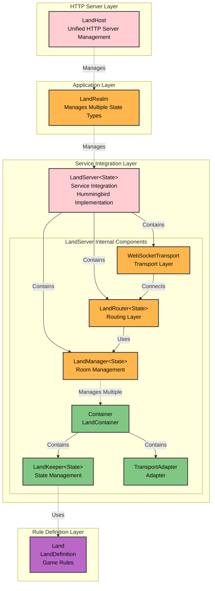

[English](architecture.md) | [中文版](architecture.zh-TW.md)

# Architecture Layers

This document describes SwiftStateTree's component layered architecture, and the responsibilities and relationships of each component (LandKeeper, LandManager, LandServer, etc.).

## Layered Architecture

### Layer Hierarchy (Top to Bottom)

```
LandHost                    → HTTP Server Layer (unified management of Application and Router)
    ↓
LandRealm                  → Application Layer (manages all land types and State types, unified entry)
    ↓
LandServer<State>          → Game Type Layer (serves all lands of one State type, can span machines)
    ↓
LandManager<State>         → Room Management Layer (manages multiple rooms, distributed actor)
    ↓
LandRouter<State>          → Routing Layer (routes connections to correct room)
    ↓
LandKeeper<State>          → State Management Layer (single room state, distributed actor)
    ↓
Land (LandDefinition)      → Rule Definition Layer (game rules)
```

### Component Relationship Diagram



**Key Relationship Notes**:
- **LandServer contains LandManager**: LandServer **composes** (composition) LandManager, LandManager is a component of LandServer
- **LandRouter uses LandManager**: LandRouter depends on LandManager to query and create rooms
- **LandManager manages multiple Containers**: Each Container contains one LandKeeper and corresponding TransportAdapter

## Component Descriptions

### 1. Land (LandDefinition) - Rule Definition Layer

**Location**: `Sources/SwiftStateTree/Land/`

**Responsibilities**:
- Define game rules and business logic
- Define handlers: OnJoin, OnLeave, Actions, Events, Tick
- Define access control and sync rules

**Features**:
- Pure definition, contains no state
- No dependency on Transport, maintains portability
- Defined using Land DSL syntax

**Related Documentation**:
- [Land DSL](core/land-dsl.md)

### 2. LandKeeper<State> - State Management Layer

**Location**: `Sources/SwiftStateTree/Runtime/LandKeeper.swift`

**Responsibilities**:
- Manage single room's authoritative state (StateNode)
- Execute Land DSL defined handlers
- Handle player join/leave lifecycle
- Handle Action/Event requests
- Manage Tick scheduled tasks
- Coordinate state sync mechanism

**Features**:
- Uses `actor` to ensure thread-safety
- Operations within single room are serialized
- Operations across different rooms can execute in parallel
- Request-scoped LandContext: new Context created for each request

**Related Documentation**:
- [Runtime Operation](core/runtime.md)

### 3. LandRouter<State> - Routing Layer

**Location**: `Sources/SwiftStateTreeTransport/LandRouter.swift`

**Responsibilities**:
- WebSocket connection management
- Join routing (landType → Land)
- Session binding (sessionToBoundLandID)
- Message routing (forward based on bound landID)

**Features**:
- Manages all WebSocket connections
- Routes join requests to corresponding Land
- Maintains session to landID mapping

### 4. LandManager<State> - Room Management Layer

**Location**: `Sources/SwiftStateTreeTransport/LandManager.swift`

**Responsibilities**:
- Manage multiple room instances
- Provide room creation, query, destruction
- Support parallel execution of multiple rooms' Tick (using `withTaskGroup`)

**Features**:
- Uses `actor` to ensure thread-safety
- Supports dynamic room creation and destruction
- Provides method to tick all lands in parallel
- Internally uses `LandContainer` as room wrapper (internal implementation detail)
- **Framework-agnostic**: No dependency on any HTTP framework (like Hummingbird, Vapor, etc.)
- Pure business logic layer, only responsible for room management

**Key Methods**:
- `getOrCreateLand(landID:definition:initialState:)` - Get or create room
- `getLand(landID:)` - Query room
- `removeLand(landID:)` - Destroy room
- `listLands()` - List all rooms

### 5. LandServer<State> - Game Type Layer (Service Integration)

**Location**: `Sources/SwiftStateTreeHummingbird/LandServer.swift` (formerly `AppContainer`)

**Responsibilities**:
- **Integrate all components**: Combine LandManager, LandRouter, Transport, HTTP Framework together
- Serve all lands of one State type
- Can span machines (future distributed support)
- Unified service management entry

**Features**:
- **Contains `LandManager`**: LandServer **composes** (composition) LandManager, not inheritance
- **Hummingbird-specific implementation**: Implements `LandServerProtocol`, binds to Hummingbird HTTP framework
- Integrated components include:
  - `LandManager<State>` - Room management
  - `LandRouter<State>` - Routing layer
  - `WebSocketTransport` - WebSocket transport
  - Configuration and management features
- Supports both single-room and multi-room modes (currently unified to use multi-room mode via LandManager)
- Backward compatible with existing single-room API

**Related Documentation**:
- [Multi-Room Architecture Design](../../Notes/design/DESIGN_MULTI_ROOM_ARCHITECTURE.md)

### 6. LandRealm - Application Layer (Optional)

**Responsibilities**:
- Manage all land types and State types
- Unified entry, supports LandServer of multiple State types

**Features**:
- Can manage LandServers of different State types in the same application
- Provides unified registration and management mechanism

### 7. LandHost - HTTP Server Layer

**Location**: `Sources/SwiftStateTreeHummingbird/LandHost.swift`

**Responsibilities**:
- Unified management of Hummingbird `Application` and `Router`
- Resolve port conflict issues with multiple `LandServer` instances
- Support multiple `LandServer` instances of different State types registered to the same Host

**Features**:
- **Must use**: Currently all land types are registered through `LandHost.register()`
- Provides unified HTTP Server management
- Simplifies deployment process for multiple land types
- Supports multiple LandServers sharing the same HTTP Server

## Data Flow

### Connection & Routing Flow

```
Client
  ↓ WebSocket Connection
LandRouter (route connection)
  ↓ Join Request (landType + instanceId)
LandManager (query or create room)
  ↓ Through TransportAdapter
LandKeeper (execute Join Handler)
  ↓ Create PlayerSession
StateNode (update state)
```

### Action/Event Processing Flow

```
Client
  ↓ Action/Event Message
LandRouter (route based on sessionToBoundLandID)
  ↓ Forward to corresponding TransportAdapter
TransportAdapter (parse message)
  ↓ Call LandKeeper
LandKeeper (execute Handler)
  ↓ Update StateNode
SyncEngine (generate Diff)
  ↓ Return Response + Diff
Client
```

## Module Division

These components are distributed across different modules and can be divided into two categories:

### Framework-Agnostic Layer (System Layer)

These components don't depend on specific HTTP frameworks and can be implemented on different platforms:

| Component | Module | Description |
|-----------|--------|-------------|
| Land (LandDefinition) | SwiftStateTree | Core module, rule definition |
| LandKeeper | SwiftStateTree | Core module, state management |
| LandRouter | SwiftStateTreeTransport | Transport module, routing |
| LandManager | SwiftStateTreeTransport | Transport module, room management |
| LandServerProtocol | SwiftStateTreeTransport | Transport module, service protocol abstraction |
| LandRealm | SwiftStateTreeTransport | Transport module, application layer management (optional) |

### Platform Implementation Layer (Framework-Specific)

These components are implementations for specific HTTP frameworks:

| Component | Module | Description |
|-----------|--------|-------------|
| LandServer | SwiftStateTreeHummingbird | Hummingbird implementation, implements `LandServerProtocol` |
| LandHost | SwiftStateTreeHummingbird | Hummingbird integration, HTTP Server management (optional) |

**Design Notes**:
- **Framework-Agnostic Layer**: Defines protocols and abstractions (like `LandServerProtocol`), provides framework-agnostic core functionality (like `LandManager`, `LandRouter`)
- **Platform Implementation Layer**: Implementations for specific HTTP frameworks (currently Hummingbird), can be extended to support other frameworks like Vapor, Kitura in the future
- **Protocol Abstraction**: `LandServerProtocol` defines service integration interface, different frameworks can implement their own `LandServer` to satisfy protocol requirements

## Design Principles

1. **Clear Layering**: From rule definition to application layer, each layer has clear responsibilities
2. **Separation of Framework-Agnostic and Platform Implementation**:
   - **Framework-Agnostic Layer** (SwiftStateTreeTransport): Defines protocols and core functionality, no dependency on specific HTTP frameworks
   - **Platform Implementation Layer** (SwiftStateTreeHummingbird): Implementation for specific frameworks, can be extended to support other frameworks
   - Achieve abstraction through protocols (like `LandServerProtocol`), allowing different frameworks to provide their own implementations
3. **Consistent Naming**: All components start with "Land", maintaining naming consistency
4. **Protocol Abstraction**: Use Protocol to define interfaces, supporting future distributed actor replacement and multi-framework support
5. **Transport Isolation**: Land layer doesn't depend on Transport, maintains portability
6. **Actor Serialization**: Use Swift Actor to ensure thread safety

## Related Documentation

- [Overview](overview.md) - System overview
- [Runtime Operation](core/runtime.md) - LandKeeper detailed description
- [Transport Layer](transport/README.md) - Transport layer detailed description
- [Multi-Room Architecture Design](../../Notes/design/DESIGN_MULTI_ROOM_ARCHITECTURE.md) - Multi-room architecture design document
- [System Architecture Design](../../Notes/design/DESIGN_SYSTEM_ARCHITECTURE.md) - System architecture design document
