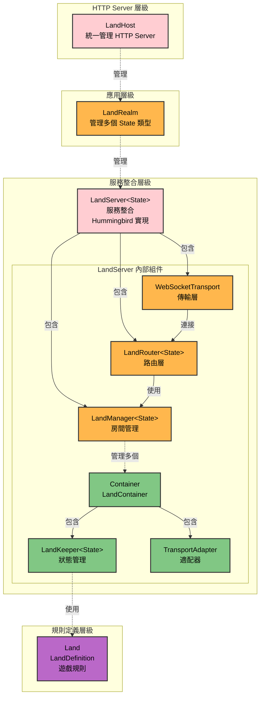

# 架構分層

本文檔說明 SwiftStateTree 的組件分層架構，以及各個組件（LandKeeper、LandManager、LandServer 等）的職責和關係。

## 分層架構

### 層級關係（從上到下）

```
LandHost                    → HTTP Server 層級（統一管理 Application 和 Router）
    ↓
LandRealm                  → 應用層級（管理所有 land types 和 State 類型，統一入口）
    ↓
LandServer<State>          → 遊戲類型層級（服務一個 State 類型的所有 lands，可跨機器）
    ↓
LandManager<State>         → 房間管理層級（管理多個房間，distributed actor）
    ↓
LandRouter<State>          → 路由層級（路由連線到正確的房間）
    ↓
LandKeeper<State>          → 狀態管理層級（單一房間的狀態，distributed actor）
    ↓
Land (LandDefinition)      → 規則定義層級（遊戲規則）
```

### 組件關係圖



**關鍵關係說明**：
- **LandServer 包含 LandManager**：LandServer **組合**（composition）LandManager，LandManager 是 LandServer 的一個組件
- **LandRouter 使用 LandManager**：LandRouter 依賴 LandManager 來查詢和創建房間
- **LandManager 管理多個 Container**：每個 Container 包含一個 LandKeeper 和對應的 TransportAdapter

## 組件說明

### 1. Land (LandDefinition) - 規則定義層

**位置**：`Sources/SwiftStateTree/Land/`

**職責**：
- 定義遊戲規則和業務邏輯
- 定義 handlers：OnJoin、OnLeave、Actions、Events、Tick
- 定義存取控制和同步規則

**特點**：
- 純定義，不包含狀態
- 不依賴 Transport，維持可移植性
- 使用 Land DSL 語法定義

**相關文檔**：
- [Land DSL](../docs/core/land-dsl.md)

### 2. LandKeeper<State> - 狀態管理層

**位置**：`Sources/SwiftStateTree/Runtime/LandKeeper.swift`

**職責**：
- 管理單一房間的權威狀態（StateNode）
- 執行 Land DSL 定義的處理器
- 處理玩家加入/離開生命週期
- 處理 Action/Event 請求
- 管理 Tick 定時任務
- 協調狀態同步機制

**特點**：
- 使用 `actor` 確保 thread-safety
- 單一房間內的操作會序列化執行
- 不同房間的操作可以並行執行
- Request-scoped LandContext：每次請求建立新的 Context

**相關文檔**：
- [Runtime 運作機制](../docs/core/runtime.md)

### 3. LandRouter<State> - 路由層級

**位置**：`Sources/SwiftStateTreeTransport/LandRouter.swift`

**職責**：
- WebSocket 連線管理
- Join 路由（landType → Land）
- Session 綁定（sessionToBoundLandID）
- 消息路由（根據綁定的 landID 轉發）

**特點**：
- 管理所有 WebSocket 連線
- 路由 join 請求到對應的 Land
- 維護 session 到 landID 的映射

### 4. LandManager<State> - 房間管理層級

**位置**：`Sources/SwiftStateTreeTransport/LandManager.swift`

**職責**：
- 管理多個房間實例
- 提供房間的建立、查詢、銷毀
- 支援並行執行多個房間的 Tick（使用 `withTaskGroup`）

**特點**：
- 使用 `actor` 確保 thread-safety
- 支援動態建立和銷毀房間
- 提供並行 tick 所有 lands 的方法
- 內部使用 `LandContainer` 作為房間的包裝器（內部實現細節）
- **框架無關**：不依賴任何 HTTP 框架（如 Hummingbird、Vapor 等）
- 純業務邏輯層，只負責房間管理

**關鍵方法**：
- `getOrCreateLand(landID:definition:initialState:)` - 取得或創建房間
- `getLand(landID:)` - 查詢房間
- `removeLand(landID:)` - 銷毀房間
- `listLands()` - 列出所有房間

### 5. LandServer<State> - 遊戲類型層級（服務整合）

**位置**：`Sources/SwiftStateTreeHummingbird/LandServer.swift`（舊名為 `AppContainer`）

**職責**：
- **整合所有組件**：將 LandManager、LandRouter、Transport、HTTP Framework 組合在一起
- 服務一個 State 類型的所有 lands
- 可跨機器（未來支援 distributed）
- 統一的服務管理入口

**特點**：
- **包含 `LandManager`**：LandServer **組合**（composition）LandManager，而非繼承關係
- **Hummingbird 特定實現**：實現 `LandServerProtocol`，綁定 Hummingbird HTTP 框架
- 整合組件包括：
  - `LandManager<State>` - 房間管理
  - `LandRouter<State>` - 路由層
  - `WebSocketTransport` - WebSocket 傳輸
  - 配置和管理功能
- 支援單房間和多房間兩種模式（目前統一使用多房間模式，透過 LandManager）
- 向後兼容現有的單房間 API

**相關文檔**：
- [多房間架構設計](../../Notes/design/DESIGN_MULTI_ROOM_ARCHITECTURE.md)

### 6. LandRealm - 應用層級（可選）

**職責**：
- 管理所有 land types 和 State 類型
- 統一入口，支援多種 State 類型的 LandServer

**特點**：
- 可以在同一個應用中管理多種不同 State 類型的 LandServer
- 提供統一的註冊和管理機制

### 7. LandHost - HTTP Server 層級

**位置**：`Sources/SwiftStateTreeHummingbird/LandHost.swift`

**職責**：
- 統一管理 Hummingbird `Application` 和 `Router`
- 解決多個 `LandServer` 實例端口衝突問題
- 支援多個不同 State 類型的 `LandServer` 註冊到同一個 Host

**特點**：
- **必須使用**：目前所有 land type 都通過 `LandHost.register()` 註冊
- 提供統一的 HTTP Server 管理
- 簡化多 land type 的部署流程
- 支援多個 LandServer 共用同一個 HTTP Server

## 資料流

### 連線與路由流程

```
Client
  ↓ WebSocket 連線
LandRouter (路由連線)
  ↓ Join Request (landType + instanceId)
LandManager (查詢或創建房間)
  ↓ 透過 TransportAdapter
LandKeeper (執行 Join Handler)
  ↓ 建立 PlayerSession
StateNode (更新狀態)
```

### Action/Event 處理流程

```
Client
  ↓ Action/Event Message
LandRouter (根據 sessionToBoundLandID 路由)
  ↓ 轉發到對應的 TransportAdapter
TransportAdapter (解析訊息)
  ↓ 呼叫 LandKeeper
LandKeeper (執行 Handler)
  ↓ 更新 StateNode
SyncEngine (生成 Diff)
  ↓ 回傳 Response + Diff
Client
```

## 模組劃分

這些組件分佈在不同的模組中，並可以分為兩大類：

### 框架無關層（系統層）

這些組件不依賴特定的 HTTP 框架，可以在不同平台上實現：

| 組件 | 模組 | 說明 |
|------|------|------|
| Land (LandDefinition) | SwiftStateTree | 核心模組，規則定義 |
| LandKeeper | SwiftStateTree | 核心模組，狀態管理 |
| LandRouter | SwiftStateTreeTransport | Transport 模組，路由 |
| LandManager | SwiftStateTreeTransport | Transport 模組，房間管理 |
| LandServerProtocol | SwiftStateTreeTransport | Transport 模組，服務協議抽象 |
| LandRealm | SwiftStateTreeTransport | Transport 模組，應用層管理（可選） |

### 平台實現層（框架特定）

這些組件是特定 HTTP 框架的實現：

| 組件 | 模組 | 說明 |
|------|------|------|
| LandServer | SwiftStateTreeHummingbird | Hummingbird 實現，實現 `LandServerProtocol` |
| LandHost | SwiftStateTreeHummingbird | Hummingbird 整合，HTTP Server 管理（可選） |

**設計說明**：
- **框架無關層**：定義協議和抽象（如 `LandServerProtocol`），提供框架無關的核心功能（如 `LandManager`、`LandRouter`）
- **平台實現層**：針對特定 HTTP 框架（目前為 Hummingbird）的實現，未來可擴展支援 Vapor、Kitura 等其他框架
- **協議抽象**：`LandServerProtocol` 定義了服務整合的介面，不同框架可以實現自己的 `LandServer` 來滿足協議要求

## 設計原則

1. **分層清晰**：從規則定義到應用層級，每層職責明確
2. **框架無關與平台實現分離**：
   - **框架無關層**（SwiftStateTreeTransport）：定義協議和核心功能，不依賴特定 HTTP 框架
   - **平台實現層**（SwiftStateTreeHummingbird）：針對特定框架的實現，可擴展支援其他框架
   - 通過協議（如 `LandServerProtocol`）實現抽象，允許不同框架提供自己的實現
3. **命名一致**：所有組件都以 "Land" 開頭，保持命名一致性
4. **協議抽象**：使用 Protocol 定義介面，支援未來 distributed actor 替換和多框架支援
5. **隔離 Transport**：Land 層不依賴 Transport，維持可移植性
6. **Actor 序列化**：使用 Swift Actor 確保線程安全

## 相關文檔

- [概觀](overview.md) - 系統整體介紹
- [Runtime 運作機制](core/runtime.md) - LandKeeper 詳細說明
- [Transport 層](transport/README.md) - Transport 層詳細說明
- [多房間架構設計](../../Notes/design/DESIGN_MULTI_ROOM_ARCHITECTURE.md) - 多房間架構設計文檔
- [系統架構設計](../../Notes/design/DESIGN_SYSTEM_ARCHITECTURE.md) - 系統架構設計文檔
