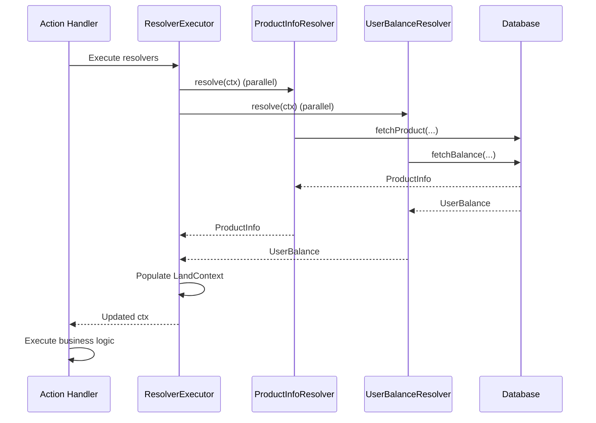

[English](resolver.md) | [中文版](resolver.zh-TW.md)

# Resolver Usage Guide

> Resolver mechanism allows parallel data loading before Action/Event handler execution, keeping handlers synchronous and focused on business logic.

## Overview

Resolver is SwiftStateTree's data loading mechanism, used to parallel load external data (databases, Redis, APIs, etc.) before Action/Event handler execution. This enables:

- **Keep handlers synchronous**: Handlers don't need to handle async operations
- **Parallel loading**: Multiple resolvers execute in parallel, improving performance
- **Error handling**: Any resolver failure aborts the entire processing flow
- **Type safety**: Provides type-safe access through `@dynamicMemberLookup`

## Core Concepts

### Resolver Definition

Resolver must implement `ContextResolver` protocol:

```swift
struct ProductInfoResolver: ContextResolver {
    typealias Output = ProductInfo
    
    static func resolve(ctx: ResolverContext) async throws -> ProductInfo {
        // Get parameters from Action payload
        let action = ctx.actionPayload as? UpdateCartAction
        guard let productID = action?.productID else {
            throw ResolverError.missingParameter("productID")
        }
        
        // Load data (can be database, API, etc.)
        let data = try await ctx.services.database.fetchProduct(by: productID)
        
        return ProductInfo(
            id: data.id,
            name: data.name,
            price: data.price,
            stock: data.stock
        )
    }
}
```

### ResolverContext

`ResolverContext` provides information needed by resolver:

- `actionPayload`: Current Action's payload (if Action handler)
- `eventPayload`: Current Event's payload (if Event handler)
- `currentState`: Current State (read-only)
- `landContext`: Complete LandContext (includes playerID, services, etc.)
- `services`: External service abstraction (database, logging, etc.)

### ResolverOutput

Resolver output must implement `ResolverOutput` protocol:

```swift
struct ProductInfo: ResolverOutput, Codable, Sendable {
    let id: String
    let name: String
    let price: Double
    let stock: Int
}
```

## Usage

### Using in Action Handler

Declare resolver in Land DSL:

```swift
Rules {
    HandleAction(UpdateCartAction.self, resolvers: ProductInfoResolver.self) { state, action, ctx in
        // Resolver has already executed, can use directly
        let productInfo = ctx.productInfo  // Type: ProductInfo?
        
        guard let product = productInfo else {
            // Theoretically won't happen, as resolver failure aborts handler
            return UpdateCartResponse(success: false)
        }
        
        // Use resolver result
        if product.stock > 0 {
            state.cart.items.append(CartItem(
                productID: product.id,
                name: product.name,
                price: product.price
            ))
            return UpdateCartResponse(success: true)
        } else {
            return UpdateCartResponse(success: false, message: "Out of stock")
        }
    }
}
```

### Using in Event Handler

Event handlers can also use resolvers:

```swift
Rules {
    HandleEvent(ChatEvent.self, resolvers: UserProfileResolver.self) { state, event, ctx in
        // Resolver has already executed
        let userProfile = ctx.userProfile  // Type: UserProfile?
        
        if let profile = userProfile {
            state.messages.append(Message(
                playerID: ctx.playerID,
                displayName: profile.displayName,
                message: event.message
            ))
        }
    }
}
```

### Multiple Resolvers

Can use multiple resolvers simultaneously, they execute in parallel:

```swift
Rules {
    HandleAction(
        PurchaseAction.self,
        resolvers: (ProductInfoResolver.self, UserBalanceResolver.self)
    ) { state, action, ctx in
        // Both resolvers have executed in parallel
        let productInfo = ctx.productInfo
        let userBalance = ctx.userBalance
        
        guard let product = productInfo, let balance = userBalance else {
            return PurchaseResponse(success: false)
        }
        
        // Check balance
        if balance.amount >= product.price {
            balance.amount -= product.price
            state.purchases.append(Purchase(
                productID: product.id,
                price: product.price,
                timestamp: Date()
            ))
            return PurchaseResponse(success: true)
        } else {
            return PurchaseResponse(success: false, message: "Insufficient balance")
        }
    }
}
```

## Execution Flow

### Parallel Execution

All declared resolvers execute in parallel:



### Execution Order

1. **Create ResolverContext**: Runtime creates context for each resolver
2. **Parallel Execution**: All resolvers execute `resolve(ctx:)` in parallel
3. **Collect Results**: Wait for all resolvers to complete
4. **Populate LandContext**: Put results into corresponding fields of `LandContext`
5. **Execute Handler**: Handler can synchronously access resolver results

### Property Name Conversion

Resolver type names are automatically converted to property names:

- `ProductInfoResolver` → `ctx.productInfo`
- `UserBalanceResolver` → `ctx.userBalance`
- `ShopConfigResolver` → `ctx.shopConfig`

Conversion rule: Remove `Resolver` suffix, convert first letter to lowercase.

## Error Handling

### Resolver Errors

When resolver execution fails:

1. **All resolvers cancelled**: If any resolver fails, other parallel resolvers are automatically cancelled
2. **Error wrapped**: Error is wrapped in `ResolverExecutionError`, including resolver name
3. **Handler not executed**: If resolver fails, handler doesn't execute
4. **Error sent to client**: Error is automatically converted to `ErrorPayload` and sent to client

### Error Types

#### ResolverError

Predefined resolver errors:

```swift
public enum ResolverError: Error, Sendable {
    case missingParameter(String)      // Missing required parameter
    case dataLoadFailed(String)        // Data load failed
    case cancelled                     // Execution cancelled
    case custom(String)                // Custom error
}
```

#### ResolverExecutionError

Executor-level error:

```swift
public enum ResolverExecutionError: Error, Sendable {
    case resolverFailed(name: String, underlyingError: Error)
}
```

### Error Handling Example

```swift
struct ProductInfoResolver: ContextResolver {
    typealias Output = ProductInfo
    
    static func resolve(ctx: ResolverContext) async throws -> ProductInfo {
        let action = ctx.actionPayload as? UpdateCartAction
        guard let productID = action?.productID else {
            throw ResolverError.missingParameter("productID")
        }
        
        // Check cache
        let state = ctx.currentState as? GameState
        if let cached = state?.productCache[productID] {
            return cached
        }
        
        // Load from database
        do {
            let data = try await ctx.services.database.fetchProduct(by: productID)
            return ProductInfo(from: data)
        } catch DatabaseError.notFound {
            throw ResolverError.dataLoadFailed("Product not found: \(productID)")
        } catch {
            throw ResolverError.dataLoadFailed("Failed to load: \(error.localizedDescription)")
        }
    }
}
```

## Best Practices

### 1. Use Cache

Check cache first in resolver to avoid unnecessary database queries:

```swift
static func resolve(ctx: ResolverContext) async throws -> ProductInfo {
    let productID = extractProductID(from: ctx)
    
    // Check cache first
    let state = ctx.currentState as? GameState
    if let cached = state?.productCache[productID] {
        return cached
    }
    
    // Cache miss, load from database
    let data = try await ctx.services.database.fetchProduct(by: productID)
    let product = ProductInfo(from: data)
    
    // Update cache (in handler)
    // state.productCache[productID] = product
    
    return product
}
```

### 2. Provide Clear Error Messages

Use descriptive error messages for easier debugging:

```swift
guard let productID = action?.productID else {
    throw ResolverError.missingParameter("productID is required for UpdateCartAction")
}

guard product.stock > 0 else {
    throw ResolverError.dataLoadFailed("Product \(productID) is out of stock")
}
```

### 3. Use Parallelism Appropriately

Separate independent data loading operations into different resolvers to leverage parallel execution:

```swift
// ✅ Good design: Two independent resolvers can execute in parallel
HandleAction(
    PurchaseAction.self,
    resolvers: (ProductInfoResolver.self, UserBalanceResolver.self)
) { state, action, ctx in
    // Both resolvers execute in parallel, total time = max(ProductInfo, UserBalance)
}

// ❌ Bad design: Sequential execution in one resolver
struct PurchaseDataResolver: ContextResolver {
    static func resolve(ctx: ResolverContext) async throws -> PurchaseData {
        let product = try await fetchProduct(...)  // Wait
        let balance = try await fetchBalance(...)  // Wait
        // Total time = Product + Balance
        return PurchaseData(product: product, balance: balance)
    }
}
```

### 4. Don't Modify State in Resolver

Resolvers should only read data, not modify state:

```swift
// ✅ Correct: Only read data
static func resolve(ctx: ResolverContext) async throws -> ProductInfo {
    let data = try await ctx.services.database.fetchProduct(by: productID)
    return ProductInfo(from: data)
}

// ❌ Wrong: Modify state in resolver
static func resolve(ctx: ResolverContext) async throws -> ProductInfo {
    var state = ctx.currentState as? GameState
    state?.productCache[productID] = product  // Shouldn't modify here
    return product
}
```

State modifications should be done in handlers.

### 5. Use Services Abstraction

Access external services through `ctx.services` to maintain testability:

```swift
static func resolve(ctx: ResolverContext) async throws -> ProductInfo {
    // Use services abstraction, don't directly depend on concrete implementation
    let data = try await ctx.services.database.fetchProduct(by: productID)
    return ProductInfo(from: data)
}
```

## Common Use Cases

### Use Case 1: Load Product Information

```swift
struct ProductInfoResolver: ContextResolver {
    typealias Output = ProductInfo
    
    static func resolve(ctx: ResolverContext) async throws -> ProductInfo {
        let action = ctx.actionPayload as? UpdateCartAction
        guard let productID = action?.productID else {
            throw ResolverError.missingParameter("productID")
        }
        
        // Load from database
        let data = try await ctx.services.database.fetchProduct(by: productID)
        return ProductInfo(from: data)
    }
}
```

### Use Case 2: Verify User Permissions

```swift
struct UserPermissionResolver: ContextResolver {
    typealias Output = UserPermission
    
    static func resolve(ctx: ResolverContext) async throws -> UserPermission {
        // Load user permissions from database
        let permission = try await ctx.services.database.fetchPermission(
            for: ctx.landContext.playerID
        )
        return UserPermission(from: permission)
    }
}

// Use in handler
HandleAction(AdminAction.self, resolvers: UserPermissionResolver.self) { state, action, ctx in
    guard let permission = ctx.userPermission, permission.isAdmin else {
        throw LandError.actionDenied("Admin access required")
    }
    // Execute admin operations
}
```

### Use Case 3: Load Multiple Related Data

```swift
// Define multiple resolvers
struct UserProfileResolver: ContextResolver { ... }
struct UserInventoryResolver: ContextResolver { ... }

// Use in handler
HandleAction(
    UpgradeItemAction.self,
    resolvers: (UserProfileResolver.self, UserInventoryResolver.self)
) { state, action, ctx in
    let profile = ctx.userProfile
    let inventory = ctx.userInventory
    
    // Use all resolver results
    // ...
}
```

## Related Documentation

- [Runtime Operation](runtime.md) - Understand how LandKeeper executes resolvers
- [Core Concepts](README.md) - Understand StateNode and Land DSL
- [Land DSL](land-dsl.md) - Understand how to use resolvers in Land DSL
