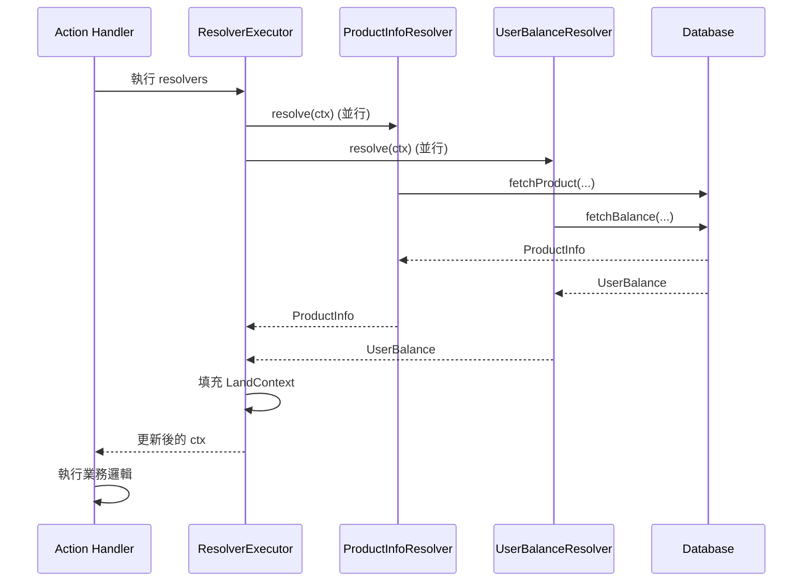

[English](resolver.md) | [中文版](resolver.zh-TW.md)

# Resolver 使用指南

> Resolver 機制允許在 Action/Event handler 執行前並行載入資料，讓 handler 保持同步並專注於業務邏輯。

## 概述

Resolver 是 SwiftStateTree 的資料載入機制，用於在 Action/Event handler 執行前並行載入外部資料（資料庫、Redis、API 等）。這樣可以：

- **保持 handler 同步**：handler 不需要處理 async 操作
- **並行載入**：多個 resolver 並行執行，提升效能
- **錯誤處理**：任何 resolver 失敗會中止整個處理流程
- **型別安全**：透過 `@dynamicMemberLookup` 提供型別安全的存取

## 核心概念

### Resolver 定義

Resolver 必須實作 `ContextResolver` protocol：

```swift
struct ProductInfoResolver: ContextResolver {
    typealias Output = ProductInfo
    
    static func resolve(ctx: ResolverContext) async throws -> ProductInfo {
        // 從 Action payload 取得參數
        let action = ctx.actionPayload as? UpdateCartAction
        guard let productID = action?.productID else {
            throw ResolverError.missingParameter("productID")
        }
        
        // 載入資料（可以是資料庫、API 等）
        let data = try await ctx.services.database.fetchProduct(by: productID)
        
        return ProductInfo(
            id: data.id,
            name: data.name,
            price: data.price,
            stock: data.stock
        )
    }
}
```

### ResolverContext

`ResolverContext` 提供 resolver 所需的資訊：

- `actionPayload`：當前 Action 的 payload（如果是 Action handler）
- `eventPayload`：當前 Event 的 payload（如果是 Event handler）
- `currentState`：當前的 State（只讀）
- `landContext`：完整的 LandContext（包含 playerID、services 等）
- `services`：外部服務抽象（資料庫、日誌等）

### ResolverOutput

Resolver 的輸出必須實作 `ResolverOutput` protocol：

```swift
struct ProductInfo: ResolverOutput, Codable, Sendable {
    let id: String
    let name: String
    let price: Double
    let stock: Int
}
```

## 使用方式

### 在 Action Handler 中使用

在 Land DSL 中宣告 resolver：

```swift
Rules {
    HandleAction(UpdateCartAction.self, resolvers: ProductInfoResolver.self) { state, action, ctx in
        // Resolver 已經執行完成，可以直接使用
        let productInfo = ctx.productInfo  // 型別：ProductInfo?
        
        guard let product = productInfo else {
            // 理論上不會發生，因為 resolver 失敗會中止 handler
            return UpdateCartResponse(success: false)
        }
        
        // 使用 resolver 的結果
        if product.stock > 0 {
            state.cart.items.append(CartItem(
                productID: product.id,
                name: product.name,
                price: product.price
            ))
            return UpdateCartResponse(success: true)
        } else {
            return UpdateCartResponse(success: false, message: "Out of stock")
        }
    }
}
```

### 在 Event Handler 中使用

Event handler 也可以使用 resolver：

```swift
Rules {
    HandleEvent(ChatEvent.self, resolvers: UserProfileResolver.self) { state, event, ctx in
        // Resolver 已經執行完成
        let userProfile = ctx.userProfile  // 型別：UserProfile?
        
        if let profile = userProfile {
            state.messages.append(Message(
                playerID: ctx.playerID,
                displayName: profile.displayName,
                message: event.message
            ))
        }
    }
}
```

### 多個 Resolver

可以同時使用多個 resolver，它們會並行執行：

```swift
Rules {
    HandleAction(
        PurchaseAction.self,
        resolvers: (ProductInfoResolver.self, UserBalanceResolver.self)
    ) { state, action, ctx in
        // 兩個 resolver 已經並行執行完成
        let productInfo = ctx.productInfo
        let userBalance = ctx.userBalance
        
        guard let product = productInfo, let balance = userBalance else {
            return PurchaseResponse(success: false)
        }
        
        // 檢查餘額
        if balance.amount >= product.price {
            balance.amount -= product.price
            state.purchases.append(Purchase(
                productID: product.id,
                price: product.price,
                timestamp: Date()
            ))
            return PurchaseResponse(success: true)
        } else {
            return PurchaseResponse(success: false, message: "Insufficient balance")
        }
    }
}
```

## 執行流程

### 並行執行

所有宣告的 resolver 會並行執行：



### 執行順序

1. **建立 ResolverContext**：Runtime 為每個 resolver 建立 context
2. **並行執行**：所有 resolver 並行執行 `resolve(ctx:)`
3. **收集結果**：等待所有 resolver 完成
4. **填充 LandContext**：將結果放入 `LandContext` 的對應欄位
5. **執行 Handler**：handler 可以同步存取 resolver 結果

### 屬性名稱轉換

Resolver 類型名稱會自動轉換為屬性名稱：

- `ProductInfoResolver` → `ctx.productInfo`
- `UserBalanceResolver` → `ctx.userBalance`
- `ShopConfigResolver` → `ctx.shopConfig`

轉換規則：移除 `Resolver` 後綴，首字母轉小寫。

## 錯誤處理

### Resolver 錯誤

當 resolver 執行失敗時：

1. **所有 resolver 被取消**：如果任何 resolver 失敗，其他並行的 resolver 會被自動取消
2. **錯誤被包裝**：錯誤會被包裝在 `ResolverExecutionError` 中，包含 resolver 名稱
3. **Handler 不執行**：如果 resolver 失敗，handler 不會執行
4. **錯誤傳送到客戶端**：錯誤會自動轉換為 `ErrorPayload` 並發送到客戶端

### 錯誤類型

#### ResolverError

預定義的 resolver 錯誤：

```swift
public enum ResolverError: Error, Sendable {
    case missingParameter(String)      // 缺少必要參數
    case dataLoadFailed(String)        // 資料載入失敗
    case cancelled                     // 執行被取消
    case custom(String)                // 自定義錯誤
}
```

#### ResolverExecutionError

執行器層級的錯誤：

```swift
public enum ResolverExecutionError: Error, Sendable {
    case resolverFailed(name: String, underlyingError: Error)
}
```

### 錯誤處理範例

```swift
struct ProductInfoResolver: ContextResolver {
    typealias Output = ProductInfo
    
    static func resolve(ctx: ResolverContext) async throws -> ProductInfo {
        let action = ctx.actionPayload as? UpdateCartAction
        guard let productID = action?.productID else {
            throw ResolverError.missingParameter("productID")
        }
        
        // 檢查快取
        let state = ctx.currentState as? GameState
        if let cached = state?.productCache[productID] {
            return cached
        }
        
        // 從資料庫載入
        do {
            let data = try await ctx.services.database.fetchProduct(by: productID)
            return ProductInfo(from: data)
        } catch DatabaseError.notFound {
            throw ResolverError.dataLoadFailed("Product not found: \(productID)")
        } catch {
            throw ResolverError.dataLoadFailed("Failed to load: \(error.localizedDescription)")
        }
    }
}
```

## 最佳實踐

### 1. 使用快取

在 resolver 中先檢查快取，避免不必要的資料庫查詢：

```swift
static func resolve(ctx: ResolverContext) async throws -> ProductInfo {
    let productID = extractProductID(from: ctx)
    
    // 先檢查快取
    let state = ctx.currentState as? GameState
    if let cached = state?.productCache[productID] {
        return cached
    }
    
    // 快取未命中，從資料庫載入
    let data = try await ctx.services.database.fetchProduct(by: productID)
    let product = ProductInfo(from: data)
    
    // 更新快取（在 handler 中）
    // state.productCache[productID] = product
    
    return product
}
```

### 2. 提供清晰的錯誤訊息

使用描述性的錯誤訊息，方便除錯：

```swift
guard let productID = action?.productID else {
    throw ResolverError.missingParameter("productID is required for UpdateCartAction")
}

guard product.stock > 0 else {
    throw ResolverError.dataLoadFailed("Product \(productID) is out of stock")
}
```

### 3. 合理使用並行

將獨立的資料載入操作分離到不同的 resolver，利用並行執行：

```swift
// ✅ 好的設計：兩個獨立的 resolver 可以並行執行
HandleAction(
    PurchaseAction.self,
    resolvers: (ProductInfoResolver.self, UserBalanceResolver.self)
) { state, action, ctx in
    // 兩個 resolver 並行執行，總時間 = max(ProductInfo, UserBalance)
}

// ❌ 不好的設計：在一個 resolver 中順序執行
struct PurchaseDataResolver: ContextResolver {
    static func resolve(ctx: ResolverContext) async throws -> PurchaseData {
        let product = try await fetchProduct(...)  // 等待
        let balance = try await fetchBalance(...)  // 等待
        // 總時間 = Product + Balance
        return PurchaseData(product: product, balance: balance)
    }
}
```

### 4. 不要在 Resolver 中修改狀態

Resolver 應該只讀取資料，不修改狀態：

```swift
// ✅ 正確：只讀取資料
static func resolve(ctx: ResolverContext) async throws -> ProductInfo {
    let data = try await ctx.services.database.fetchProduct(by: productID)
    return ProductInfo(from: data)
}

// ❌ 錯誤：在 resolver 中修改狀態
static func resolve(ctx: ResolverContext) async throws -> ProductInfo {
    var state = ctx.currentState as? GameState
    state?.productCache[productID] = product  // 不應該在這裡修改
    return product
}
```

狀態修改應該在 handler 中進行。

### 5. 使用 Services 抽象

透過 `ctx.services` 存取外部服務，保持可測試性：

```swift
static func resolve(ctx: ResolverContext) async throws -> ProductInfo {
    // 使用 services 抽象，不直接依賴具體實作
    let data = try await ctx.services.database.fetchProduct(by: productID)
    return ProductInfo(from: data)
}
```

## 常見使用場景

### 場景 1：載入產品資訊

```swift
struct ProductInfoResolver: ContextResolver {
    typealias Output = ProductInfo
    
    static func resolve(ctx: ResolverContext) async throws -> ProductInfo {
        let action = ctx.actionPayload as? UpdateCartAction
        guard let productID = action?.productID else {
            throw ResolverError.missingParameter("productID")
        }
        
        // 從資料庫載入
        let data = try await ctx.services.database.fetchProduct(by: productID)
        return ProductInfo(from: data)
    }
}
```

### 場景 2：驗證使用者權限

```swift
struct UserPermissionResolver: ContextResolver {
    typealias Output = UserPermission
    
    static func resolve(ctx: ResolverContext) async throws -> UserPermission {
        // 從資料庫載入使用者權限
        let permission = try await ctx.services.database.fetchPermission(
            for: ctx.landContext.playerID
        )
        return UserPermission(from: permission)
    }
}

// 在 handler 中使用
HandleAction(AdminAction.self, resolvers: UserPermissionResolver.self) { state, action, ctx in
    guard let permission = ctx.userPermission, permission.isAdmin else {
        throw LandError.actionDenied("Admin access required")
    }
    // 執行管理員操作
}
```

### 場景 3：載入多個相關資料

```swift
// 定義多個 resolver
struct UserProfileResolver: ContextResolver { ... }
struct UserInventoryResolver: ContextResolver { ... }

// 在 handler 中使用
HandleAction(
    UpgradeItemAction.self,
    resolvers: (UserProfileResolver.self, UserInventoryResolver.self)
) { state, action, ctx in
    let profile = ctx.userProfile
    let inventory = ctx.userInventory
    
    // 使用所有 resolver 的結果
    // ...
}
```

## 相關文檔

- [Runtime 運作機制](runtime.zh-TW.md) - 了解 LandKeeper 如何執行 resolver
- [核心概念](README.zh-TW.md) - 了解 StateNode 和 Land DSL
- [Land DSL](land-dsl.zh-TW.md) - 了解如何在 Land DSL 中使用 resolver

