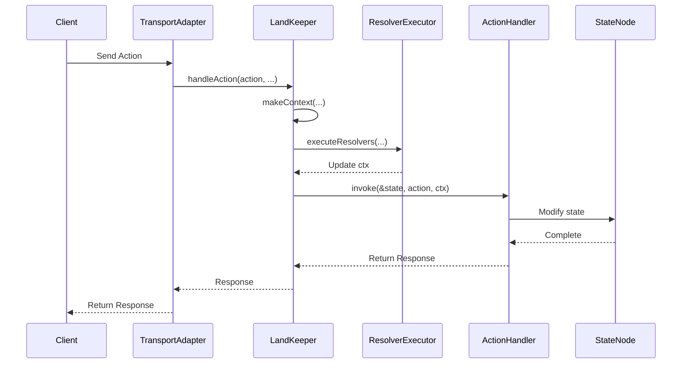

[English](runtime.md) | [中文版](runtime.zh-TW.md)

# Runtime Operation Mechanism

> LandKeeper is SwiftStateTree's runtime executor, responsible for managing state, executing handlers, and coordinating synchronization.

## Overview

`LandKeeper` is SwiftStateTree's core runtime component, managing the complete lifecycle of a single Land instance as an `actor`. It is responsible for:

- Managing authoritative state (StateNode)
- Executing Land-defined handlers (Action, Event, Tick)
- Handling player join/leave lifecycle
- Coordinating state synchronization mechanism
- Managing scheduled tasks (Tick) and auto-destruction

## Core Design

### Actor Serialization

`LandKeeper` is an `actor`, which means:

1. **Serialization within single room**: All operations within the same `LandKeeper` instance are serialized, ensuring state consistency
2. **Parallel execution across different rooms**: Each room has an independent `LandKeeper` instance and can execute in parallel

```swift
// Operations within the same room are serialized
await keeper.handleAction(action, playerID: playerID, ...)
await keeper.handleEvent(event, playerID: playerID, ...)

// Operations across different rooms can execute in parallel
await withTaskGroup(of: Void.self) { group in
    for room in rooms {
        group.addTask {
            await room.keeper.tick() // Parallel execution
        }
    }
}
```

### Snapshot Sync Mode

`LandKeeper` uses snapshot mode for synchronization, which is a non-blocking design:

- **Get snapshot when syncing**: Sync operations get a state snapshot at the start
- **Don't block changes**: State changes can proceed in parallel with synchronization
- **Consistency guarantee**: Actor serialization ensures each sync gets a consistent snapshot
- **Deduplication mechanism**: Concurrent sync requests are deduplicated to avoid duplicate work

```swift
// Sync flow
guard let state = await keeper.beginSync() else {
    // Another sync is in progress, skip (deduplication)
    return
}
defer { await keeper.endSync() }

// Use state snapshot for sync operations
// State changes can proceed in parallel at this time, won't block
```

## State Management

### State Changes

All state changes must go through `LandKeeper` methods:

```swift
// Change state in handler
HandleAction(SomeAction.self) { state, action, ctx in
    // state is inout parameter, can modify directly
    state.someField = action.value
    return SomeResponse()
}
```

`LandKeeper` uses `withMutableStateSync` to ensure thread safety of state changes:

```swift
// Internal implementation (simplified)
func withMutableStateSync<T>(_ operation: (inout State) throws -> T) rethrows -> T {
    // Actor serialization ensures thread safety
    return try operation(&state)
}
```

### State Reading

There are two ways to read state:

1. **Current state**: `currentState()` - Get snapshot of current state (read-only)
2. **Sync snapshot**: `beginSync()` - Snapshot obtained when starting sync operation

```swift
// Read current state (read-only)
let current = await keeper.currentState()

// Start sync (get snapshot)
guard let snapshot = await keeper.beginSync() else { return }
defer { await keeper.endSync() }
// Use snapshot for sync operations
```

## Request-Scoped LandContext

Each Action/Event request creates a new `LandContext`, which is released after processing. This is similar to NestJS's Request Context design pattern.

### LandContext Features

- **Request-level**: Each request creates a new `LandContext`
- **Not persistent**: Released after processing, doesn't retain state
- **Isolated Transport**: Through closure delegation, doesn't expose Transport details

```swift
// LandKeeper internally creates LandContext
func handleAction<A: ActionPayload>(_ action: A, ...) async throws -> AnyCodable {
    var ctx = makeContext(
        playerID: playerID,
        clientID: clientID,
        sessionID: sessionID
    )
    
    // Execute Resolver (if any)
    if !handler.resolverExecutors.isEmpty {
        ctx = try await ResolverExecutor.executeResolvers(...)
    }
    
    // Execute handler
    return try withMutableStateSync { state in
        try handler.invoke(&state, action: action, ctx: ctx)
    }
}
```

### LandContext Functions

`LandContext` provides the following functions:

- **Identification**: `playerID`, `clientID`, `sessionID`, `landID`
- **Service access**: `services` - External service abstraction (database, logging, etc.)
- **Event sending**: `sendEvent(_:to:)` - Send event to specified target
- **Manual sync**: `syncNow()` - Manually trigger state synchronization
- **Background tasks**: `spawn(_:)` - Execute asynchronous background tasks
- **Resolver output**: Access resolver results through `@dynamicMemberLookup`

## Handler Execution Flow

### Action Handler Flow



### Event Handler Flow

Event handler flow is similar, but has no return value:

```swift
// Event handler execution
func handleEvent<E: EventPayload>(_ event: E, ...) async {
    var ctx = makeContext(...)
    
    // Execute Resolver (if any)
    if !handler.resolverExecutors.isEmpty {
        ctx = try await ResolverExecutor.executeResolvers(...)
    }
    
    // Execute handler (no return value)
    try withMutableStateSync { state in
        try handler.invoke(&state, event: event, ctx: ctx)
    }
}
```

## Player Lifecycle

### Join Flow

Player joining has two phases:

1. **CanJoin**: Validation before joining (optional)
2. **OnJoin**: Processing after joining

```swift
// Join flow
public func join(session: PlayerSession, ...) async throws -> JoinDecision {
    // 1. Execute CanJoin handler (if defined)
    if let canJoinHandler = definition.lifetimeHandlers.canJoin {
        decision = try canJoinHandler(state, session, ctx)
    }
    
    // 2. If denied, return directly
    guard case .allow(let playerID) = decision else {
        return decision
    }
    
    // 3. Check player limit
    if let maxPlayers = definition.config.maxPlayers {
        guard players.count < maxPlayers else {
            throw JoinError.roomIsFull
        }
    }
    
    // 4. Execute OnJoin handler (if defined)
    if let onJoinHandler = definition.lifetimeHandlers.onJoin {
        // Execute Resolver (if any)
        // Execute handler
        try withMutableStateSync { state in
            try onJoinHandler(&state, ctx)
        }
    }
    
    return decision
}
```

### Leave Flow

When a player leaves, `OnLeave` handler is executed:

```swift
public func leave(playerID: PlayerID, ...) async throws {
    // Execute OnLeave handler (if defined)
    if let onLeaveHandler = definition.lifetimeHandlers.onLeave {
        try withMutableStateSync { state in
            try onLeaveHandler(&state, ctx)
        }
    }
    
    // Clean up player data
    players.removeValue(forKey: playerID)
    
    // Check if auto-destruction is needed
    checkAutoDestroy()
}
```

## Tick Mechanism

### Tick Configuration

Define Tick in Land DSL:

```swift
Lifetime {
    Tick(every: .milliseconds(100)) { state, ctx in
        // Execute every 100ms
        state.stepSimulation()
    }
}
```

### Tick Execution

`LandKeeper` automatically manages Tick tasks:

```swift
// Start Tick on initialization
Task {
    // Execute OnInitialize (if defined)
    if let onInitializeHandler = definition.lifetimeHandlers.onInitialize {
        await executeOnInitialize(handler: onInitializeHandler)
    }
    
    // Start Tick loop
    if let interval = definition.lifetimeHandlers.tickInterval {
        await configureTickLoop(interval: interval)
    }
}

// Tick loop
private func configureTickLoop(interval: Duration) async {
    tickTask = Task {
        while !Task.isCancelled {
            try? await Task.sleep(for: interval)
            
            // Execute Tick handler
            if let tickHandler = definition.lifetimeHandlers.tickHandler {
                try withMutableStateSync { state in
                    try tickHandler(&state, makeContext(...))
                }
            }
        }
    }
}
```

## Synchronization Mechanism

### Sync Flow

Synchronization uses snapshot mode, doesn't block state changes:

```swift
// Start sync
public func beginSync() -> State? {
    guard !isSyncing else {
        return nil  // Deduplication: skip concurrent sync requests
    }
    isSyncing = true
    return state  // Get snapshot directly, non-blocking
}

// End sync
public func endSync(clearDirtyFlags: Bool = true) {
    isSyncing = false
    if clearDirtyFlags {
        state.clearDirty()  // Clear dirty flags
    }
}
```

### Sync Deduplication

`isSyncing` flag is used for deduplication, not for blocking:

- When sync is in progress, concurrent sync requests are skipped
- State changes (Action/Event) are not blocked, can proceed in parallel
- Each sync gets a consistent snapshot (guaranteed by actor serialization)

### Dirty Tracking

State changes automatically mark dirty:

```swift
// In StateNode
@Sync(.broadcast)
var players: [PlayerID: PlayerState] = [:] {
    didSet {
        markDirty()  // Automatically mark dirty
    }
}
```

After sync completes, dirty flags can be cleared:

```swift
// Clear all dirty flags
state.clearDirty()
```

## Auto-Destruction

### Destruction Conditions

Define destruction conditions in Land DSL:

```swift
Lifetime {
    DestroyWhenEmpty(after: .seconds(60)) { state, ctx in
        // Destroy empty room after 60 seconds, can execute cleanup logic here
        ctx.logger.info("Land is empty, destroying...")
    }
}
```

### Destruction Check

`LandKeeper` checks destruction conditions at appropriate times:

```swift
// Check when player leaves
private func checkAutoDestroy() {
    if players.isEmpty {
        // Start destruction timer
        destroyTask = Task {
            try? await Task.sleep(for: destroyDelay)
            // Execute destruction logic
        }
    } else {
        // Player joined, cancel destruction
        destroyTask?.cancel()
        destroyTask = nil
    }
}
```

## Best Practices

1. **Avoid long-running handlers**: Handlers should execute quickly, use `ctx.spawn` for long operations
2. **Use Resolver appropriately**: Put data loading logic in Resolver, keep handlers synchronous
3. **Pay attention to state change scope**: Only change state in handlers, don't change in Resolver
4. **Leverage Actor serialization**: No need for additional locking mechanisms, actor automatically ensures thread safety

## Related Documentation

- [Core Concepts](README.md) - Understand StateNode and Land DSL
- [Sync Rules](sync.md) - Deep dive into sync mechanism
- [Resolver Mechanism](resolver.md) - Resolver usage guide
- [Transport Layer](../transport/README.md) - Understand how TransportAdapter interacts with LandKeeper
