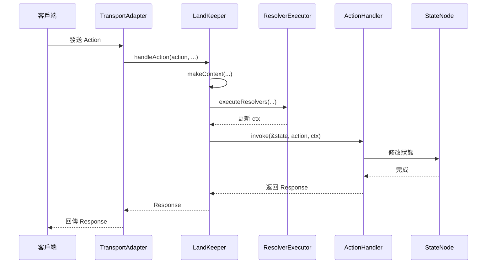

[English](runtime.md) | [中文版](runtime.zh-TW.md)

# Runtime 運作機制

> LandKeeper 是 SwiftStateTree 的運行時執行器，負責管理狀態、執行 handlers 和協調同步。

## 概述

`LandKeeper` 是 SwiftStateTree 的核心運行時組件，作為一個 `actor` 管理單一 Land 實例的完整生命週期。它負責：

- 管理權威狀態（StateNode）
- 執行 Land 定義的 handlers（Action、Event、Tick）
- 處理玩家加入/離開生命週期
- 協調狀態同步機制
- 管理定時任務（Tick）和自動銷毀

## 核心設計

### Actor 序列化

`LandKeeper` 是一個 `actor`，這意味著：

1. **單一房間內的序列化**：同一個 `LandKeeper` 實例內的所有操作會序列化執行，確保狀態一致性
2. **不同房間的並行執行**：每個房間有獨立的 `LandKeeper` 實例，可以並行執行

```swift
// 同一個房間內的操作會序列化
await keeper.handleAction(action, playerID: playerID, ...)
await keeper.handleEvent(event, playerID: playerID, ...)

// 不同房間的操作可以並行
await withTaskGroup(of: Void.self) { group in
    for room in rooms {
        group.addTask {
            await room.keeper.tick() // 並行執行
        }
    }
}
```

### Snapshot 同步模式

`LandKeeper` 使用 snapshot 模式進行同步，這是一個非阻塞的設計：

- **同步時取得快照**：同步操作在開始時取得狀態快照
- **不阻塞變更**：狀態變更可以與同步並行進行
- **一致性保證**：Actor 序列化確保每個同步都取得一致的快照
- **去重機制**：並發的同步請求會被去重，避免重複工作

```swift
// Sync 流程
guard let state = await keeper.beginSync() else {
    // 另一個同步正在進行，跳過（去重）
    return
}
defer { await keeper.endSync() }

// 使用 state 快照進行同步操作
// 此時狀態變更可以並行進行，不會阻塞
```

## 狀態管理

### 狀態變更

所有狀態變更都必須通過 `LandKeeper` 的方法進行：

```swift
// 在 handler 中變更狀態
HandleAction(SomeAction.self) { state, action, ctx in
    // state 是 inout 參數，可以直接修改
    state.someField = action.value
    return SomeResponse()
}
```

`LandKeeper` 使用 `withMutableStateSync` 來確保狀態變更的線程安全：

```swift
// 內部實作（簡化版）
func withMutableStateSync<T>(_ operation: (inout State) throws -> T) rethrows -> T {
    // Actor 序列化確保線程安全
    return try operation(&state)
}
```

### 狀態讀取

讀取狀態有兩種方式：

1. **當前狀態**：`currentState()` - 取得當前狀態的快照（只讀）
2. **同步快照**：`beginSync()` - 開始同步操作時取得的快照

```swift
// 讀取當前狀態（只讀）
let current = await keeper.currentState()

// 開始同步（取得快照）
guard let snapshot = await keeper.beginSync() else { return }
defer { await keeper.endSync() }
// 使用 snapshot 進行同步操作
```

## Request-Scoped LandContext

每次 Action/Event 請求都會建立一個新的 `LandContext`，處理完成後釋放。這類似於 NestJS 的 Request Context 設計模式。

### LandContext 特性

- **請求級別**：每個請求建立一個新的 `LandContext`
- **不持久化**：處理完成後釋放，不保留狀態
- **隔離 Transport**：透過閉包委派，不暴露 Transport 細節

```swift
// LandKeeper 內部建立 LandContext
func handleAction<A: ActionPayload>(_ action: A, ...) async throws -> AnyCodable {
    var ctx = makeContext(
        playerID: playerID,
        clientID: clientID,
        sessionID: sessionID
    )
    
    // 執行 Resolver（如果有的話）
    if !handler.resolverExecutors.isEmpty {
        ctx = try await ResolverExecutor.executeResolvers(...)
    }
    
    // 執行 handler
    return try withMutableStateSync { state in
        try handler.invoke(&state, action: action, ctx: ctx)
    }
}
```

### LandContext 功能

`LandContext` 提供以下功能：

- **識別資訊**：`playerID`、`clientID`、`sessionID`、`landID`
- **服務存取**：`services` - 外部服務抽象（資料庫、日誌等）
- **事件發送**：`sendEvent(_:to:)` - 發送事件給指定目標
- **手動同步**：`syncNow()` - 手動觸發狀態同步
- **背景任務**：`spawn(_:)` - 執行非同步背景任務
- **Resolver 輸出**：透過 `@dynamicMemberLookup` 存取 resolver 結果

## Handler 執行流程

### Action Handler 流程



### Event Handler 流程

Event handler 的流程類似，但沒有返回值：

```swift
// Event handler 執行
func handleEvent<E: EventPayload>(_ event: E, ...) async {
    var ctx = makeContext(...)
    
    // 執行 Resolver（如果有的話）
    if !handler.resolverExecutors.isEmpty {
        ctx = try await ResolverExecutor.executeResolvers(...)
    }
    
    // 執行 handler（無返回值）
    try withMutableStateSync { state in
        try handler.invoke(&state, event: event, ctx: ctx)
    }
}
```

## 玩家生命週期

### Join 流程

玩家加入有兩個階段：

1. **CanJoin**：加入前的驗證（可選）
2. **OnJoin**：加入後的處理

```swift
// Join 流程
public func join(session: PlayerSession, ...) async throws -> JoinDecision {
    // 1. 執行 CanJoin handler（如果定義）
    if let canJoinHandler = definition.lifetimeHandlers.canJoin {
        decision = try canJoinHandler(state, session, ctx)
    }
    
    // 2. 如果被拒絕，直接返回
    guard case .allow(let playerID) = decision else {
        return decision
    }
    
    // 3. 檢查人數上限
    if let maxPlayers = definition.config.maxPlayers {
        guard players.count < maxPlayers else {
            throw JoinError.roomIsFull
        }
    }
    
    // 4. 執行 OnJoin handler（如果定義）
    if let onJoinHandler = definition.lifetimeHandlers.onJoin {
        // 執行 Resolver（如果有的話）
        // 執行 handler
        try withMutableStateSync { state in
            try onJoinHandler(&state, ctx)
        }
    }
    
    return decision
}
```

### Leave 流程

玩家離開時會執行 `OnLeave` handler：

```swift
public func leave(playerID: PlayerID, ...) async throws {
    // 執行 OnLeave handler（如果定義）
    if let onLeaveHandler = definition.lifetimeHandlers.onLeave {
        try withMutableStateSync { state in
            try onLeaveHandler(&state, ctx)
        }
    }
    
    // 清理玩家資料
    players.removeValue(forKey: playerID)
    
    // 檢查是否需要自動銷毀
    checkAutoDestroy()
}
```

## Tick 機制

### Tick 設定

在 Land DSL 中定義 Tick：

```swift
Lifetime {
    Tick(every: .milliseconds(100)) { state, ctx in
        // 每 100ms 執行一次
        state.stepSimulation()
    }
}
```

### Tick 執行

`LandKeeper` 會自動管理 Tick 任務：

```swift
// 初始化時啟動 Tick
Task {
    // 執行 OnInitialize（如果定義）
    if let onInitializeHandler = definition.lifetimeHandlers.onInitialize {
        await executeOnInitialize(handler: onInitializeHandler)
    }
    
    // 啟動 Tick loop
    if let interval = definition.lifetimeHandlers.tickInterval {
        await configureTickLoop(interval: interval)
    }
}

// Tick loop
private func configureTickLoop(interval: Duration) async {
    tickTask = Task {
        while !Task.isCancelled {
            try? await Task.sleep(for: interval)
            
            // 執行 Tick handler
            if let tickHandler = definition.lifetimeHandlers.tickHandler {
                try withMutableStateSync { state in
                    try tickHandler(&state, makeContext(...))
                }
            }
        }
    }
}
```

## 同步機制

### 同步流程

同步使用 snapshot 模式，不阻塞狀態變更：

```swift
// 開始同步
public func beginSync() -> State? {
    guard !isSyncing else {
        return nil  // 去重：跳過並發的同步請求
    }
    isSyncing = true
    return state  // 直接取得快照，不阻塞
}

// 結束同步
public func endSync(clearDirtyFlags: Bool = true) {
    isSyncing = false
    if clearDirtyFlags {
        state.clearDirty()  // 清除 dirty 標記
    }
}
```

### 同步去重

`isSyncing` 標記用於去重，不是用於阻塞：

- 當同步進行中時，並發的同步請求會被跳過
- 狀態變更（Action/Event）不會被阻塞，可以並行進行
- 每個同步都取得一致的快照（actor 序列化保證）

### Dirty Tracking

狀態變更時會自動標記 dirty：

```swift
// 在 StateNode 中
@Sync(.broadcast)
var players: [PlayerID: PlayerState] = [:] {
    didSet {
        markDirty()  // 自動標記 dirty
    }
}
```

同步完成後可以選擇清除 dirty 標記：

```swift
// 清除所有 dirty 標記
state.clearDirty()
```

## 自動銷毀

### 銷毀條件

在 Land DSL 中定義銷毀條件：

```swift
Lifetime {
    DestroyWhenEmpty(after: .seconds(60)) { state, ctx in
        // 空房間 60 秒後銷毀，可在這裡執行清理邏輯
        ctx.logger.info("Land is empty, destroying...")
    }
}
```

### 銷毀檢查

`LandKeeper` 會在適當的時機檢查銷毀條件：

```swift
// 玩家離開時檢查
private func checkAutoDestroy() {
    if players.isEmpty {
        // 啟動銷毀計時器
        destroyTask = Task {
            try? await Task.sleep(for: destroyDelay)
            // 執行銷毀邏輯
        }
    } else {
        // 有玩家加入，取消銷毀
        destroyTask?.cancel()
        destroyTask = nil
    }
}
```

## 最佳實踐

1. **避免長時間運行的 handler**：handler 應該快速執行，長時間操作使用 `ctx.spawn`
2. **合理使用 Resolver**：將資料載入邏輯放在 Resolver 中，handler 保持同步
3. **注意狀態變更範圍**：只在 handler 中變更狀態，不要在 Resolver 中變更
4. **利用 Actor 序列化**：不需要額外的鎖機制，actor 自動保證線程安全

## 相關文檔

- [核心概念](README.zh-TW.md) - 了解 StateNode 和 Land DSL
- [同步規則](sync.zh-TW.md) - 深入了解同步機制
- [Resolver 機制](resolver.zh-TW.md) - Resolver 使用指南
- [Transport 層](../transport/README.zh-TW.md) - 了解 TransportAdapter 如何與 LandKeeper 互動

