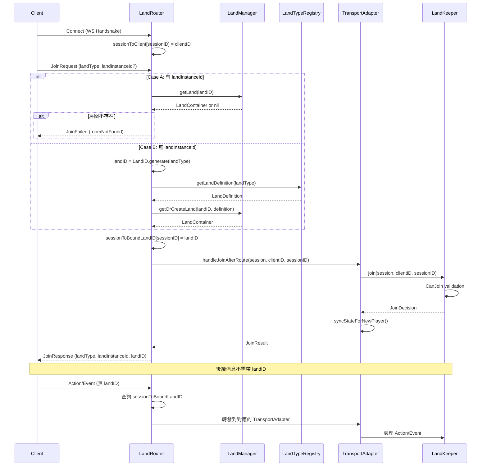

# LandRouter 與 Join 規格設計文檔 v1.0

> 本文檔說明 LandRouter 的架構設計與 Join 規格修改

## 版本歷史

| 版本 | 日期 | 說明 |
|------|------|------|
| v1.0 | 2024-12-14 | 初版：LandRouter 架構、LandID 結構化、Join 規格 |

---

## 目錄

1. [設計目標](#設計目標)
2. [核心元件職責](#核心元件職責)
3. [LandID 結構化設計](#landid-結構化設計)
4. [LandRouter 架構](#landrouter-架構)
5. [Join 規格](#join-規格)
6. [連線模型](#連線模型)
7. [元件交互流程](#元件交互流程)

---

## 設計目標

### 核心目標

1. **同一個 WebSocket endpoint 可服務多個 landType**（例如 lobby、game1、game2）
2. **一條 WS 連線只綁定一個 Land Instance**，降低路由複雜度
3. **Join 需要能指定 landType（必填）與 landInstanceId（可選）**

### 有意延後的功能

- joinOrCreate、createRoom、room list、matchmaking queue：屬於 **Lobby Land** 或 **MatchmakingService** 的上層能力

---

## 核心元件職責

### 架構分層圖

```
┌─────────────────────────────────────────────────────────────┐
│                    Hummingbird Server                        │
│                                                              │
│  WebSocket: wss://game.example.com/ws                       │
│                         │                                    │
│                         ▼                                    │
│  ┌────────────────────────────────────────────────────┐     │
│  │                   LandRouter                        │     │
│  │  • WS 連線管理 (onConnect / onDisconnect)           │     │
│  │  • Join 路由 (landType → Land)                     │     │
│  │  • Session 綁定 (sessionToBoundLandID)             │     │
│  │  • 消息路由 (根據綁定的 landID 轉發)                 │     │
│  └─────────────┬─────────────┬─────────────┬──────────┘     │
│                │             │             │                 │
│                ▼             ▼             ▼                 │
│  ┌─────────────────┐ ┌─────────────────┐ ┌─────────────────┐│
│  │ TransportAdapter │ │ TransportAdapter │ │ TransportAdapter ││
│  │   (lobby)        │ │   (game1)        │ │   (game2)        ││
│  └────────┬────────┘ └────────┬────────┘ └────────┬────────┘│
│           ▼                   ▼                   ▼          │
│  ┌─────────────────┐ ┌─────────────────┐ ┌─────────────────┐│
│  │   LandKeeper    │ │   LandKeeper    │ │   LandKeeper    ││
│  └─────────────────┘ └─────────────────┘ └─────────────────┘│
│                                                              │
│                   LandManager (管理所有 Land)                 │
└─────────────────────────────────────────────────────────────┘
```

### 元件職責表

| 元件 | 位置 | 職責 |
|------|------|------|
| **LandRouter** | SwiftStateTreeTransport | WS 連線管理、Join 路由、Session 綁定、消息路由 |
| **TransportAdapter** | SwiftStateTreeTransport | 協議轉換、CanJoin/OnJoin 處理、Initial Sync、Action/Event 處理 |
| **LandKeeper** | SwiftStateTree | 權威狀態管理、DSL Handler 執行、玩家生命週期 |
| **LandManager** | SwiftStateTreeTransport | Land 生命週期管理、getOrCreateLand、getLand |
| **LandTypeRegistry** | SwiftStateTreeTransport | landType → LandDefinition 映射、初始狀態工廠 |

---

## LandID 結構化設計

### 名詞定義

| 名詞 | 說明 | 範例 |
|------|------|------|
| **landType** | Land 類型，對應 LandDefinition | `lobby`, `game1`, `battle` |
| **landInstanceId** | 實例識別（等同 roomId） | `550e8400-e29b-41d4-a716-446655440000` |
| **landID** | 最終識別，格式 `landType:instanceId` | `game1:550e8400-e29b-41d4...` |

### LandID 結構

```swift
public struct LandID: Hashable, Codable, Sendable {
    public let landType: String
    public let instanceId: String
    
    /// 完整的 landID 字串
    public var rawValue: String {
        "\(landType):\(instanceId)"
    }
    
    /// 新的初始化方式
    public init(landType: String, instanceId: String) {
        self.landType = landType
        self.instanceId = instanceId
    }
    
    /// 從 rawValue 解析
    public init(_ rawValue: String) {
        if let colonIndex = rawValue.firstIndex(of: ":") {
            self.landType = String(rawValue[..<colonIndex])
            self.instanceId = String(rawValue[rawValue.index(after: colonIndex)...])
        } else {
            self.landType = ""
            self.instanceId = rawValue
        }
    }
    
    /// 產生新的 LandID（使用 UUID v4）
    public static func generate(landType: String) -> LandID {
        return LandID(landType: landType, instanceId: UUID().uuidString.lowercased())
    }
}
```

---

## LandRouter 架構

### 職責

1. **WS 連線管理**：處理 onConnect / onDisconnect
2. **Join 路由**：解析 landType + landInstanceId，決定目標 Land
3. **Session 綁定**：記錄 `sessionToBoundLandID[sessionID] = landID`
4. **消息路由**：根據綁定的 landID 轉發消息到對應的 TransportAdapter

### 核心介面

```swift
public actor LandRouter<State: StateNodeProtocol> {
    private let landManager: LandManager<State>
    private let landTypeRegistry: LandTypeRegistry<State>
    
    // Session 管理
    private var sessionToClient: [SessionID: ClientID] = [:]
    private var sessionToBoundLandID: [SessionID: LandID] = [:]
    
    // WS 連線管理
    public func onConnect(sessionID: SessionID, clientID: ClientID) async
    public func onDisconnect(sessionID: SessionID) async
    
    // 消息處理
    public func onMessage(_ message: Data, from sessionID: SessionID) async
}
```

### 消息處理流程

```
Client 消息 → LandRouter.onMessage()
    │
    ├── 是 JoinRequest？
    │   └── 是 → handleJoinRequest()
    │           ├── Case A (有 landInstanceId): 加入現有房間
    │           └── Case B (無 landInstanceId): 建立新房間
    │
    └── 否 → 查詢 sessionToBoundLandID
            └── 轉發到對應的 TransportAdapter
```

---

## Join 規格

### JoinRequest（Client → Server）

```swift
public struct TransportJoinPayload: Codable, Sendable {
    public let requestID: String
    public let landType: String           // 必填: Land 類型
    public let landInstanceId: String?    // 可選: 指定 instance
    public let playerID: String?
    public let deviceID: String?
    public let metadata: [String: AnyCodable]?
}
```

### Join 行為語義

#### Case A：指定 landInstanceId → 加入現有房間

```
landID = LandID(landType: landType, instanceId: landInstanceId)
land = LandManager.getLand(landID)

if land == nil:
    return JoinFailed(code: .joinRoomNotFound)  // 不隱式建立
else:
    進入 CanJoin 驗證 → allow/deny
```

#### Case B：未指定 landInstanceId → 建立新房間

```
landID = LandID.generate(landType: landType)
definition = LandTypeRegistry.getLandDefinition(landType)
initialState = LandTypeRegistry.initialStateFactory(landType, landID)
land = LandManager.getOrCreateLand(landID, definition, initialState)

進入 CanJoin 驗證 → allow/deny
成功後回傳 landInstanceId
```

### JoinResponse（Server → Client）

```swift
public struct TransportJoinResponsePayload: Codable, Sendable {
    public let requestID: String
    public let success: Bool
    public let landType: String?          // 加入的 landType
    public let landInstanceId: String?    // 加入的 instanceId
    public let landID: String?            // 完整 landID
    public let playerID: String?
    public let reason: String?
}
```

### 錯誤碼

```swift
public enum ErrorCode: String, Codable, Sendable {
    // 現有...
    case joinRoomNotFound = "join_room_not_found"
    case joinLandTypeNotFound = "join_land_type_not_found"
}
```

---

## 連線模型

### 規則 A：一個 WS 只能連一個 Land Instance

- WS 握手完成後，Client 發送 JoinRequest
- Join 成功後，LandRouter 綁定 `session.boundLandID`
- 後續 Action/Event **不需要帶 landID**（由 LandRouter 根據綁定路由）

### 規則 B：同一個路由可以包含多個 landType

- 例如固定 `wss://gameurl/ws`
- 透過 JoinRequest 的 landType 指定要加入的類型
- LandTypeRegistry 管理 landType → LandDefinition 映射

---

## 元件交互流程

### 完整 Join 流程



---

## 相關文件

- [DESIGN_SYSTEM_ARCHITECTURE.md](./DESIGN_SYSTEM_ARCHITECTURE.md) - 系統整體架構
- [DESIGN_TRANSPORT.md](./DESIGN_TRANSPORT.md) - Transport 層設計
- [DESIGN_MULTI_ROOM_ARCHITECTURE.md](./DESIGN_MULTI_ROOM_ARCHITECTURE.md) - 多房間架構
