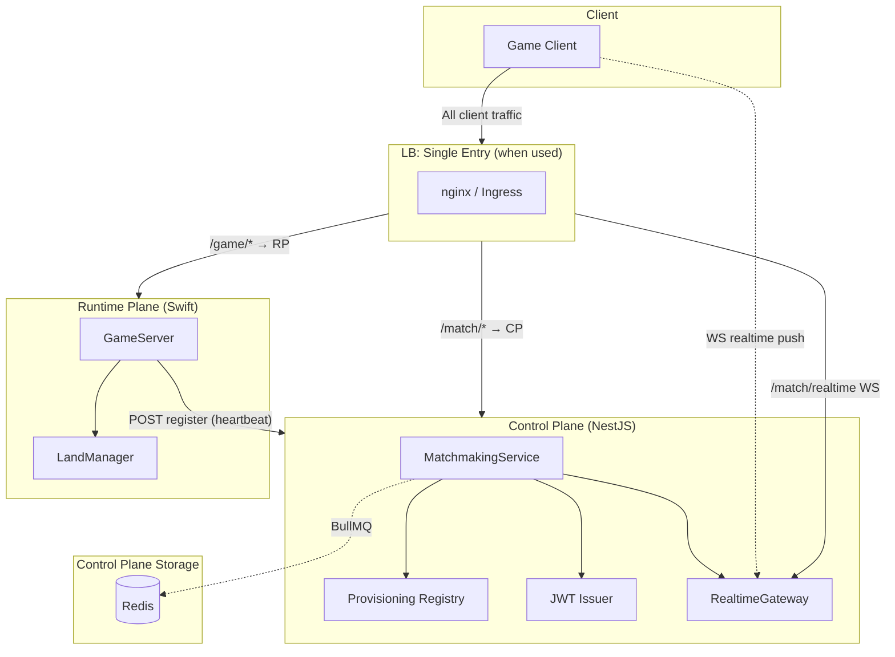
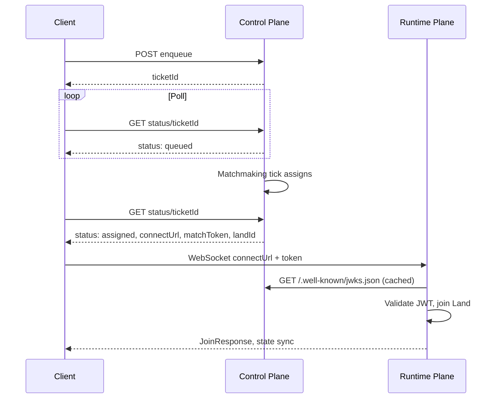

[English](matchmaking-two-plane.md) | [中文版](matchmaking-two-plane.zh-TW.md)

# Matchmaking Two-Plane Architecture

> **Status:** Describes the current MVP architecture (2026-02). Control plane (NestJS) + Runtime plane (Swift GameServer).

## Overview

The matchmaking system is split into two planes with clear responsibilities:

| Plane | Role | Technology | Responsibilities |
|-------|------|------------|------------------|
| **Control Plane** | Orchestration | NestJS | Queue, assignment, JWT issuance, server registry |
| **Runtime Plane** | Execution | Swift (GameServer) | Game state, WebSocket, Land lifecycle |

The control plane **does not** run game logic. The runtime plane **does not** manage matchmaking queue. They communicate via REST (provisioning) and share assignment data through the client.

---

## Architecture Diagram



**Without LB:** Client talks directly to Control Plane (REST + WebSocket `/realtime`) and GameServer (WebSocket) on their respective ports.

**With LB:** Client uses a **single entry point**. All traffic goes through the LB; the LB routes by path prefix.

**Phase 1 additions:** Redis (BullMQ queue and persistence), RealtimeGateway (WebSocket realtime `match.assigned` push).

---

## Control Plane

**Location:** `Packages/control-plane`

### Responsibilities

1. **Queue management**
   - `POST /v1/matchmaking/enqueue` – add group to queue, return `ticketId`
   - `GET /v1/matchmaking/status/:ticketId` – poll until `assigned`
   - `POST /v1/matchmaking/cancel` – cancel queued ticket

2. **Assignment lifecycle**
   - Periodic tick matches queued tickets with available servers
   - Calls internal provisioning client to allocate `landId` and `connectUrl`
   - Issues JWT (`matchToken`) for the assignment

3. **Server registry (provisioning)**
   - `POST /v1/provisioning/servers/register` – game servers register on startup + heartbeat
   - `DELETE /v1/provisioning/servers/:serverId` – deregister on shutdown
   - In-memory registry; allocate is internal (no external HTTP)

4. **Security**
   - JWT issuance for assignments
   - `GET /.well-known/jwks.json` – public keys for game server validation

### Does NOT

- Run game logic
- Hold WebSocket connections to clients
- Manage Land state

---

## Runtime Plane

**Location:** `Examples/GameDemo/Sources/GameServer`, `Sources/SwiftStateTreeNIO`, `Sources/SwiftStateTreeNIOProvisioning`

### Responsibilities

1. **Game execution**
   - LandManager, LandRouter, LandKeeper
   - WebSocket transport for game state sync
   - Tick loop, actions, events

2. **Provisioning registration**
   - `ProvisioningMiddleware` registers with control plane on startup
   - Heartbeat every 30s to stay in registry
   - Deregisters on shutdown

3. **Client connection**
   - Accepts WebSocket at `connectUrl` (from assignment)
   - Validates `matchToken` (JWT) via JWKS from control plane
   - Creates/joins Land by `landId`

### Does NOT

- Manage matchmaking queue
- Issue tokens
- Decide which server a client connects to (control plane does)

---

## Communication Between Planes

### Control Plane ← Runtime Plane (REST)

| Direction | Endpoint | Purpose |
|-----------|----------|---------|
| Runtime → Control | `POST /v1/provisioning/servers/register` | Register + heartbeat |
| Runtime → Control | `DELETE /v1/provisioning/servers/:serverId` | Deregister on shutdown |

**Payload (register):**

```json
{
  "serverId": "game-1",
  "host": "0.0.0.0",
  "port": 8080,
  "landType": "hero-defense",
  "connectHost": "localhost",
  "connectPort": 9090,
  "connectScheme": "ws"
}
```

- `host`, `port`: actual bind address (for control plane internal use)
- `connectHost`, `connectPort`, `connectScheme`: client-facing URL (used in assignment `connectUrl`)

When behind nginx LB, Runtime sets `connectHost`/`connectPort` to the LB address so clients connect via LB, not directly to the game server.

### Client ↔ Control Plane (REST)

| Direction | Endpoint | Purpose |
|-----------|----------|---------|
| Client → Control | `POST /v1/matchmaking/enqueue` | Join queue |
| Client → Control | `GET /v1/matchmaking/status/:ticketId` | Poll for assignment |
| Client → Control | `POST /v1/matchmaking/cancel` | Cancel ticket |

**With LB:** Client calls `{LB_BASE}/match/v1/matchmaking/...` (LB proxies `/match/*` to Control Plane).

### Client ↔ Runtime Plane (WebSocket)

| Direction | Purpose |
|-----------|---------|
| Client → Runtime | Connect at `connectUrl` with `token` query param |
| Runtime | Validates JWT, joins Land by `landId`, syncs state |

**With LB:** `connectUrl` uses LB host; client connects to `{LB_BASE}/game/hero-defense?...` (LB proxies `/game/*` to GameServer).

---

## Client Journey



1. Client enqueues → gets `ticketId`
2. Client polls status until `assigned`
3. Assignment contains `connectUrl`, `matchToken`, `landId`
4. Client connects WebSocket to `connectUrl` with token
5. Runtime validates JWT, joins Land, syncs state

---

## LB as Single Entry Point

When using a load balancer (nginx, K8s Ingress), **clients must not bypass the LB**. All client traffic goes through the LB, which routes by path prefix:

| Path prefix | Backend | Purpose |
|-------------|---------|---------|
| `/match` | Control Plane | Matchmaking REST API (enqueue, status, cancel), health, JWKS |
| `/match/realtime` | Control Plane | WebSocket for real-time match.assigned push (Phase 1) |
| `/game` | Runtime Plane | Game WebSocket (e.g. `/game/hero-defense`) |
| `/admin` | Runtime Plane | Admin routes (optional, API key protected) |

**Example client URLs (through LB at `game.example.com:443`):**

- Matchmaking: `https://game.example.com/match/v1/matchmaking/enqueue`
- Status poll: `https://game.example.com/match/v1/matchmaking/status/:ticketId`
- Realtime (WebSocket): `wss://game.example.com/match/realtime?ticketId=:ticketId`
- JWKS: `https://game.example.com/match/.well-known/jwks.json`
- Game WebSocket: `wss://game.example.com/game/hero-defense?landId=...&token=...`

The control plane and game server may run on different internal hosts; the LB hides this from the client.

---

## Deployment Phasing: nginx First, K8s Later

**Recommended approach:** Start with nginx (or similar LB) as a fixed routing layer, then migrate to Kubernetes when needed.

| Phase | Setup | Pros |
|-------|-------|------|
| **Phase A** | nginx as single entry, upstream to Control Plane + GameServer | Simple config, fast iteration, easy to debug |
| **Phase B** | Migrate to K8s | Replace nginx upstream with K8s Service; same routing logic applies |

Migration path: nginx config → K8s Ingress (e.g. nginx-ingress controller). The path-based routing (`/match/*`, `/game/*`) stays the same; only the upstream resolution changes.

---

## connectUrl and Load Balancer

When behind an LB, the Runtime Plane registers with `connectHost` and `connectPort` pointing to the LB. The `connectUrl` in the assignment uses the **same LB host** so the client connects via the single entry:

```
LB:                    game.example.com:443 (single entry)
  /match/*  → Control Plane (internal :3000)
  /game/*   → GameServer (internal :8080)

Runtime binds:        0.0.0.0:8080
connectUrl to client: wss://game.example.com/game/hero-defense?landId=...
```

| Scenario | connectHost | connectPort | connectUrl |
|----------|-------------|-------------|------------|
| Direct (no LB) | (omit) | (omit) | ws://host:8080/... |
| LB single entry | game.example.com | 443 | wss://game.example.com/game/... |

---

## Module Mapping

| Component | Package / Path |
|-----------|----------------|
| Control Plane | `Packages/control-plane` |
| Provisioning Middleware | `Sources/SwiftStateTreeNIOProvisioning` |
| GameServer | `Examples/GameDemo/Sources/GameServer` |
| NIO Host | `Sources/SwiftStateTreeNIO` |
| nginx config (E2E) | `docs/deploy/nginx-matchmaking-e2e.docker.conf` |

**Note:** The E2E nginx config (`docs/deploy/nginx-matchmaking-e2e.docker.conf`) implements single-entry: `/match/*` → Control Plane, `/game/*` → GameServer, `/admin/*` → GameServer.

---

## Related Documents

- [Matchmaking Control Plane Design](plans/2026-02-12-matchmaking-control-plane-design.md) – original design goals
- [Provisioning API Contract](contracts/provisioning-api.md) – REST contract
- [Matchmaking Control Plane MVP Runbook](operations/matchmaking-control-plane-mvp.md) – runbook
