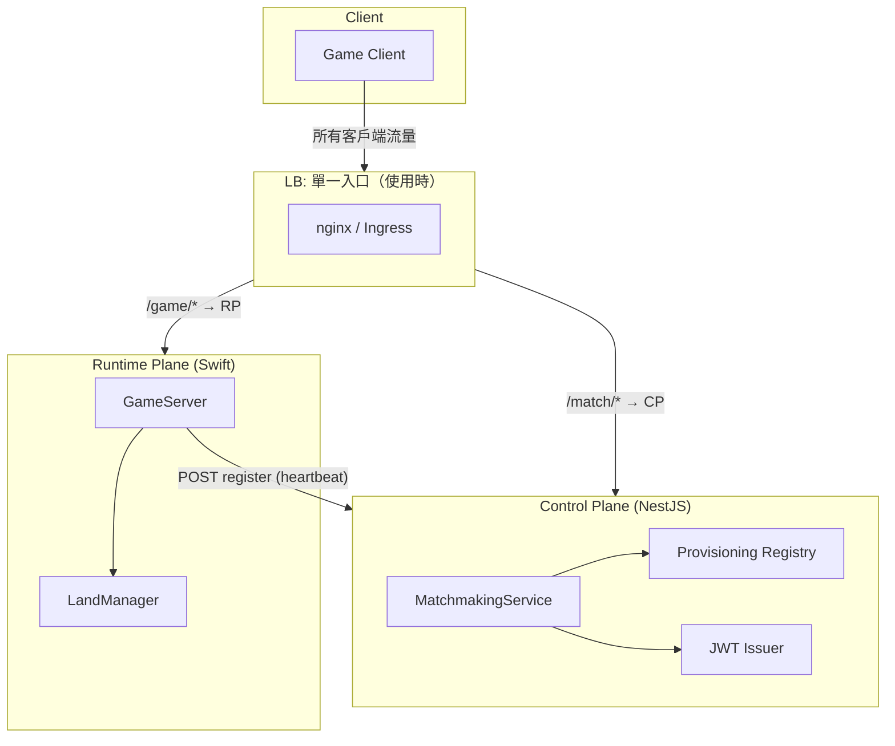
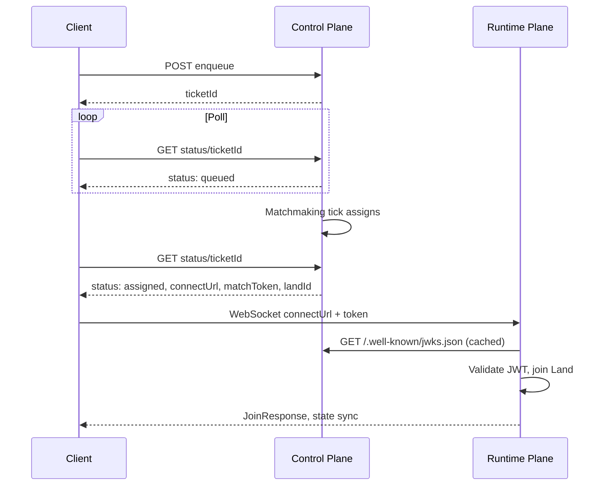

[English](matchmaking-two-plane.md) | [中文版](matchmaking-two-plane.zh-TW.md)

# 配對雙層架構

> **狀態：** 描述目前 MVP 架構（2026-02）。Control Plane（NestJS）+ Runtime Plane（Swift GameServer）。

## 概覽

配對系統分為兩層，職責明確：

| 層 | 角色 | 技術 | 職責 |
|----|------|------|------|
| **Control Plane** | 編排 | NestJS | 佇列、分配、JWT 發放、伺服器註冊 |
| **Runtime Plane** | 執行 | Swift (GameServer) | 遊戲狀態、WebSocket、Land 生命週期 |

Control Plane **不**執行遊戲邏輯。Runtime Plane **不**管理配對佇列。兩者透過 REST（provisioning）通訊，並透過客戶端傳遞分配資料。

---

## 架構圖



**無 LB 時：** 客戶端直接連線 Control Plane（REST）與 GameServer（WebSocket）的各自 port。

**有 LB 時：** 客戶端使用**單一入口**。所有流量經由 LB；LB 依路徑前綴轉發。

---

## Control Plane

**位置：** `Packages/matchmaking-control-plane`

### 職責

1. **佇列管理**
   - `POST /v1/matchmaking/enqueue` – 將隊伍加入佇列，回傳 `ticketId`
   - `GET /v1/matchmaking/status/:ticketId` – 輪詢直到 `assigned`
   - `POST /v1/matchmaking/cancel` – 取消排隊中的 ticket

2. **分配生命週期**
   - 週期性 tick 將排隊 ticket 與可用伺服器配對
   - 呼叫內部 provisioning client 分配 `landId` 與 `connectUrl`
   - 為分配發放 JWT（`matchToken`）

3. **伺服器註冊（provisioning）**
   - `POST /v1/provisioning/servers/register` – 遊戲伺服器啟動時註冊並定期 heartbeat
   - `DELETE /v1/provisioning/servers/:serverId` – 關閉時註銷
   - 記憶體儲存；allocate 為內部呼叫（無外部 HTTP）

4. **安全**
   - 為分配發放 JWT
   - `GET /.well-known/jwks.json` – 供遊戲伺服器驗證的公開金鑰

### 不負責

- 執行遊戲邏輯
- 維持與客戶端的 WebSocket 連線
- 管理 Land 狀態

---

## Runtime Plane

**位置：** `Examples/GameDemo/Sources/GameServer`、`Sources/SwiftStateTreeNIO`、`Sources/SwiftStateTreeNIOProvisioning`

### 職責

1. **遊戲執行**
   - LandManager、LandRouter、LandKeeper
   - WebSocket 傳輸用於遊戲狀態同步
   - Tick 迴圈、動作、事件

2. **Provisioning 註冊**
   - `ProvisioningMiddleware` 啟動時向 Control Plane 註冊
   - 每 30 秒 heartbeat 以維持註冊
   - 關閉時註銷

3. **客戶端連線**
   - 接受來自 assignment 的 `connectUrl` 連線
   - 透過 Control Plane 的 JWKS 驗證 `matchToken`（JWT）
   - 依 `landId` 建立或加入 Land

### 不負責

- 管理配對佇列
- 發放 token
- 決定客戶端連到哪台伺服器（由 Control Plane 決定）

---

## 兩層間通訊

### Control Plane ← Runtime Plane (REST)

| 方向 | 端點 | 用途 |
|------|------|------|
| Runtime → Control | `POST /v1/provisioning/servers/register` | 註冊與 heartbeat |
| Runtime → Control | `DELETE /v1/provisioning/servers/:serverId` | 關閉時註銷 |

**Payload（register）：**

```json
{
  "serverId": "game-1",
  "host": "0.0.0.0",
  "port": 8080,
  "landType": "hero-defense",
  "connectHost": "localhost",
  "connectPort": 9090,
  "connectScheme": "ws"
}
```

- `host`、`port`：實際綁定位址（供 Control Plane 內部使用）
- `connectHost`、`connectPort`、`connectScheme`：客戶端面向的 URL（用於 assignment 的 `connectUrl`）

當在 nginx LB 後方時，Runtime 設定 `connectHost`/`connectPort` 為 LB 位址，讓客戶端透過 LB 連線，而非直接連線遊戲伺服器。

### Client ↔ Control Plane (REST)

| 方向 | 端點 | 用途 |
|------|------|------|
| Client → Control | `POST /v1/matchmaking/enqueue` | 加入佇列 |
| Client → Control | `GET /v1/matchmaking/status/:ticketId` | 輪詢分配狀態 |
| Client → Control | `POST /v1/matchmaking/cancel` | 取消 ticket |

**有 LB 時：** 客戶端呼叫 `{LB_BASE}/match/v1/matchmaking/...`（LB 將 `/match/*` 轉發至 Control Plane）。

### Client ↔ Runtime Plane (WebSocket)

| 方向 | 用途 |
|------|------|
| Client → Runtime | 以 `connectUrl` 與 `token` query 參數連線 |
| Runtime | 驗證 JWT，依 `landId` 加入 Land，同步狀態 |

**有 LB 時：** `connectUrl` 使用 LB host；客戶端連線至 `{LB_BASE}/game/hero-defense?...`（LB 將 `/game/*` 轉發至 GameServer）。

---

## 客戶端流程



1. 客戶端 enqueue → 取得 `ticketId`
2. 客戶端輪詢 status 直到 `assigned`
3. Assignment 包含 `connectUrl`、`matchToken`、`landId`
4. 客戶端以 token 連線 WebSocket 至 `connectUrl`
5. Runtime 驗證 JWT，加入 Land，同步狀態

---

## LB 單一入口

使用負載平衡器（nginx、K8s Ingress）時，**客戶端不可繞過 LB**。所有客戶端流量經由 LB，LB 依路徑前綴轉發：

| 路徑前綴 | 後端 | 用途 |
|----------|------|------|
| `/match` | Control Plane | 配對 REST API（enqueue、status、cancel）、health、JWKS |
| `/game` | Runtime Plane | 遊戲 WebSocket（如 `/game/hero-defense`） |
| `/admin` | Runtime Plane | Admin 路由（可選，API key 保護） |

**範例客戶端 URL（經 LB `game.example.com:443`）：**

- 配對：`https://game.example.com/match/v1/matchmaking/enqueue`
- 輪詢狀態：`https://game.example.com/match/v1/matchmaking/status/:ticketId`
- JWKS：`https://game.example.com/match/.well-known/jwks.json`
- 遊戲 WebSocket：`wss://game.example.com/game/hero-defense?landId=...&token=...`

Control Plane 與 GameServer 可運行於不同內部 host；LB 對客戶端隱藏此拓樸。

---

## connectUrl 與負載平衡器

位於 LB 後方時，Runtime Plane 以指向 LB 的 `connectHost` 與 `connectPort` 註冊。Assignment 中的 `connectUrl` 使用**同一 LB host**，讓客戶端經由單一入口連線：

```
LB:                    game.example.com:443（單一入口）
  /match/*  → Control Plane（內部 :3000）
  /game/*   → GameServer（內部 :8080）

Runtime 綁定：        0.0.0.0:8080
客戶端 connectUrl：   wss://game.example.com/game/hero-defense?landId=...
```

| 情境 | connectHost | connectPort | connectUrl |
|------|-------------|-------------|------------|
| 直連（無 LB） | （省略） | （省略） | ws://host:8080/... |
| LB 單一入口 | game.example.com | 443 | wss://game.example.com/game/... |

---

## 模組對應

| 組件 | Package / 路徑 |
|------|----------------|
| Control Plane | `Packages/matchmaking-control-plane` |
| Provisioning Middleware | `Sources/SwiftStateTreeNIOProvisioning` |
| GameServer | `Examples/GameDemo/Sources/GameServer` |
| NIO Host | `Sources/SwiftStateTreeNIO` |
| nginx config (E2E) | `docs/deploy/nginx-matchmaking-e2e.docker.conf` |

**備註：** E2E nginx 設定（`docs/deploy/nginx-matchmaking-e2e.docker.conf`）已實作單一入口：`/match/*` → Control Plane，`/game/*` → GameServer，`/admin/*` → GameServer。

---

## 相關文件

- [Matchmaking Control Plane Design](plans/2026-02-12-matchmaking-control-plane-design.md) – 原始設計目標
- [Provisioning API Contract](contracts/provisioning-api.md) – REST 合約
- [Matchmaking Control Plane MVP Runbook](operations/matchmaking-control-plane-mvp.md) – 操作手冊
