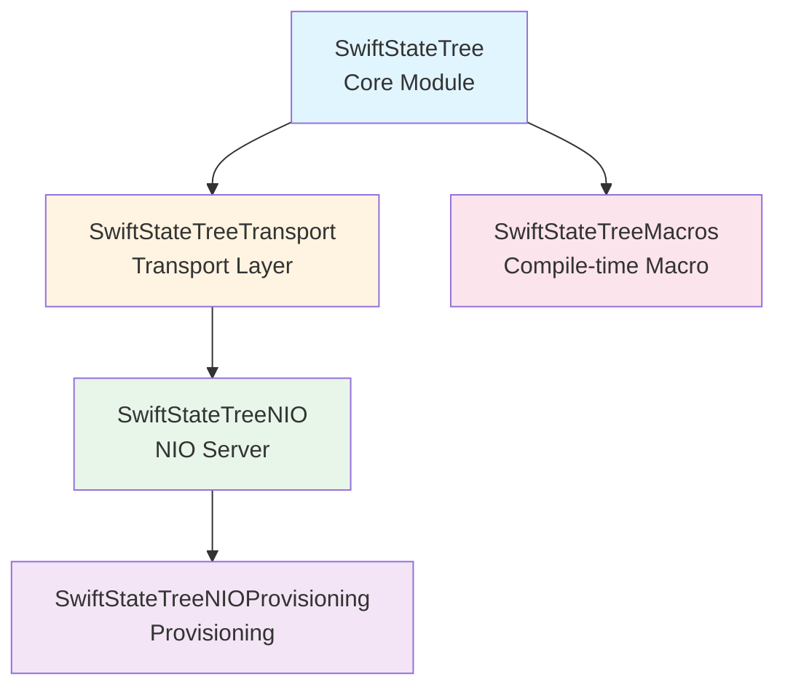
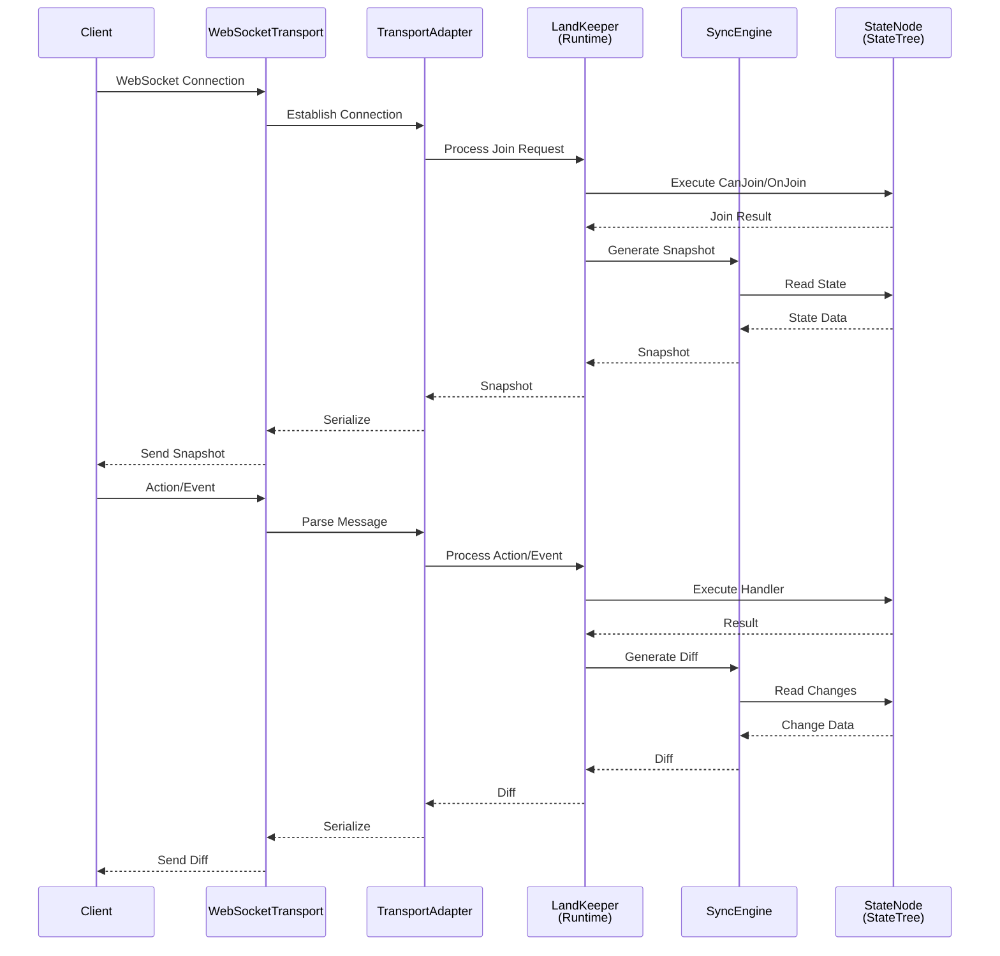
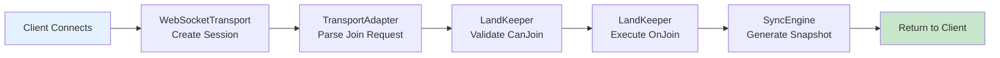
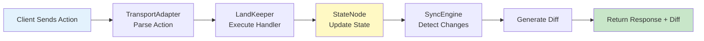
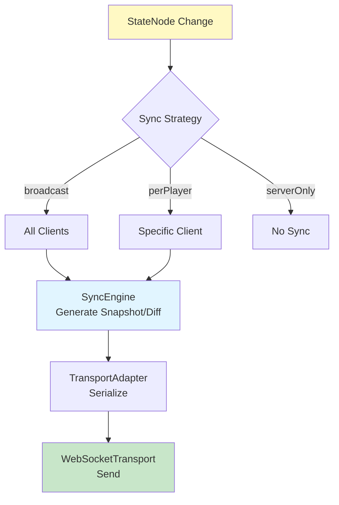

[English](overview.md) | [中文版](overview.zh-TW.md)

# Overview

SwiftStateTree is a server logic engine centered on "Single Authoritative StateTree + Sync Rules + Land DSL".
The core focus is: centralizing state changes on the server and sending necessary data to clients through sync rules.

## Module Composition

SwiftStateTree adopts a modular design with clear responsibilities for each module:

| Module | Description | Responsibilities |
|--------|-------------|------------------|
| **SwiftStateTree** | Core module | StateNode, Sync, Land DSL, Runtime (LandKeeper), Schema generation |
| **SwiftStateTreeTransport** | Transport layer | Transport abstraction, WebSocketTransport, Land management, multi-room routing |
| **SwiftStateTreeNIO** | NIO server | WebSocket hosting, JWT/Guest auth, Admin routes (default server) |
| **SwiftStateTreeNIOProvisioning** | Provisioning | Registers GameServer with matchmaking control plane on startup |
| **SwiftStateTreeMacros** | Compile-time tools | `@StateNodeBuilder`, `@Payload`, `@SnapshotConvertible` |
| **SwiftStateTreeDeterministicMath** | Deterministic math | Fixed-point arithmetic, collision detection, vector operations for server-authoritative games |
| **SwiftStateTreeBenchmarks** | Benchmarks | Performance test executable |

Matchmaking is handled by the NestJS control plane (`Packages/matchmaking-control-plane`). See [Matchmaking Two-Plane Architecture](matchmaking-two-plane.md).

### Module Dependencies



**Notes**:
- **SwiftStateTree** is the core module, network-independent, provides core logic
- **SwiftStateTreeTransport** provides network abstraction and room management
- **SwiftStateTreeNIO** is the default WebSocket server (replaces archived Hummingbird integration)
- **SwiftStateTreeNIOProvisioning** registers with the NestJS matchmaking control plane
- **SwiftStateTreeMacros** is a compile-time dependency, automatically generates metadata

## System Data Flow

### High-Level Data Flow

```
Client
  ↕ WebSocket
WebSocketTransport
  ↕ TransportAdapter
LandKeeper (Runtime)
  ↕ SyncEngine / StateSnapshot
StateNode (StateTree)
```

### Detailed Data Flow Diagram



### Core Component Interactions

#### 1. Connection Establishment Flow



#### 2. Action Processing Flow



#### 3. Synchronization Mechanism



## Core Concepts

### StateNode (State Node)

Server authoritative state, uses `@StateNodeBuilder` to generate necessary metadata. StateNode is the single source of truth for the entire system.

**Features**:
- Use `@Sync` attribute to mark sync strategy
- Use `@Internal` to mark internal fields (not synced)
- Supports nested structures
- All state changes go through StateNode

### SyncPolicy (Sync Strategy)

Defines field sync strategy, controlling which data is synced to which clients.

**Strategy Types**:
- `.broadcast`: Broadcast to all clients
- `.perPlayerSlice()`: Dictionary only syncs that player's slice
- `.perPlayer(...)`: Filter by player
- `.serverOnly`: Server internal use, not synced
- `.custom(...)`: Fully custom filter

### Land (Domain Definition)

Logical unit that defines game rules, lifecycle, and event handling.

**Components**:
- `AccessControl`: Access control (player limit, public/private)
- `Rules`: Rule definitions (Action/Event handling, Join/Leave)
- `Lifetime`: Lifecycle (Tick, destroy conditions)
- `ClientEvents` / `ServerEvents`: Event type registration

### LandKeeper (Runtime Executor)

Responsible for executing Land-defined logic and handling all state changes.

**Responsibilities**:
- Handle join/leave requests
- Execute Action/Event handlers
- Manage Tick scheduled tasks
- Coordinate sync mechanism
- Create request-scoped `LandContext`

### TransportAdapter (Transport Adapter)

Converts transport messages to LandKeeper calls, isolating network details.

**Functions**:
- Parse WebSocket messages
- Manage connection state (session, player, client three-layer identification)
- Serialize/deserialize messages
- Coordinate SyncEngine for state synchronization

### SyncEngine (Sync Engine)

Responsible for generating state snapshots and diffs, implementing efficient synchronization.

**Mechanisms**:
- Maintains broadcast and per-player caches
- Supports dirty tracking optimization
- Generates path-based patches
- Supports firstSync mechanism

## Core Component Interaction Description

### Request Processing Flow

1. **Connection Phase**:
   - Client connects via WebSocket
   - WebSocketTransport creates session
   - TransportAdapter waits for join request

2. **Join Phase**:
   - Client sends join request
   - TransportAdapter parses and calls LandKeeper
   - LandKeeper executes `CanJoin` validation
   - After passing, executes `OnJoin` handler
   - SyncEngine generates initial Snapshot
   - Returns to Client

3. **Runtime Phase**:
   - Client sends Action/Event
   - TransportAdapter parses and calls corresponding handler
   - LandKeeper executes handler, updates StateNode
   - SyncEngine detects changes, generates Diff
   - Returns Response and Diff to Client

4. **Synchronization Mechanism**:
   - StateNode changes mark dirty
   - SyncEngine filters data according to `@Sync` strategy
   - Generates Snapshot (full state) or Diff (changes)
   - TransportAdapter serializes and sends

### Multi-Room Architecture

In multi-room mode:

- `LandManager` manages all Land instances
- `LandRouter` routes connections to corresponding Land
- Each Land has independent LandKeeper and StateNode
- TransportAdapter is bound to specific Land

## Documentation Entry Points

- **[Quick Start](quickstart.md)** - Build your first server from scratch
- **[Architecture Layers](architecture.md)** - Component layered architecture and relationship descriptions
- **[Core Concepts](core/README.md)** - StateNode, Sync, Land DSL details
- **[Transport Layer](transport/README.md)** - Network transport and connection management
- **[Deploy & Load Balancing](deploy/README.md)** - Server deployment, nginx LB
