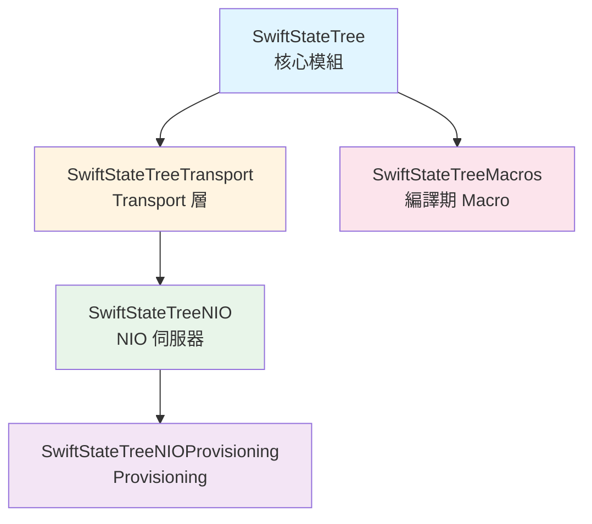
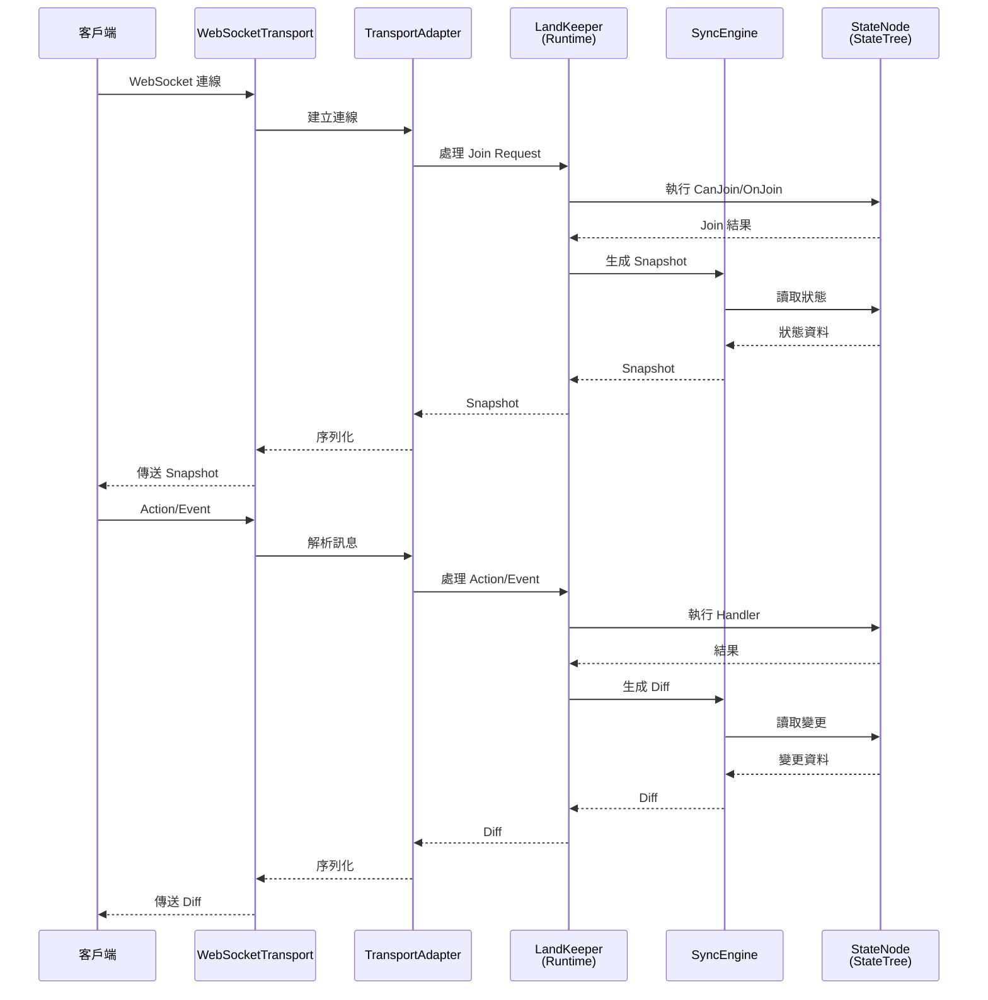
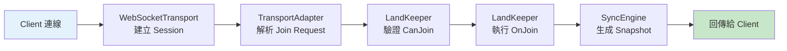
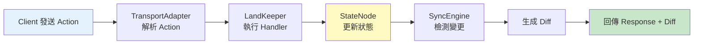
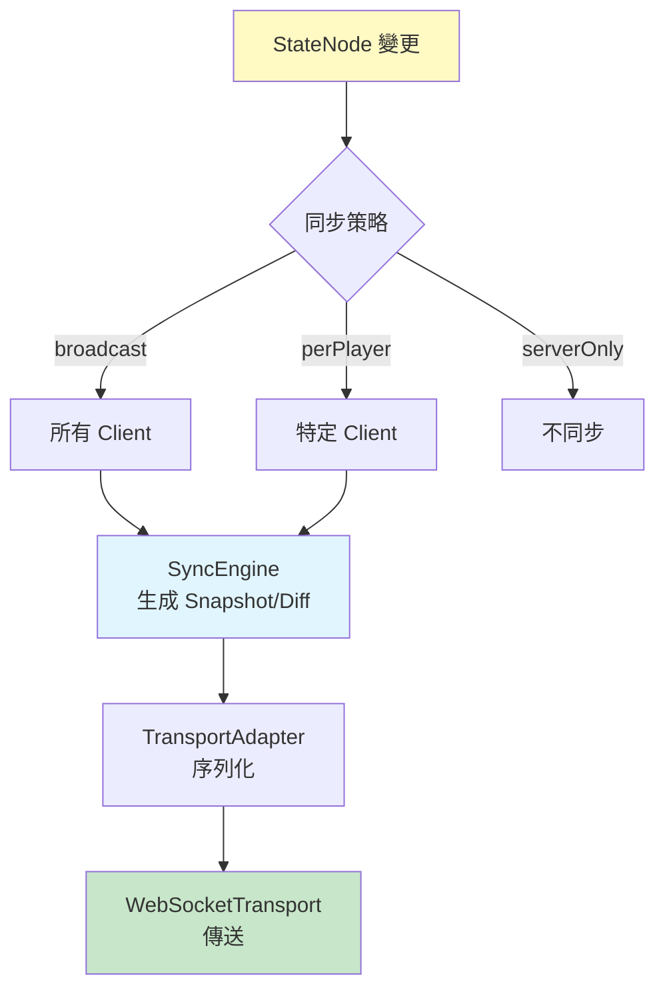

[English](overview.md) | [中文版](overview.zh-TW.md)

# 概觀

SwiftStateTree 是以「單一權威 StateTree + 同步規則 + Land DSL」為核心的伺服器邏輯引擎。
核心關注點是：把狀態變更集中在伺服器、透過同步規則把必要資料發送給客戶端。

## 模組組成

SwiftStateTree 採用模組化設計，各模組職責明確：

| 模組 | 說明 | 職責 |
|------|------|------|
| **SwiftStateTree** | 核心模組 | StateNode、Sync、Land DSL、Runtime（LandKeeper）、Schema 生成 |
| **SwiftStateTreeTransport** | Transport 層 | Transport 抽象、WebSocketTransport、Land 管理、多房間路由 |
| **SwiftStateTreeNIO** | NIO 伺服器 | WebSocket Hosting、JWT/Guest 認證、Admin 路由（預設伺服器） |
| **SwiftStateTreeNIOProvisioning** | Provisioning | 啟動時向 matchmaking control plane 註冊 GameServer |
| **SwiftStateTreeMacros** | 編譯期工具 | `@StateNodeBuilder`、`@Payload`、`@SnapshotConvertible` |
| **SwiftStateTreeDeterministicMath** | 確定性數學運算 | 固定點運算、碰撞檢測、向量運算，用於伺服器權威遊戲 |
| **SwiftStateTreeBenchmarks** | 基準測試 | 效能測試執行檔 |

配對由 NestJS control plane（`Packages/matchmaking-control-plane`）處理。詳見 [Matchmaking 雙平面架構](matchmaking-two-plane.zh-TW.md)。

### 模組依賴關係



**說明**：
- **SwiftStateTree** 是核心模組，不依賴網路，提供核心邏輯
- **SwiftStateTreeTransport** 提供網路抽象和房間管理
- **SwiftStateTreeNIO** 為預設 WebSocket 伺服器（取代已歸檔的 Hummingbird 整合）
- **SwiftStateTreeNIOProvisioning** 向 NestJS matchmaking control plane 註冊
- **SwiftStateTreeMacros** 是編譯時依賴，自動生成 metadata

## 系統資料流

### 高層資料流

```
Client
  ↕ WebSocket
WebSocketTransport
  ↕ TransportAdapter
LandKeeper (Runtime)
  ↕ SyncEngine / StateSnapshot
StateNode (StateTree)
```

### 詳細資料流程圖



### 核心組件互動

#### 1. 連線建立流程



#### 2. Action 處理流程



#### 3. 同步機制



## 核心概念

### StateNode（狀態節點）

伺服器權威狀態，使用 `@StateNodeBuilder` 產生必要 metadata。StateNode 是整個系統的單一真相來源。

**特點**：
- 使用 `@Sync` 屬性標記同步策略
- 使用 `@Internal` 標記內部欄位（不同步）
- 支援巢狀結構
- 所有狀態變更都通過 StateNode

### SyncPolicy（同步策略）

定義欄位同步策略，控制哪些資料同步給哪些客戶端。

**策略類型**：
- `.broadcast`：廣播給所有 client
- `.perPlayerSlice()`：Dictionary 只同步該玩家的 slice
- `.perPlayer(...)`：依玩家過濾
- `.serverOnly`：伺服器內部用，不同步
- `.custom(...)`：完全自定義過濾

### Land（領域定義）

邏輯單位，定義遊戲規則、生命周期和事件處理。

**組成**：
- `AccessControl`：存取控制（人數上限、公開性）
- `Rules`：規則定義（Action/Event 處理、Join/Leave）
- `Lifetime`：生命周期（Tick、銷毀條件）
- `ClientEvents` / `ServerEvents`：事件型別註冊

### LandKeeper（Runtime 執行器）

負責執行 Land 定義的邏輯，處理所有狀態變更。

**職責**：
- 處理 join/leave 請求
- 執行 Action/Event handlers
- 管理 Tick 定時任務
- 協調同步機制
- 建立 request-scoped 的 `LandContext`

### TransportAdapter（傳輸適配器）

將 transport message 轉換為 LandKeeper 呼叫，隔離網路細節。

**功能**：
- 解析 WebSocket 訊息
- 管理連線狀態（session、player、client 三層識別）
- 序列化/反序列化訊息
- 協調 SyncEngine 進行狀態同步

### SyncEngine（同步引擎）

負責生成狀態快照（Snapshot）和差異（Diff），實現高效同步。

**機制**：
- 維護 broadcast 和 per-player 快取
- 支援 dirty tracking 優化
- 生成 path-based patches
- 支援 firstSync 機制

## 核心組件互動說明

### 請求處理流程

1. **連線階段**：
   - Client 透過 WebSocket 連線
   - WebSocketTransport 建立 session
   - TransportAdapter 等待 join request

2. **加入階段**：
   - Client 發送 join request
   - TransportAdapter 解析並呼叫 LandKeeper
   - LandKeeper 執行 `CanJoin` 驗證
   - 通過後執行 `OnJoin` handler
   - SyncEngine 生成初始 Snapshot
   - 回傳給 Client

3. **運行階段**：
   - Client 發送 Action/Event
   - TransportAdapter 解析並呼叫對應 handler
   - LandKeeper 執行 handler，更新 StateNode
   - SyncEngine 檢測變更，生成 Diff
   - 回傳 Response 和 Diff 給 Client

4. **同步機制**：
   - StateNode 變更時標記 dirty
   - SyncEngine 根據 `@Sync` 策略過濾資料
   - 生成 Snapshot（完整狀態）或 Diff（變更）
   - TransportAdapter 序列化並傳送

### 多房間架構

在多房間模式下：

- `LandManager` 管理所有 Land 實例
- `LandRouter` 負責路由連線到對應 Land
- 每個 Land 有獨立的 LandKeeper 和 StateNode
- TransportAdapter 與特定 Land 綁定

## 文件入口

- **[快速開始](quickstart.zh-TW.md)** - 從零開始建立第一個伺服器
- **[架構分層](architecture.zh-TW.md)** - 組件分層架構與關係說明
- **[核心概念](core/README.zh-TW.md)** - StateNode、Sync、Land DSL 詳解
- **[Transport 層](transport/README.zh-TW.md)** - 網路傳輸與連線管理
- **[部署與負載均衡](deploy/README.md)** - 伺服器部署、nginx LB
