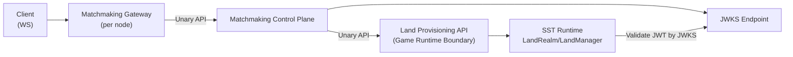

# Matchmaking Control Plane Design

> **Status (2026-02):** NestJS control plane MVP implemented. Swift in-process matchmaking (`SwiftStateTreeMatchmaking`) archived; see `Archive/SwiftStateTreeMatchmaking/README.md`.

## Goal

Define a clear architecture for matchmaking that keeps game runtime concerns separated, supports future cross-language integration, and allows fast MVP iteration.

## Final User Outcome

The final product goal is explicit and user-facing:
- Player requests matchmaking from client.
- System returns assignment data (`matchToken`, `connectUrl`, `landId`, `assignmentId`, `expiresAt`).
- Player client uses that assignment data to connect directly to the game server URL and start playing.

## Agreed Terminology

- `Matchmaking Control Plane`: matchmaking decisions, queue state, assignment lifecycle, token issuing.
- `Matchmaking Gateway`: client-facing WebSocket entry, request proxy, auth boundary, event push.
- `Server Capacity Registry`: server health/capacity registration and lookup.
- `Land Provisioning API`: create/get land and return connect info.
- `Match Assignment`: allocation result (not "resource allocation").

## Architecture Overview



## System Behaviors

### 1) Server Registration

- Each game server reports its own status (owner writes its own status).
- Registry data includes `serverId`, `region`, `supportedLandTypes`, `capacity`, `drainMode`, `health`.
- For distributed mode, recommended heartbeat profile is `every 2s` with `8s expiry`.

### 2) Capacity Management

- Control plane reads capacity/health snapshot to select candidate servers.
- Drain mode removes a server from new assignments while allowing existing sessions to finish.
- Capacity management is control-plane responsibility; room state remains inside SST runtime.

### 3) Match Assignment

- Match request is normalized into `MatchGroup` (`groupSize=1` for solo, `>1` for party).
- Control plane selects server by strategy and calls provisioning API synchronously.
- On success, control plane returns:
  - `assignmentId`
  - `matchToken` (JWT)
  - `connectUrl`
  - `landId`
  - `expiresAt`
- Matchmaking Gateway pushes result over existing client WebSocket session.

## Communication Model

- `Client <-> Matchmaking Gateway`: WebSocket long connection.
- `Matchmaking Gateway -> Matchmaking`: unary API (REST first, gRPC optional).
- `Matchmaking -> Land Provisioning API`: unary API.
- Streaming is optional in phase 2; phase 1 focuses on unary correctness.

## Security Model

- Match token is issued by control plane.
- Token format: JWT.
- Game server validates token using JWKS public keys.
- Token claims should include: `assignmentId`, `playerId`, `landId`, `exp`, `jti`.

## Failure Policy (Current Decision)

- If assignment is not acknowledged/finished within timeout, mark as failed.
- No automatic reassignment in MVP.
- Client is notified to retry through Matchmaking Gateway.

## Storage Strategy

### Phase 1 (MVP)

- Use storage interface abstraction.
- Start with `InMemory` implementation.
- Accept that restart clears in-flight queue state.

### Phase 2 (Scale-out)

- Add `Redis` implementation behind the same storage interface.
- Use Redis as shared state plane for multi-instance control plane and server status sync.
- Pub/Sub is for notification acceleration, not source of truth.

## Package Layout (Monorepo First)

```text
Packages/
  MatchmakingContracts/
  MatchmakingCore/
  MatchmakingInfraRedis/
  MatchmakingAPI/
```

- `MatchmakingContracts`: DTOs, error codes, protocol contracts.
- `MatchmakingCore`: strategy, queueing, dedupe, assignment lifecycle.
- `MatchmakingInfraRedis`: Redis adapter implementation (phase 2).
- `MatchmakingAPI`: HTTP/gRPC entry for gateway and internal services.

## Module Boundary

- Keep `Matchmaking Gateway` as a separate module from `Matchmaking Control Plane`.
- Gateway owns client identity/authentication and websocket session lifecycle.
- Control plane owns queue/assignment/token logic and does not manage direct client websocket sessions.

## Why This Split

- Keeps SST runtime focused on room lifecycle and gameplay state.
- Keeps matchmaking logic independent and replaceable.
- Enables cross-language integration through stable contracts.
- Minimizes MVP complexity while preserving future scale path.

## Local Config Example (Phase 1)

```yaml
gateway:
  host: "0.0.0.0"
  port: 3000
  wsPath: "/ws"
  matchmakingApiBaseUrl: "http://127.0.0.1:3001"
  allowClientPlayerId: true

controlPlane:
  host: "0.0.0.0"
  port: 3001
  assignmentTimeoutMs: 3000
  noReassign: true
  jwt:
    issuer: "matchmaking-dev"
    audience: "game-server"
    kid: "mm-dev-1"
    privateKeyPath: "./keys/matchmaking-private.pem"
    publicJwksPath: "./keys/matchmaking-public.jwks.json"
  provisioningNodes:
    - serverId: "game-1"
      region: "asia"
      landTypes: ["hero-defense"]
      allocateUrl: "http://127.0.0.1:9101/v1/provisioning/allocate"
      statusUrl: "http://127.0.0.1:9101/v1/provisioning/status"

gameServers:
  - serverId: "game-1"
    region: "asia"
    host: "127.0.0.1"
    port: 8080
    matchmakingMode: "control-plane"
    heartbeat:
      intervalMs: 2000
      ttlMs: 8000
      reportUrl: "http://127.0.0.1:3001/v1/servers/heartbeat"
```

- This YAML format is recommended for readability in local development.
- A JSON-equivalent config can be generated from the same schema if needed.

## Implementation Status (MVP)

- **Control Plane**: NestJS service in `Packages/control-plane` with InMemory storage, JWT/JWKS, and built-in provisioning (in-memory server registry).
- **Two-plane architecture**: See [Matchmaking Two-Plane Architecture](../matchmaking-two-plane.md) for system design and plane relationship.
- **Provisioning**: Game servers register via `POST /v1/provisioning/servers/register`. Allocate is internal (no external HTTP).
- **Runbook**: See `docs/operations/matchmaking-control-plane-mvp.md`.
