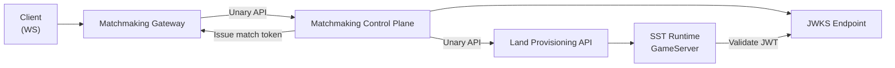

# NestJS Matchmaking Control Plane Implementation Plan

> **Status (2026-02-14):** MVP implemented. Provisioning is now built into the control plane (in-memory registry). MatchmakingSwiftProvisioningStub and ProvisioningService have been removed. See `docs/plans/2026-02-14-provisioning-rest-api-migration-plan.md` for the migration.

**Goal:** Build a NestJS-based matchmaking control plane MVP with InMemory storage, JWT/JWKS token flow, Matchmaking Gateway-facing API, and game-runtime provisioning integration.

**End User Outcome:** Client receives assignment data (`matchToken`, `connectUrl`, `landId`, `assignmentId`, `expiresAt`) and then connects to the game server URL to actually play.

**Architecture:** Keep client realtime on Matchmaking Gateway WebSocket, and use unary API calls between services. The control plane owns matchmaking queue, assignment lifecycle, and token issuance. Game runtime integration is done through a dedicated provisioning client boundary (not direct room state logic in matchmaking).

**Tech Stack:** NestJS, TypeScript, Jest, Supertest, class-validator, jsonwebtoken (RS256), jose (JWKS), pnpm/npm, OpenAPI.

## Architecture Diagram



## Identity Modes and Matchmaking Impact

### Mode A: Client-supplied playerId (development only)

- Pros: fastest development loop, no auth dependency.
- Cons: easy impersonation, weak dedupe trust, weak abuse protection.
- Matchmaking impact: queue dedupe and fairness are only as trustworthy as client input.

### Mode B: Gateway-issued identity token (recommended for real use)

- Pros: trusted identity, stronger dedupe, better anti-abuse controls.
- Cons: requires token issuance and verification path.
- Matchmaking impact: stable player identity across enqueue/cancel/status and assignment claims.

### Current rollout decision

- Phase A uses Mode A behind a development guard: `ALLOW_CLIENT_PLAYER_ID=true`.
- Phase B moves to Mode B and disables client-controlled player identity.

## Module Boundary Decision

- `Matchmaking Gateway` and `Matchmaking Control Plane` are separate modules.
- Gateway owns client authentication, session lifecycle, and websocket push.
- Control plane exposes service API, owns queue/assignment/token logic, and stays client-transport agnostic.

## Execution Order and Quality Gates (Required)

### Phase A: Packages-only validation first

Complete Tasks 0-8 first, without modifying `Examples/GameDemo` runtime behavior.

**Required gate before GameDemo integration:**

Run:

- `cd Packages/control-plane && npm test`

Expected:

- PASS (all unit + e2e tests under package)

Run:

- `cd Packages/control-plane && npm run test:e2e -- --runInBand`

Expected:

- PASS (control-plane API + JWT/JWKS + provisioning stub flow)

### Phase B: GameDemo integration after gate passes

Only after Phase A gate passes, execute Task 9 to integrate `GameDemo` and CLI scenario.

**Required gate after GameDemo integration:**

Run:

- `cd Tools/CLI && npm run test:e2e:game:matchmaking:mvp`

Expected:

- PASS (assignment flow from Gateway to GameDemo works)

Run:

- `cd Tools/CLI && npm run test:e2e:game`

Expected:

- PASS (existing game scenarios remain compatible)

### Task 0: Add minimal Swift provisioning stub for E2E proof

**Files:**

- Create: `Packages/MatchmakingSwiftProvisioningStub/Package.swift`
- Create: `Packages/MatchmakingSwiftProvisioningStub/Sources/MatchmakingSwiftProvisioningStub/StubServer.swift`
- Create: `Packages/MatchmakingSwiftProvisioningStub/Sources/MatchmakingSwiftProvisioningStub/Models.swift`
- Create: `Packages/MatchmakingSwiftProvisioningStub/Sources/MatchmakingSwiftProvisioningStub/main.swift`
- Create: `Packages/control-plane/test/e2e.provisioning-stub.spec.ts`

**Step 1: Write the failing E2E test for assignment with Swift stub**

```ts
it("assigns a connectUrl from Swift provisioning stub", async () => {
  const res = await request(app.getHttpServer())
    .post("/v1/matchmaking/enqueue")
    .send({
      groupId: "solo-p1",
      queueKey: "standard:asia",
      members: ["p1"],
      groupSize: 1,
    })
    .expect(200);

  expect(res.body.assignment.connectUrl).toContain("ws://");
  expect(res.body.assignment.serverId).toBe("stub-server-1");
});
```

**Step 2: Run test to verify it fails**

Run: `cd Packages/control-plane && npm test -- e2e.provisioning-stub.spec.ts`

Expected: FAIL (Swift provisioning stub does not exist yet).

**Step 3: Write minimal Swift stub implementation**

Implement a tiny HTTP server exposing:

- `GET /health`
- `POST /v1/provisioning/allocate`

Return deterministic payload:

```json
{
  "serverId": "stub-server-1",
  "landId": "standard:stub-room-1",
  "connectUrl": "ws://127.0.0.1:8080/game/standard?landId=standard:stub-room-1"
}
```

**Step 4: Re-run test to verify it passes**

Run: `cd Packages/control-plane && npm test -- e2e.provisioning-stub.spec.ts`

Expected: PASS.

**Step 5: Commit**

```bash
git add Packages/MatchmakingSwiftProvisioningStub Packages/control-plane/test/e2e.provisioning-stub.spec.ts
git commit -m "test(matchmaking): add Swift provisioning stub for end-to-end assignment proof"
```

### Task 1: Bootstrap NestJS service skeleton

**Files:**

- Create: `Packages/control-plane/package.json`
- Create: `Packages/control-plane/tsconfig.json`
- Create: `Packages/control-plane/nest-cli.json`
- Create: `Packages/control-plane/src/main.ts`
- Create: `Packages/control-plane/src/app.module.ts`
- Create: `Packages/control-plane/test/app.e2e-spec.ts`

**Step 1: Write the failing e2e smoke test**

```ts
it("/health (GET) should return ok", async () => {
  await request(app.getHttpServer())
    .get("/health")
    .expect(200)
    .expect({ ok: true });
});
```

**Step 2: Run test to verify it fails**

Run: `cd Packages/control-plane && npm test -- --runInBand`

Expected: FAIL (service not bootstrapped).

**Step 3: Write minimal implementation**

Add Nest bootstrap and one health route returning `{ ok: true }`.

**Step 4: Run test to verify it passes**

Run: `cd Packages/control-plane && npm test -- --runInBand`

Expected: PASS.

**Step 5: Commit**

```bash
git add Packages/control-plane
git commit -m "feat(matchmaking): bootstrap NestJS control plane service"
```

### Task 2: Add contracts and validation layer

**Files:**

- Create: `Packages/control-plane/src/contracts/matchmaking.dto.ts`
- Create: `Packages/control-plane/src/contracts/assignment.dto.ts`
- Create: `Packages/control-plane/src/contracts/error-codes.ts`
- Create: `Packages/control-plane/test/contracts.validation.spec.ts`

**Step 1: Write failing validation tests**

```ts
it("rejects enqueue request without queueKey", async () => {
  const body = { groupId: "g1", members: ["p1"] };
  await request(app.getHttpServer())
    .post("/v1/matchmaking/enqueue")
    .send(body)
    .expect(400);
});
```

**Step 2: Run test to verify it fails**

Run: `cd Packages/control-plane && npm test -- contracts.validation.spec.ts`

Expected: FAIL.

**Step 3: Implement DTO + validation pipe**

Define `EnqueueRequest`, `CancelRequest`, `StatusResponse`, `AssignmentResult` with strict typing.

**Step 4: Run test to verify it passes**

Run: `cd Packages/control-plane && npm test -- contracts.validation.spec.ts`

Expected: PASS.

**Step 5: Commit**

```bash
git add Packages/control-plane/src/contracts Packages/control-plane/test/contracts.validation.spec.ts
git commit -m "feat(matchmaking): add API contracts and request validation"
```

### Task 3: Implement InMemory storage port and adapter

**Files:**

- Create: `Packages/control-plane/src/storage/match-storage.port.ts`
- Create: `Packages/control-plane/src/storage/inmemory-match-storage.ts`
- Create: `Packages/control-plane/test/inmemory-storage.spec.ts`

**Step 1: Write failing storage behavior tests**

```ts
it("deduplicates active group ticket by groupId", async () => {
  const first = await storage.enqueue(group);
  const second = await storage.enqueue(group);
  expect(second.ticketId).toBe(first.ticketId);
});
```

**Step 2: Run test to verify it fails**

Run: `cd Packages/control-plane && npm test -- inmemory-storage.spec.ts`

Expected: FAIL.

**Step 3: Implement minimal storage adapter**

Support enqueue/cancel/status/assignment persistence in memory maps.

**Step 4: Run test to verify it passes**

Run: `cd Packages/control-plane && npm test -- inmemory-storage.spec.ts`

Expected: PASS.

**Step 5: Commit**

```bash
git add Packages/control-plane/src/storage Packages/control-plane/test/inmemory-storage.spec.ts
git commit -m "feat(matchmaking): add in-memory storage adapter with dedupe"
```

### Task 4: Add matchmaking core service and strategy plugin interface

**Files:**

- Create: `Packages/control-plane/src/matchmaking/matchmaking.service.ts`
- Create: `Packages/control-plane/src/matchmaking/match-strategy.port.ts`
- Create: `Packages/control-plane/src/matchmaking/strategies/default.strategy.ts`
- Create: `Packages/control-plane/test/matchmaking.service.spec.ts`

**Step 1: Write failing service tests**

```ts
it("supports solo and party by same MatchGroup model", async () => {
  const solo = await service.enqueue({ groupSize: 1, ...base });
  const party = await service.enqueue({ groupSize: 3, ...baseParty });
  expect(solo).toBeDefined();
  expect(party).toBeDefined();
});
```

**Step 2: Run test to verify it fails**

Run: `cd Packages/control-plane && npm test -- matchmaking.service.spec.ts`

Expected: FAIL.

**Step 3: Implement core service + strategy port**

Add strategy selection by `queueKey` and keep default strategy deterministic.

**Step 4: Run test to verify it passes**

Run: `cd Packages/control-plane && npm test -- matchmaking.service.spec.ts`

Expected: PASS.

**Step 5: Commit**

```bash
git add Packages/control-plane/src/matchmaking Packages/control-plane/test/matchmaking.service.spec.ts
git commit -m "feat(matchmaking): add core service and pluggable strategy interface"
```

### Task 5: Add provisioning client boundary and assignment flow

**Files:**

- Create: `Packages/control-plane/src/provisioning/provisioning-client.port.ts`
- Create: `Packages/control-plane/src/provisioning/http-provisioning.client.ts`
- Modify: `Packages/control-plane/src/matchmaking/matchmaking.service.ts`
- Create: `Packages/control-plane/test/assignment-flow.spec.ts`

**Step 1: Write failing assignment flow test**

```ts
it("creates assignment and returns connect info from provisioning client", async () => {
  const result = await service.processMatch(group);
  expect(result.connectUrl).toContain("ws");
  expect(result.assignmentId).toBeDefined();
});
```

**Step 2: Run test to verify it fails**

Run: `cd Packages/control-plane && npm test -- assignment-flow.spec.ts`

Expected: FAIL.

**Step 3: Implement provisioning boundary integration**

Call provisioning client synchronously when match is ready.

**Step 4: Run test to verify it passes**

Run: `cd Packages/control-plane && npm test -- assignment-flow.spec.ts`

Expected: PASS.

**Step 5: Commit**

```bash
git add Packages/control-plane/src/provisioning Packages/control-plane/src/matchmaking/matchmaking.service.ts Packages/control-plane/test/assignment-flow.spec.ts
git commit -m "feat(matchmaking): integrate provisioning client for assignment"
```

### Task 6: Implement JWT issuing and JWKS endpoint

**Files:**

- Create: `Packages/control-plane/src/security/jwt-issuer.service.ts`
- Create: `Packages/control-plane/src/security/jwks.controller.ts`
- Create: `Packages/control-plane/src/security/security.module.ts`
- Create: `Packages/control-plane/test/security.jwt-jwks.spec.ts`

**Step 1: Write failing JWT/JWKS tests**

```ts
it("issues RS256 token with assignment claims", async () => {
  const token = await issuer.issue(payload);
  expect(token.split(".").length).toBe(3);
});
```

**Step 2: Run test to verify it fails**

Run: `cd Packages/control-plane && npm test -- security.jwt-jwks.spec.ts`

Expected: FAIL.

**Step 3: Implement minimal RS256 issuer + JWKS route**

Expose `GET /.well-known/jwks.json` and add required claims (`assignmentId`, `playerId`, `landId`, `exp`, `jti`).

**Step 4: Run test to verify it passes**

Run: `cd Packages/control-plane && npm test -- security.jwt-jwks.spec.ts`

Expected: PASS.

**Step 5: Commit**

```bash
git add Packages/control-plane/src/security Packages/control-plane/test/security.jwt-jwks.spec.ts
git commit -m "feat(matchmaking): add JWT issuer and JWKS endpoint"
```

### Task 7: Add gateway-facing controller endpoints

**Files:**

- Create: `Packages/control-plane/src/matchmaking/matchmaking.controller.ts`
- Modify: `Packages/control-plane/src/matchmaking/matchmaking.service.ts`
- Modify: `Packages/control-plane/src/app.module.ts`
- Create: `Packages/control-plane/test/matchmaking.controller.e2e-spec.ts`

**Step 1: Write failing endpoint tests**

Add tests for:

- `POST /v1/matchmaking/enqueue`
- `POST /v1/matchmaking/cancel`
- `GET /v1/matchmaking/status/:ticketId`

**Step 2: Run test to verify it fails**

Run: `cd Packages/control-plane && npm test -- matchmaking.controller.e2e-spec.ts`

Expected: FAIL.

**Step 3: Implement minimal controller endpoints**

Wire endpoints to service methods and return stable response schema.

**Step 4: Run test to verify it passes**

Run: `cd Packages/control-plane && npm test -- matchmaking.controller.e2e-spec.ts`

Expected: PASS.

**Step 5: Commit**

```bash
git add Packages/control-plane/src/matchmaking Packages/control-plane/test/matchmaking.controller.e2e-spec.ts Packages/control-plane/src/app.module.ts
git commit -m "feat(matchmaking): add gateway-facing matchmaking endpoints"
```

### Task 8: Add docs and runbook for current MVP behavior

**Files:**

- Create: `Packages/control-plane/README.md`
- Modify: `docs/plans/2026-02-12-matchmaking-control-plane-design.md`
- Create: `docs/operations/matchmaking-control-plane-mvp.md`

**Step 1: Write docs test checklist**

Document exact commands and expected outputs for local run.

**Step 2: Run full test suite**

Run: `cd Packages/control-plane && npm test`

Expected: PASS.

**Step 3: Add explicit MVP constraints**

Document: InMemory only, restart drops queue, no automatic reassignment.

**Step 4: Commit**

```bash
git add Packages/control-plane/README.md docs/plans/2026-02-12-matchmaking-control-plane-design.md docs/operations/matchmaking-control-plane-mvp.md
git commit -m "docs(matchmaking): add MVP runbook and operational constraints"
```

### Task 9: Integrate GameDemo in Phase 1 (mode toggle + CLI scenario)

**Files:**

- Modify: `Examples/GameDemo/Sources/GameServer/main.swift`
- Create: `Tools/CLI/scenarios/game/test-matchmaking-assignment-flow.json`
- Modify: `Tools/CLI/package.json`
- Modify: `Tools/CLI/test-e2e-game.sh`
- Create: `Tools/CLI/scripts/internal/run-matchmaking-mvp.sh`

**Step 1: Write failing CLI scenario for assignment flow**

Create scenario asserting:

- client receives matchmaking assignment payload,
- payload includes `connectUrl` and `matchToken`,
- connect to assigned URL succeeds.

**Step 2: Run scenario to verify it fails**

Run: `cd Tools/CLI && npm run test:e2e:game -- --scenario scenarios/game/test-matchmaking-assignment-flow.json`

Expected: FAIL (GameServer does not expose control-plane path yet).

**Step 3: Add GameServer mode toggle for phase-1 integration**

Implement env mode:

- `MATCHMAKING_MODE=direct` (default; existing behavior),
- `MATCHMAKING_MODE=control-plane` (assignment/token flow enabled).

In control-plane mode:

- disable unauthenticated auto-create path,
- require assignment token for room entry.

**Step 4: Add minimal CLI script + package command**

Add command to run only matchmaking MVP game scenario for quick iteration.

**Step 5: Re-run scenario to verify it passes**

Run: `cd Tools/CLI && npm run test:e2e:game:matchmaking:mvp`

Expected: PASS.

**Step 6: Commit**

```bash
git add Examples/GameDemo/Sources/GameServer/main.swift Tools/CLI/scenarios/game/test-matchmaking-assignment-flow.json Tools/CLI/package.json Tools/CLI/test-e2e-game.sh Tools/CLI/scripts/internal/run-matchmaking-mvp.sh
git commit -m "feat(game-demo): add phase-1 matchmaking integration and CLI scenario"
```

### Task 10: Freeze Provisioning API contract across NestJS and Swift stub (P0)

**Files:**

- Create: `Packages/control-plane/src/contracts/provisioning.contract.ts`
- Create: `Packages/control-plane/test/provisioning.contract.spec.ts`
- Modify: `Packages/MatchmakingSwiftProvisioningStub/Sources/MatchmakingSwiftProvisioningStub/Models.swift`
- Create: `Packages/MatchmakingSwiftProvisioningStub/Tests/MatchmakingSwiftProvisioningStubTests/ProvisioningContractTests.swift`
- Create: `docs/contracts/provisioning-api.md`

**Step 1: Write failing contract compatibility tests**

Add tests that assert required fields and field semantics for both sides:
- request: `queueKey`, `groupId`, `groupSize`, `region`, `constraints`
- response: `serverId`, `landId`, `connectUrl`, `expiresAt`, `assignmentHints`
- error: `code`, `message`, `retryable`

**Step 2: Run tests to verify they fail**

Run: `cd Packages/control-plane && npm test -- provisioning.contract.spec.ts`

Run: `swift test --package-path Packages/MatchmakingSwiftProvisioningStub`

Expected: FAIL (contract not frozen yet).

**Step 3: Implement shared contract and align Swift stub model**

Define canonical contract in TypeScript and mirror exact field names/types in Swift models.

**Step 4: Re-run tests to verify they pass**

Run: `cd Packages/control-plane && npm test -- provisioning.contract.spec.ts`

Run: `swift test --package-path Packages/MatchmakingSwiftProvisioningStub`

Expected: PASS.

**Step 5: Commit**

```bash
git add Packages/control-plane/src/contracts/provisioning.contract.ts Packages/control-plane/test/provisioning.contract.spec.ts Packages/MatchmakingSwiftProvisioningStub/Sources/MatchmakingSwiftProvisioningStub/Models.swift Packages/MatchmakingSwiftProvisioningStub/Tests/MatchmakingSwiftProvisioningStubTests/ProvisioningContractTests.swift docs/contracts/provisioning-api.md
git commit -m "chore(matchmaking): freeze provisioning API contract for NestJS and Swift stub"
```

### Task 11: Add local stack orchestrator for deterministic E2E runs (P0)

**Files:**

- Create: `Tools/CLI/scripts/internal/run-matchmaking-local-stack.sh`
- Create: `Tools/CLI/scripts/internal/stop-matchmaking-local-stack.sh`
- Modify: `Tools/CLI/package.json`
- Create: `docs/operations/matchmaking-local-dev-stack.md`

**Step 1: Write failing smoke command check**

Add a command test that expects one-shot local stack script to:
- start control plane,
- start Swift provisioning stub,
- start gateway (or test gateway shim),
- expose health endpoints before E2E starts.

**Step 2: Run command to verify it fails**

Run: `cd Tools/CLI && npm run test:matchmaking:stack:smoke`

Expected: FAIL (scripts do not exist yet).

**Step 3: Implement start/stop orchestrator scripts**

Implement scripts with PID/log management and cleanup traps.

**Step 4: Re-run smoke + MVP scenario**

Run: `cd Tools/CLI && npm run test:matchmaking:stack:smoke`

Run: `cd Tools/CLI && npm run test:e2e:game:matchmaking:mvp`

Expected: PASS.

**Step 5: Commit**

```bash
git add Tools/CLI/scripts/internal/run-matchmaking-local-stack.sh Tools/CLI/scripts/internal/stop-matchmaking-local-stack.sh Tools/CLI/package.json docs/operations/matchmaking-local-dev-stack.md
git commit -m "test(matchmaking): add local stack orchestrator for deterministic e2e"
```

### Task 12: Add rollback gate to guarantee existing direct mode compatibility (P0)

**Files:**

- Modify: `Tools/CLI/test-e2e-game.sh`
- Modify: `Tools/CLI/package.json`
- Create: `Tools/CLI/scenarios/game/test-direct-mode-regression.json`
- Modify: `Examples/GameDemo/Sources/GameServer/main.swift`

**Step 1: Write failing regression scenario for direct mode**

Add scenario proving old direct flow still works when:
- `MATCHMAKING_MODE=direct`
- no assignment token is involved
- existing hero-defense actions/events remain valid.

**Step 2: Run regression test to verify it fails**

Run: `cd Tools/CLI && MATCHMAKING_MODE=direct npm run test:e2e:game -- --scenario scenarios/game/test-direct-mode-regression.json`

Expected: FAIL before explicit rollback path is completed.

**Step 3: Implement explicit fallback path in GameServer mode switch**

Ensure direct mode preserves prior behavior exactly (auto-create and existing join flow).

**Step 4: Run both gates**

Run: `cd Tools/CLI && npm run test:e2e:game:matchmaking:mvp`

Run: `cd Tools/CLI && MATCHMAKING_MODE=direct npm run test:e2e:game`

Expected: PASS for both control-plane mode and direct mode.

**Step 5: Commit**

```bash
git add Tools/CLI/test-e2e-game.sh Tools/CLI/package.json Tools/CLI/scenarios/game/test-direct-mode-regression.json Examples/GameDemo/Sources/GameServer/main.swift
git commit -m "test(game-demo): add rollback gate for direct mode compatibility"
```
